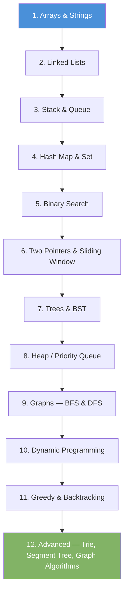

# Data Structures & Algorithms — Index

A reference guide covering the most common DSA topics with time/space complexity and learning order.

- [Complexity Analysis](00b-complexity-analysis.md) — Big O, time & space complexity rules
- [Popular 50 Problems](50-popular-problems.md) — Curated interview problems with progress tracker

---

## How to Read Complexity Notation

| Symbol   | Meaning                        |
|----------|-------------------------------|
| O(1)     | Constant — does not grow      |
| O(log n) | Logarithmic — halves each step|
| O(n)     | Linear — grows with input     |
| O(n log n)| Linearithmic                 |
| O(n²)   | Quadratic — nested loops      |
| O(2ⁿ)   | Exponential — avoid in prod   |

---

## Data Structures

### 1. Linear Structures

| Structure       | Access | Search | Insert | Delete | Notes                          |
|-----------------|--------|--------|--------|--------|-------------------------------|
| Array           | O(1)   | O(n)   | O(n)   | O(n)   | Fixed size, contiguous memory |
| Dynamic Array   | O(1)   | O(n)   | O(1)*  | O(n)   | Amortized insert at end       |
| Singly Linked List | O(n)| O(n)   | O(1)†  | O(1)†  | †At head; O(n) at tail        |
| Doubly Linked List | O(n)| O(n)   | O(1)†  | O(1)†  | Bi-directional traversal      |
| Stack           | O(n)   | O(n)   | O(1)   | O(1)   | LIFO — push/pop at top        |
| Queue           | O(n)   | O(n)   | O(1)   | O(1)   | FIFO — enqueue/dequeue        |
| Deque           | O(n)   | O(n)   | O(1)   | O(1)   | Insert/remove at both ends    |

Files:
- [00a — Arrays & Strings](00a-arrays-and-strings.md)
- [01 — Linked List](01-linked-list.md)
- [03 — Stack](03-stack.md)
- [03a — MinStack](03a-min-stack.md)
- [04 — Queue](04-queue.md)

---

### 2. Hash-Based Structures

| Structure    | Access  | Search | Insert | Delete | Notes                         |
|--------------|---------|--------|--------|--------|------------------------------|
| Hash Map     | O(1)*   | O(1)*  | O(1)*  | O(1)*  | *Average; O(n) worst case    |
| Hash Set     | —       | O(1)*  | O(1)*  | O(1)*  | Unique elements only          |

Files:
- [05 — Hash Map](05-hash-map.md)
- [06 — Hash Set](06-hash-set.md)

---

### 3. Tree Structures

| Structure         | Search   | Insert   | Delete   | Notes                        |
|-------------------|----------|----------|----------|------------------------------|
| Binary Tree       | O(n)     | O(n)     | O(n)     | Unordered                    |
| Binary Search Tree| O(log n)*| O(log n)*| O(log n)*| *Average; O(n) if unbalanced |
| AVL Tree          | O(log n) | O(log n) | O(log n) | Self-balancing BST           |
| Red-Black Tree    | O(log n) | O(log n) | O(log n) | Looser balance, faster insert|
| B-Tree            | O(log n) | O(log n) | O(log n) | Used in databases/filesystems|
| Trie              | O(m)     | O(m)     | O(m)     | m = key length; for strings  |
| Segment Tree      | O(log n) | O(log n) | O(log n) | Range queries                |
| Heap (Min/Max)    | O(1)†    | O(log n) | O(log n) | †Only min or max element     |

Files:
- [07 — Binary Tree](07-binary-tree.md)
- [08 — Binary Search Tree](08-binary-search-tree.md)
- [09 — Heap / Priority Queue](09-heap.md)
- [10 — Trie](10-trie.md)

---

### 4. Graph Structures

| Representation   | Space    | Add Edge | Check Edge | Notes                     |
|------------------|----------|----------|------------|---------------------------|
| Adjacency Matrix | O(V²)    | O(1)     | O(1)       | Good for dense graphs     |
| Adjacency List   | O(V + E) | O(1)     | O(degree)  | Good for sparse graphs    |

Files:
- [11 — Graph Representations](11-graph.md)

---

## Algorithms

### 1. Sorting

| Algorithm      | Best       | Average    | Worst      | Space    | Stable |
|----------------|------------|------------|------------|----------|--------|
| Bubble Sort    | O(n)       | O(n²)      | O(n²)      | O(1)     | Yes    |
| Selection Sort | O(n²)      | O(n²)      | O(n²)      | O(1)     | No     |
| Insertion Sort | O(n)       | O(n²)      | O(n²)      | O(1)     | Yes    |
| Merge Sort     | O(n log n) | O(n log n) | O(n log n) | O(n)     | Yes    |
| Quick Sort     | O(n log n) | O(n log n) | O(n²)      | O(log n) | No     |
| Heap Sort      | O(n log n) | O(n log n) | O(n log n) | O(1)     | No     |
| Counting Sort  | O(n + k)   | O(n + k)   | O(n + k)   | O(k)     | Yes    |
| Radix Sort     | O(nk)      | O(nk)      | O(nk)      | O(n + k) | Yes    |

Files:
- [20 — Bubble Sort](20-bubble-sort.md)
- [21 — Insertion Sort](21-insertion-sort.md)
- [22 — Merge Sort](22-merge-sort.md)
- [23 — Quick Sort](23-quick-sort.md)

---

### 2. Searching

| Algorithm       | Best  | Average  | Worst  | Requirement           |
|-----------------|-------|----------|--------|-----------------------|
| Linear Search   | O(1)  | O(n)     | O(n)   | None                  |
| Binary Search   | O(1)  | O(log n) | O(log n)| Sorted array         |
| BFS             | O(1)  | O(V + E) | O(V + E)| Graph/Tree          |
| DFS             | O(1)  | O(V + E) | O(V + E)| Graph/Tree          |

Files:
- [24 — Binary Search](24-binary-search.md)
- [25 — BFS — Breadth First Search](25-bfs.md)
- [26 — DFS — Depth First Search](26-dfs.md)

---

### 3. Graph Algorithms

| Algorithm           | Time Complexity     | Use Case                          |
|---------------------|---------------------|-----------------------------------|
| BFS                 | O(V + E)            | Shortest path (unweighted)        |
| DFS                 | O(V + E)            | Cycle detection, topological sort |
| Dijkstra            | O((V + E) log V)    | Shortest path (non-negative weights)|
| Bellman-Ford        | O(V × E)            | Shortest path (negative weights)  |
| Floyd-Warshall      | O(V³)               | All-pairs shortest path           |
| Prim's              | O((V + E) log V)    | Minimum spanning tree             |
| Kruskal's           | O(E log E)          | Minimum spanning tree             |
| Topological Sort    | O(V + E)            | Dependency ordering               |

Files:
- [30 — Dijkstra](30-dijkstra.md)
- 31 — Topological Sort _(coming soon)_
- 32 — Minimum Spanning Tree _(coming soon)_

---

### 4. Problem-Solving Techniques

| Technique            | When to Use                                          |
|----------------------|------------------------------------------------------|
| Two Pointers         | Pair/subarray problems in sorted arrays              |
| Sliding Window       | Subarray/substring with fixed or variable window     |
| Divide and Conquer   | Problem splits into independent subproblems          |
| Dynamic Programming  | Overlapping subproblems with optimal substructure    |
| Greedy               | Local optimal choice leads to global optimum         |
| Backtracking         | Explore all possibilities, prune invalid paths       |
| Binary Search        | Search space can be halved at each step              |
| BFS/DFS              | Graph/tree traversal, shortest path, connectivity    |

Files:
- [40 — Two Pointers](40-two-pointers.md)
- [41 — Sliding Window](41-sliding-window.md)
- [42 — Dynamic Programming](42-dynamic-programming.md)
- [43 — Greedy Algorithms](43-greedy.md)
- [44 — Backtracking](44-backtracking.md)

---

## Suggested Learning Order

---

## Quick Cheatsheet — Which Structure to Use?

| Problem Pattern                         | Reach For             |
|-----------------------------------------|-----------------------|
| Need O(1) access by index               | Array                 |
| Frequent insert/delete at head          | Linked List           |
| Undo / function call tracking           | Stack                 |
| Process items in order received         | Queue                 |
| Key-value lookup                        | Hash Map              |
| Unique elements, fast membership test   | Hash Set              |
| Sorted data, range queries              | BST / Segment Tree    |
| Always need min or max quickly          | Heap                  |
| Prefix/autocomplete matching            | Trie                  |
| Shortest path, connectivity             | Graph + BFS/Dijkstra  |
