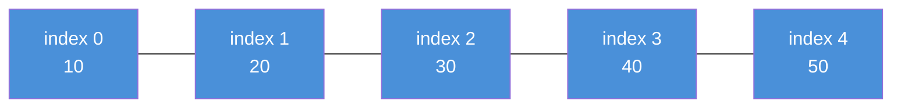
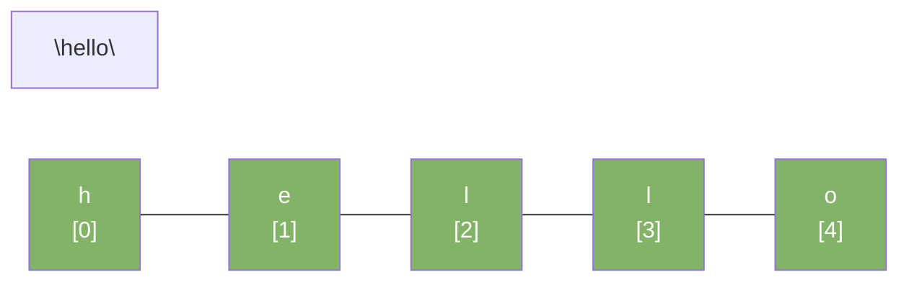

# Arrays & Strings

Arrays and strings are the most basic data structures. Most problems start here.

---

## Array

An array stores elements in contiguous memory. Each element has an index starting at 0.



### Operations

| Operation       | Time | Notes                              |
|-----------------|------|------------------------------------|
| Access by index | O(1) | `arr[i]` is instant                |
| Search          | O(n) | Must check each element            |
| Insert at end   | O(1) | Amortized for dynamic arrays       |
| Insert at middle| O(n) | Must shift elements right          |
| Delete at middle| O(n) | Must shift elements left           |

---

## Java Arrays

```java
// Fixed-size array
int[] arr = new int[5];
arr[0] = 10;
arr[1] = 20;

// Array literal
int[] nums = {10, 20, 30, 40, 50};

// Access
int first = nums[0];       // 10
int last  = nums[nums.length - 1]; // 50

// Iterate
for (int n : nums) {
    System.out.println(n);
}

// Sort
Arrays.sort(nums);

// Binary search (array must be sorted)
int idx = Arrays.binarySearch(nums, 30); // 2

// Copy
int[] copy = Arrays.copyOf(nums, nums.length);
int[] slice = Arrays.copyOfRange(nums, 1, 4); // {20, 30, 40}
```

## Java ArrayList (Dynamic Array)

```java
import java.util.ArrayList;
import java.util.List;

List<Integer> list = new ArrayList<>();
list.add(10);
list.add(20);
list.add(30);

int val  = list.get(0);          // 10
list.set(0, 99);                 // replace index 0
list.remove(Integer.valueOf(20)); // remove by value
list.remove(0);                  // remove by index

int size = list.size();          // current count
Collections.sort(list);          // sort
```

---

## 2D Arrays

```java
int[][] matrix = new int[3][3];

// Fill
int[][] grid = {
    {1, 2, 3},
    {4, 5, 6},
    {7, 8, 9}
};

// Access element at row 1, col 2
int val = grid[1][2]; // 6

// Iterate
for (int r = 0; r < grid.length; r++) {
    for (int c = 0; c < grid[0].length; c++) {
        System.out.print(grid[r][c] + " ");
    }
}
```

---

## String

A string is an immutable sequence of characters in Java. Every modification creates a new string object.



### Common String Operations

```java
String s = "hello world";

// Length
int len = s.length();           // 11

// Access character
char c = s.charAt(0);           // 'h'

// Substring
String sub = s.substring(6);    // "world"
String sub2 = s.substring(0, 5); // "hello"

// Search
int idx = s.indexOf("world");   // 6
boolean has = s.contains("llo"); // true

// Comparison
boolean eq = s.equals("hello world"); // true
int cmp = s.compareTo("hello");       // positive (longer)

// Transform
String upper = s.toUpperCase();  // "HELLO WORLD"
String lower = s.toLowerCase();  // "hello world"
String trimmed = "  hi  ".strip(); // "hi"
String replaced = s.replace("world", "Java"); // "hello Java"

// Split
String[] parts = s.split(" "); // ["hello", "world"]

// Convert to char array
char[] chars = s.toCharArray();
```

### String vs StringBuilder

String is immutable. Concatenating strings in a loop creates many objects.

```java
// Slow — creates a new String object each iteration
String result = "";
for (int i = 0; i < 1000; i++) {
    result += i;  // O(n²) total
}

// Fast — StringBuilder mutates in place
StringBuilder sb = new StringBuilder();
for (int i = 0; i < 1000; i++) {
    sb.append(i); // O(n) total
}
String result2 = sb.toString();
```

| Class           | Mutable | Thread-safe | Use When                    |
|-----------------|---------|-------------|-----------------------------|
| `String`        | No      | Yes         | Short, infrequent changes   |
| `StringBuilder` | Yes     | No          | Loop building, most cases   |
| `StringBuffer`  | Yes     | Yes         | Multi-threaded string build |

---

## Common Patterns

### Sliding Window — Max Sum Subarray of size k

```java
int maxSum(int[] nums, int k) {
    int sum = 0;
    for (int i = 0; i < k; i++) sum += nums[i];
    int max = sum;
    for (int i = k; i < nums.length; i++) {
        sum += nums[i] - nums[i - k];
        max = Math.max(max, sum);
    }
    return max;
}
```

### Two Pointers — Check Palindrome

```java
boolean isPalindrome(String s) {
    int left = 0, right = s.length() - 1;
    while (left < right) {
        if (s.charAt(left) != s.charAt(right)) return false;
        left++;
        right--;
    }
    return true;
}
```

### Frequency Map on String

```java
int[] charFreq(String s) {
    int[] freq = new int[26];
    for (char c : s.toCharArray()) {
        freq[c - 'a']++;
    }
    return freq;
}
```

---

## Key Pitfalls

| Pitfall                              | Fix                                      |
|--------------------------------------|------------------------------------------|
| `==` compares references, not values | Use `.equals()` for string comparison    |
| String concatenation in loop is O(n²)| Use `StringBuilder`                      |
| `substring()` in Java 8+ copies data | Aware of memory on large strings         |
| Off-by-one on index                  | Check `< length` not `<= length`        |
| Integer overflow on large index math | Cast to `long` before multiplying        |
