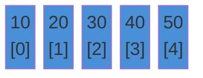
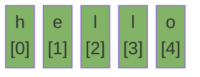

# Arrays & Strings

The building blocks of almost every coding problem. Master these first.

---

## Intuition

An array stores items in a row in memory. Each item has an index. You jump to any item instantly — no searching needed.

A string is an array of characters. In Java, strings are immutable. Every change creates a new object.

---

## Operations

### Array

| Operation | Time | Notes |
|-----------|------|-------|
| Access by index | O(1) | `arr[i]` |
| Search | O(n) | Check each element |
| Insert at end | O(1)* | *Amortized for ArrayList |
| Insert at middle | O(n) | Shift elements right |
| Delete at middle | O(n) | Shift elements left |

### String

| Operation | Time | Notes |
|-----------|------|-------|
| Access character | O(1) | `s.charAt(i)` |
| Search substring | O(n·m) | n = string length, m = pattern length |
| Concatenate with `+` | O(n) | Creates a new string each time |
| `StringBuilder.append` | O(1)* | *Amortized |

---

## Sample Input

```
arr = [10, 20, 30, 40, 50]
s   = "hello"
```

These values are used in all examples below.

---

## Visual Representation

**Array — indexed boxes:**



**String — character boxes:**



---

## Step-by-step Trace — Find Maximum

Input: `arr = [10, 20, 30, 40, 50]`

```java
// Time: O(n)  Space: O(1)
int findMax(int[] arr) {
    int max = arr[0];
    for (int i = 1; i < arr.length; i++) {
        if (arr[i] > max) max = arr[i];
    }
    return max;
}
```

| Step | i | arr[i] | max | Action |
|------|---|--------|-----|--------|
| init | — | — | 10 | max = arr[0] |
| 1 | 1 | 20 | 20 | 20 > 10 → update max |
| 2 | 2 | 30 | 30 | 30 > 20 → update max |
| 3 | 3 | 40 | 40 | 40 > 30 → update max |
| 4 | 4 | 50 | 50 | 50 > 40 → update max |
| done | — | — | **50** | return 50 |

---

## Java Implementation

### Fixed-size Array

```java
int[] arr = {10, 20, 30, 40, 50};

int first = arr[0];                        // 10
int last  = arr[arr.length - 1];           // 50
Arrays.sort(arr);                          // sort in place
int idx   = Arrays.binarySearch(arr, 30);  // 2 (array must be sorted)
int[] copy = Arrays.copyOfRange(arr, 1, 4); // {20, 30, 40}
```

### Dynamic Array (ArrayList)

```java
List<Integer> list = new ArrayList<>();
list.add(10);
list.add(20);
list.add(30);

int val = list.get(0);             // 10
list.set(0, 99);                   // replace at index
list.remove(Integer.valueOf(20));  // remove by value
list.remove(0);                    // remove by index
Collections.sort(list);
```

### 2D Array

```java
int[][] grid = {
    {1, 2, 3},
    {4, 5, 6},
    {7, 8, 9}
};

int val = grid[1][2]; // 6

for (int r = 0; r < grid.length; r++)
    for (int c = 0; c < grid[0].length; c++)
        System.out.print(grid[r][c] + " ");
```

### String Operations

```java
String s = "hello";

char c       = s.charAt(0);         // 'h'
String sub   = s.substring(1, 4);   // "ell"
int idx      = s.indexOf("ll");     // 2
boolean has  = s.contains("ell");   // true
String upper = s.toUpperCase();     // "HELLO"
String[] parts = "a b c".split(" "); // ["a","b","c"]
char[] chars = s.toCharArray();
```

### StringBuilder — Build Strings in a Loop

```java
// Slow — creates a new object every iteration
String result = "";
for (int i = 0; i < n; i++) result += i; // O(n²)

// Fast — mutates in place
StringBuilder sb = new StringBuilder();
for (int i = 0; i < n; i++) sb.append(i); // O(n)
String result = sb.toString();
```

### Common Patterns

**Two Pointers — palindrome check:**

```java
// Time: O(n)  Space: O(1)
boolean isPalindrome(String s) {
    int l = 0, r = s.length() - 1;
    while (l < r) {
        if (s.charAt(l) != s.charAt(r)) return false;
        l++; r--;
    }
    return true;
}
```

**Frequency map — character count:**

```java
// Time: O(n)  Space: O(1) — fixed 26-slot array
int[] freq = new int[26];
for (char c : s.toCharArray()) freq[c - 'a']++;
```

---

## Common Mistakes

- **Using `==` to compare strings.** It checks the reference, not the value. Use `.equals()`.
- **Concatenating strings in a loop.** Each `+` creates a new object. Use `StringBuilder`.
- **Off-by-one on index.** Loop condition is `i < arr.length`, not `i <= arr.length`.
- **Calling `.length()` on an array.** Arrays use `.length` (no parentheses). Strings use `.length()`.
- **Assuming `indexOf` returns 0 when not found.** It returns `-1`. Always check before using the result.
- **Integer overflow in index math.** `int mid = (left + right) / 2` can overflow. Use `left + (right - left) / 2`.

---

## Practice Problems

| Difficulty | Problem | Link |
|------------|---------|------|
| Easy | Two Sum | [LeetCode 1](https://leetcode.com/problems/two-sum/) |
| Medium | Longest Substring Without Repeating Characters | [LeetCode 3](https://leetcode.com/problems/longest-substring-without-repeating-characters/) |
| Medium | Product of Array Except Self | [LeetCode 238](https://leetcode.com/problems/product-of-array-except-self/) |

---

## Deep Dive

### Why Strings are Immutable in Java

The JVM keeps a **string pool** — a cache of string literals. Two variables with the same literal point to the same object. If strings were mutable, changing one would change the other. Immutability makes this safe.

### String vs StringBuilder vs StringBuffer

| Class | Mutable | Thread-safe | Use when |
|-------|---------|-------------|----------|
| `String` | No | Yes | Short, infrequent changes |
| `StringBuilder` | Yes | No | Loop building — most cases |
| `StringBuffer` | Yes | Yes | Multi-threaded string building |

### ArrayList Resizing

ArrayList starts with capacity 10. When full, it creates a new array of size 1.5×, copies all elements, then discards the old array. This is O(n) but happens rarely — so `add()` is O(1) amortized.
