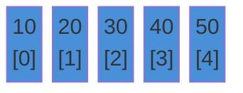

# Arrays

A fixed-size sequence of items stored in contiguous memory, accessed by index.

---

## Intuition

An array is a row of numbered boxes. Each box holds one value. You reach any box instantly by its number — no searching needed. The trade-off: inserting or deleting in the middle means shifting everything beside it.

---

## Operations

| Operation | Time | Notes |
|-----------|------|-------|
| Access by index | O(1) | `arr[i]` |
| Search | O(n) | Check each element |
| Insert at end | O(1)* | *Amortized for ArrayList |
| Insert at middle | O(n) | Shift elements right |
| Delete at middle | O(n) | Shift elements left |

---

## Sample Input

```
arr = [10, 20, 30, 40, 50]
```

---

## Visual Representation



---

## Step-by-step Trace — Find Maximum

Input: `arr = [10, 20, 30, 40, 50]`

```java
// Time: O(n)  Space: O(1)
int findMax(int[] arr) {
    int max = arr[0];
    for (int i = 1; i < arr.length; i++)
        if (arr[i] > max) max = arr[i];
    return max;
}
```

| Step | i | arr[i] | max | Action |
|------|---|--------|-----|--------|
| init | — | — | 10 | max = arr[0] |
| 1 | 1 | 20 | 20 | 20 > 10 → update |
| 2 | 2 | 30 | 30 | 30 > 20 → update |
| 3 | 3 | 40 | 40 | 40 > 30 → update |
| 4 | 4 | 50 | 50 | 50 > 40 → update |
| done | — | — | **50** | return 50 |

---

## Java Implementation

### Fixed-size Array

```java
int[] arr = {10, 20, 30, 40, 50};

int first  = arr[0];                         // 10
int last   = arr[arr.length - 1];            // 50
Arrays.sort(arr);                            // sort in place — O(n log n)
int idx    = Arrays.binarySearch(arr, 30);   // 2 (array must be sorted)
int[] copy = Arrays.copyOfRange(arr, 1, 4);  // {20, 30, 40}
```

### Dynamic Array (ArrayList)

```java
List<Integer> list = new ArrayList<>();
list.add(10);
list.add(20);
list.add(30);

int val = list.get(0);             // 10
list.set(0, 99);                   // replace at index 0
list.remove(Integer.valueOf(20));  // remove by value — O(n)
list.remove(0);                    // remove by index — O(n)
Collections.sort(list);
```

### 2D Array

```java
int[][] grid = {
    {1, 2, 3},
    {4, 5, 6},
    {7, 8, 9}
};

int val = grid[1][2]; // 6

for (int r = 0; r < grid.length; r++)
    for (int c = 0; c < grid[0].length; c++)
        System.out.print(grid[r][c] + " ");
```

---

## Common Mistakes

- **Off-by-one on index.** Loop condition is `i < arr.length`, not `i <= arr.length`.
- **Calling `.length()` on an array.** Arrays use `.length` (no parentheses). Strings use `.length()`.
- **Integer overflow in index math.** `int mid = (left + right) / 2` can overflow. Use `left + (right - left) / 2`.
- **Removing from ArrayList by index vs value.** `list.remove(2)` removes index 2. `list.remove(Integer.valueOf(2))` removes the value 2. Easy to mix up.
- **Sorting mutates the original.** `Arrays.sort(arr)` changes `arr` in place. Copy first if you need the original order.

---

## Practice Problems

| Difficulty | Problem | Link |
|------------|---------|------|
| Easy | Two Sum | [LeetCode 1](https://leetcode.com/problems/two-sum/) |
| Medium | Product of Array Except Self | [LeetCode 238](https://leetcode.com/problems/product-of-array-except-self/) |
| Medium | Maximum Subarray | [LeetCode 53](https://leetcode.com/problems/maximum-subarray/) |

---

## Deep Dive

### ArrayList Resizing

ArrayList starts with capacity 10. When full, it allocates a new array at 1.5× the size, copies all elements, then discards the old array. The copy is O(n) but happens rarely — so `add()` is O(1) amortized.

### Cache Performance

Array elements sit next to each other in memory. The CPU loads a chunk of memory (a cache line) at once. Iterating an array hits the cache almost every time — very fast. Linked list nodes scatter across memory, causing frequent cache misses.
