# Complexity Analysis

How to measure how fast an algorithm runs and how much memory it uses as input grows.

---

## Intuition

When you write code, you need to answer: "If my input doubles, does my program take twice as long — or a hundred times longer?" Big O notation is the standard way to answer that question without benchmarking on specific hardware.

---

## Big O — Common Complexities

Ordered from fastest to slowest:

| Notation | Name | Example |
|----------|------|---------|
| O(1) | Constant | Array index lookup, HashMap get |
| O(log n) | Logarithmic | Binary search, BST lookup |
| O(n) | Linear | Single loop through an array |
| O(n log n) | Linearithmic | Merge sort, Heap sort |
| O(n²) | Quadratic | Nested loops (Bubble sort) |
| O(2ⁿ) | Exponential | Recursive subsets |
| O(n!) | Factorial | Generating all permutations |

---

## Growth Rate Diagram

```mermaid
graph LR
    A["O(1) — flat"] --> B["O(log n) — slow rise"]
    B --> C["O(n) — straight line"]
    C --> D["O(n log n) — slight curve"]
    D --> E["O(n²) — steep curve"]
    E --> F["O(2ⁿ) — explosive"]
    F --> G["O(n!) — avoid at all costs"]

    style A fill:#2ecc71,color:#fff
    style B fill:#27ae60,color:#fff
    style C fill:#f39c12,color:#fff
    style D fill:#e67e22,color:#fff
    style E fill:#e74c3c,color:#fff
    style F fill:#c0392b,color:#fff
    style G fill:#7b241c,color:#fff
```



---

## How to Read Code for Time Complexity

| Code Pattern | Complexity |
|---|---|
| Single statement, no loop | O(1) |
| One loop `0..n` | O(n) |
| Two separate loops `0..n` | O(n) |
| Loop inside a loop, both `0..n` | O(n²) |
| Halving the input each step | O(log n) |
| Loop + halving per iteration | O(n log n) |
| Two recursive calls per level, depth n | O(2ⁿ) |

**Drop constants and lower-order terms:**
- O(3n) → O(n)
- O(n² + n) → O(n²)
- O(500) → O(1)

---

## Space Complexity

Counts the **extra memory allocated** beyond the input itself.

| Pattern | Space |
|---|---|
| Fixed number of variables | O(1) |
| Array or list of size n | O(n) |
| 2D matrix of size n × n | O(n²) |
| Recursive call stack of depth d | O(d) |

---

## Sample Analysis — Find Pair That Sums to k

**Input:** `arr = [3, 1, 4, 1, 5, 9]`, `k = 10`

### Approach 1 — Brute Force

```java
// Time: O(n²)  Space: O(1)
for (int i = 0; i < n; i++)
    for (int j = i + 1; j < n; j++)
        if (arr[i] + arr[j] == k) return true;
```

### Approach 2 — Hash Set

```java
// Time: O(n)  Space: O(n)
Set<Integer> seen = new HashSet<>();
for (int x : arr) {
    if (seen.contains(k - x)) return true;
    seen.add(x);
}
```

**Variable trace (Approach 2):**

| Step | x | k - x | seen before | Found? |
|------|---|-------|-------------|--------|
| 1 | 3 | 7 | {} | No → add 3 |
| 2 | 1 | 9 | {3} | No → add 1 |
| 3 | 4 | 6 | {3, 1} | No → add 4 |
| 4 | 1 | 9 | {3, 1, 4} | No (skip dup) |
| 5 | 5 | 5 | {3, 1, 4} | No → add 5 |
| 6 | 9 | 1 | {3, 1, 4, 5} | **Yes — return true** |

---

## Common Mistakes

- **Counting total operations instead of growth rate** — O(2n) and O(n) are the same class; drop the constant.
- **Missing the call stack** — a recursive function with depth n uses O(n) space even if it allocates no variables.
- **Treating average case as worst case** — Quick Sort averages O(n log n) but degrades to O(n²) on already-sorted input with a bad pivot choice.
- **Ignoring built-in method complexity** — `String.contains()` is O(n·m), not O(1).

---

## Practice Problems

| Difficulty | Problem | Link |
|------------|---------|------|
| Easy | Two Sum | [LeetCode 1](https://leetcode.com/problems/two-sum/) |
| Medium | Maximum Subarray | [LeetCode 53](https://leetcode.com/problems/maximum-subarray/) |
| Medium | Product of Array Except Self | [LeetCode 238](https://leetcode.com/problems/product-of-array-except-self/) |

---

## Deep Dive

### Amortized Analysis

Some operations are occasionally expensive but cheap on average. `ArrayList.add()` is O(1) amortized — the backing array doubles when full (O(n) copy), but this happens so rarely the cost averages to O(1) per add across n operations.

### Best / Average / Worst Case

Big O typically describes the **worst case**. Three formal notations exist:

| Symbol | Meaning |
|--------|---------|
| Ω (Omega) | Best case lower bound |
| Θ (Theta) | Tight bound — both upper and lower |
| O (Big O) | Upper bound — worst case |

**Quick Sort example:**
- Ω(n log n) — best case (random pivots)
- Θ(n log n) — average case
- O(n²) — worst case (already sorted, picks first element as pivot)
