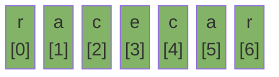

# Strings

An immutable sequence of characters. Every modification creates a new object.

---

## Intuition

A string is an array of characters with a locked lid — you can read it but not change it in place. Java enforces this so strings can be safely shared and cached. When you need to build a string piece by piece, use `StringBuilder` instead.

---

## Operations

| Operation | Time | Notes |
|-----------|------|-------|
| Access character | O(1) | `s.charAt(i)` |
| Search substring | O(n·m) | n = string, m = pattern |
| Substring | O(n) | Copies characters |
| Concatenate with `+` | O(n) | Creates a new object each time |
| `StringBuilder.append` | O(1)* | *Amortized |

---

## Sample Input

```
s = "racecar"
```

---

## Visual Representation



---

## Step-by-step Trace — Palindrome Check

Input: `s = "racecar"`

```java
// Time: O(n)  Space: O(1)
boolean isPalindrome(String s) {
    int l = 0, r = s.length() - 1;
    while (l < r) {
        if (s.charAt(l) != s.charAt(r)) return false;
        l++; r--;
    }
    return true;
}
```

| Step | l | r | s.charAt(l) | s.charAt(r) | Match? |
|------|---|---|-------------|-------------|--------|
| 1 | 0 | 6 | r | r | ✓ → l++, r-- |
| 2 | 1 | 5 | a | a | ✓ → l++, r-- |
| 3 | 2 | 4 | c | c | ✓ → l++, r-- |
| 4 | 3 | 3 | — | — | l ≥ r → exit |
| done | — | — | — | — | **return true** |

---

## Java Implementation

### Common String Methods

```java
String s = "racecar";

int len      = s.length();           // 7
char c       = s.charAt(0);          // 'r'
String sub   = s.substring(1, 4);    // "ace"
int idx      = s.indexOf("ace");     // 1
boolean has  = s.contains("ace");    // true
boolean eq   = s.equals("racecar");  // true
String upper = s.toUpperCase();      // "RACECAR"
String rev   = new StringBuilder(s).reverse().toString(); // "racecar"
String[] parts = "a,b,c".split(","); // ["a", "b", "c"]
char[] chars = s.toCharArray();
```

### StringBuilder — Build Strings in a Loop

```java
// Slow — creates a new object every iteration — O(n²)
String result = "";
for (int i = 0; i < n; i++) result += i;

// Fast — mutates in place — O(n)
StringBuilder sb = new StringBuilder();
for (int i = 0; i < n; i++) sb.append(i);
String result = sb.toString();
```

### Frequency Map — Character Count

```java
// Time: O(n)  Space: O(1) — fixed 26-slot array
int[] freq = new int[26];
for (char c : s.toCharArray())
    freq[c - 'a']++;
```

---

## Common Mistakes

- **Using `==` to compare strings.** It checks the reference, not the value. Use `.equals()`.
- **Concatenating strings in a loop.** Each `+` creates a new object. Use `StringBuilder`.
- **Assuming `indexOf` returns 0 when not found.** It returns `-1`. Check before using the result.
- **Forgetting strings are zero-indexed.** `s.charAt(0)` is the first character, `s.charAt(s.length() - 1)` is the last.
- **`substring(start, end)` is exclusive of end.** `"hello".substring(0, 3)` gives `"hel"`, not `"hell"`.

---

## Practice Problems

| Difficulty | Problem | Link |
|------------|---------|------|
| Easy | Valid Palindrome | [LeetCode 125](https://leetcode.com/problems/valid-palindrome/) |
| Medium | Longest Substring Without Repeating Characters | [LeetCode 3](https://leetcode.com/problems/longest-substring-without-repeating-characters/) |
| Medium | Longest Palindromic Substring | [LeetCode 5](https://leetcode.com/problems/longest-palindromic-substring/) |

---

## Deep Dive

### Why Strings are Immutable in Java

The JVM keeps a string pool — a cache of string literals. Two variables with the same literal point to the same object. If strings were mutable, changing one would silently change the other. Immutability makes sharing safe.

### String vs StringBuilder vs StringBuffer

| Class | Mutable | Thread-safe | Use when |
|-------|---------|-------------|----------|
| `String` | No | Yes | Short or infrequent changes |
| `StringBuilder` | Yes | No | Loop building — the default choice |
| `StringBuffer` | Yes | Yes | Multi-threaded string building |
