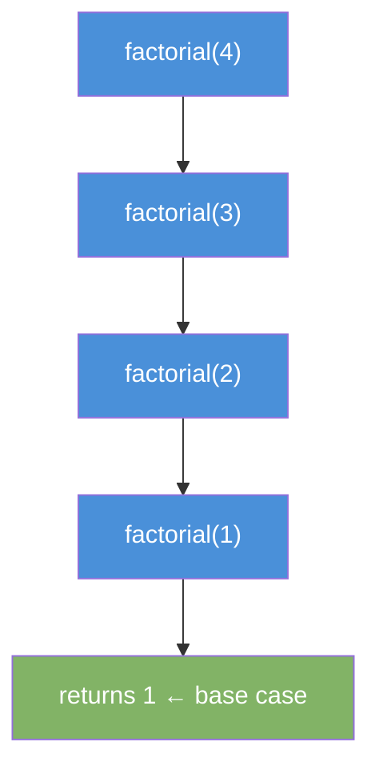
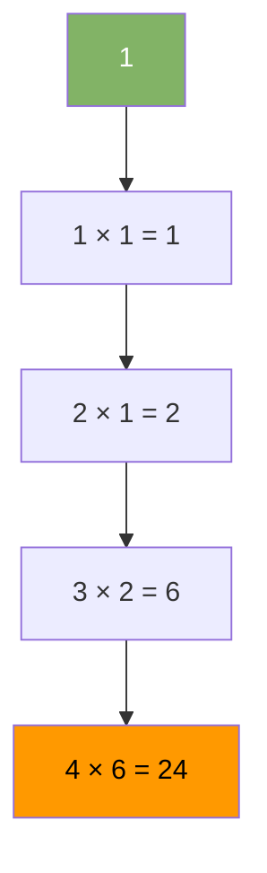

# Recursion

A function that calls itself to solve a smaller version of the same problem.

---

## Intuition

Every recursive solution has two parts. A base case that stops the recursion. A recursive case that breaks the problem into a smaller version and calls itself.

Think of Russian nesting dolls. To open the innermost doll, you open the outer one first. That reveals a smaller doll. You keep opening until there is nothing left to open. That stopping point is the base case.

---

## Key Terms

| Term | Meaning |
|------|---------|
| Base case | The condition where the function stops calling itself |
| Recursive case | The part that calls the function with a smaller input |
| Call stack | The memory that tracks each active function call |
| Stack overflow | Error when recursion goes too deep and fills the call stack |

---

## Sample Input

```
factorial(4)
```

Expected output: `24` (4 × 3 × 2 × 1)

---

## Visual Representation

**Call stack builds up (unwinding phase):**



**Returns bubble back up:**



---

## Step-by-step Trace

Input: `factorial(4)`

| Step | Call | n | Returns |
|------|------|---|---------|
| 1 | factorial(4) | 4 | waits... |
| 2 | factorial(3) | 3 | waits... |
| 3 | factorial(2) | 2 | waits... |
| 4 | factorial(1) | 1 | 1 (base case) |
| 5 | factorial(2) resumes | 2 | 2 × 1 = 2 |
| 6 | factorial(3) resumes | 3 | 3 × 2 = 6 |
| 7 | factorial(4) resumes | 4 | 4 × 6 = 24 |

---

## Java Implementation

### Factorial

```java
// Time: O(n)  Space: O(n) call stack
int factorial(int n) {
    if (n <= 1) return 1;        // base case
    return n * factorial(n - 1); // recursive case
}
```

### Sum of Array

```java
// Time: O(n)  Space: O(n) call stack
int sum(int[] arr, int i) {
    if (i == arr.length) return 0;          // base case
    return arr[i] + sum(arr, i + 1);        // recursive case
}
```

### Fibonacci

```java
// Time: O(2^n)  Space: O(n) call stack
int fib(int n) {
    if (n <= 1) return n;               // base case
    return fib(n - 1) + fib(n - 2);    // two recursive calls
}
```

### Binary Search (recursive)

```java
// Time: O(log n)  Space: O(log n) call stack
int binarySearch(int[] arr, int target, int lo, int hi) {
    if (lo > hi) return -1;             // base case: not found
    int mid = lo + (hi - lo) / 2;
    if (arr[mid] == target) return mid; // base case: found
    if (arr[mid] < target) return binarySearch(arr, target, mid + 1, hi);
    return binarySearch(arr, target, lo, mid - 1);
}
```

---

## Common Mistakes

- **No base case.** The function calls itself forever and causes a stack overflow.
- **Base case never reached.** The input never shrinks toward the base case. Example: calling `factorial(n + 1)` instead of `factorial(n - 1)`.
- **Wrong return.** Forgetting to `return` the recursive call. The result gets thrown away.
- **Recomputing work.** Naive Fibonacci recalculates the same subproblems exponentially. Use memoization or iteration for large inputs.
- **Assuming recursion is always elegant.** Iteration is often faster and uses less memory. Use recursion when it makes the logic cleaner — trees, graphs, divide-and-conquer.

---

## Practice Problems

| Difficulty | Problem | Link |
|------------|---------|------|
| Easy | Fibonacci Number | [LeetCode 509](https://leetcode.com/problems/fibonacci-number/) |
| Easy | Power of Two | [LeetCode 231](https://leetcode.com/problems/power-of-two/) |
| Medium | Subsets | [LeetCode 78](https://leetcode.com/problems/subsets/) |

---

## Deep Dive

### The Call Stack in Memory

Each recursive call adds a **stack frame** to the call stack. A frame stores the local variables and the return address. When the base case returns, frames pop off one by one. Deep recursion on large inputs can exhaust the stack — Java's default stack depth is roughly 500–1000 frames depending on the JVM.

### Tail Recursion

A recursive call is **tail recursive** when the recursive call is the last operation before returning. Some languages optimize this into a loop (no extra stack frames). Java does **not** optimize tail calls, so deep tail recursion still risks stack overflow.

```java
// NOT tail recursive — must multiply after the call returns
int factorial(int n) {
    return n * factorial(n - 1);
}

// Tail recursive — result accumulates in a parameter
int factorial(int n, int acc) {
    if (n <= 1) return acc;
    return factorial(n - 1, n * acc); // last operation is the call
}
```

### When to Prefer Iteration

| Situation | Prefer |
|-----------|--------|
| Simple loop over an array | Iteration |
| Tree or graph traversal | Either (recursion is cleaner) |
| Divide and conquer (merge sort) | Recursion |
| Deep input that could overflow | Iteration or explicit stack |
