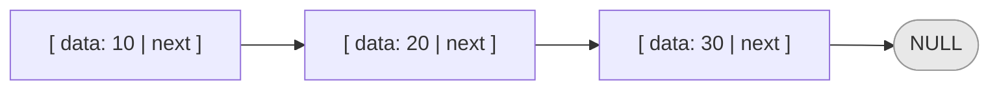
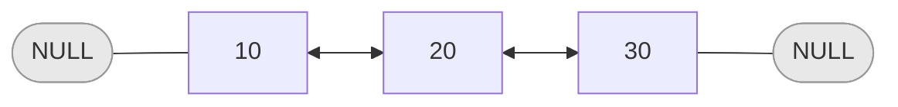
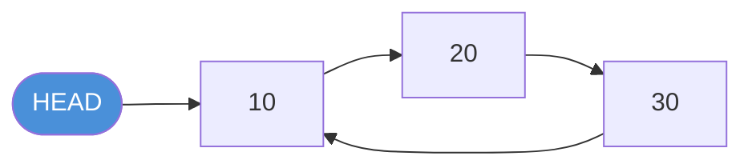

# Linked List — Data Type

## What is a Linked List?

A linked list is a linear data structure where elements (called **nodes**) are stored in non-contiguous memory locations and connected via pointers.

Unlike arrays, there is no fixed block of memory. Each node holds its data and a reference to the next node.

---

## Node Structure

Each node contains two fields:

| Field  | Description                          |
|--------|--------------------------------------|
| `data` | The value stored in the node         |
| `next` | Pointer/reference to the next node   |



---

## Java Implementation

```java
public class Node {
    int data;
    Node next;

    Node(int data) {
        this.data = data;
        this.next = null;
    }
}

public class LinkedList {
    Node head;

    LinkedList() {
        this.head = null;
    }

    void addToFront(int data) {
        Node newNode = new Node(data);
        newNode.next = head;
        head = newNode;
    }

    void addToEnd(int data) {
        Node newNode = new Node(data);
        if (head == null) {
            head = newNode;
            return;
        }
        Node current = head;
        while (current.next != null) {
            current = current.next;
        }
        current.next = newNode;
    }
}
```

---

## Types of Linked Lists

### Singly Linked List

Each node points only to the **next** node.


### Doubly Linked List

Each node points to both **next** and **previous** nodes.



### Circular Linked List

The last node points back to the **head** instead of NULL.



---

## Key Properties

| Property           | Value                             |
|--------------------|-----------------------------------|
| Access by index    | O(n) — must traverse from head    |
| Insert at head     | O(1)                              |
| Insert at tail     | O(n) without tail pointer         |
| Delete at head     | O(1)                              |
| Memory             | Extra per node for pointer        |
| Size               | Dynamic — grows/shrinks at runtime|

---

## Array vs Linked List

| Operation      | Array  | Linked List |
|----------------|--------|-------------|
| Access by index| O(1)   | O(n)        |
| Insert at head | O(n)   | O(1)        |
| Insert at tail | O(1)*  | O(n)        |
| Delete at head | O(n)   | O(1)        |
| Memory layout  | Contiguous | Scattered  |

> *Amortized for dynamic arrays
