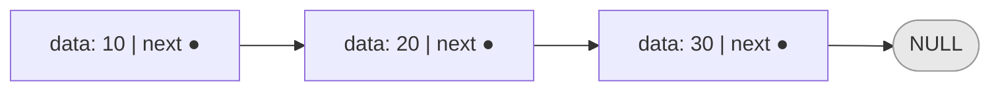
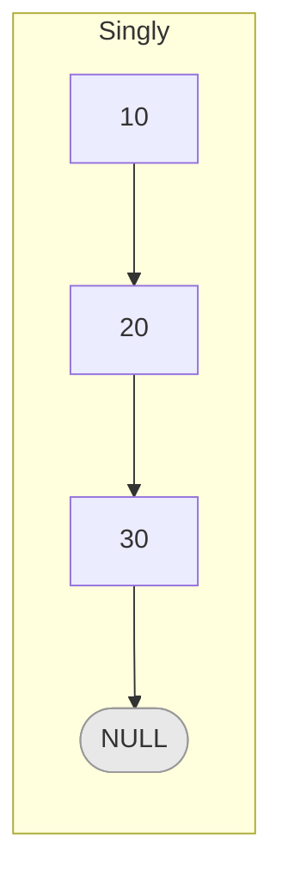
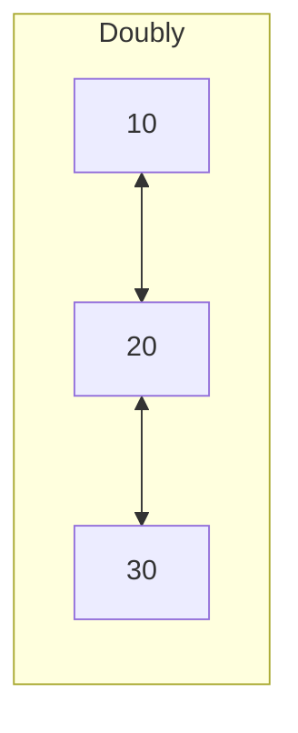
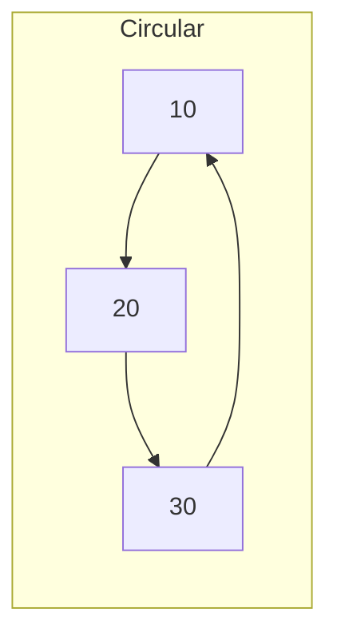
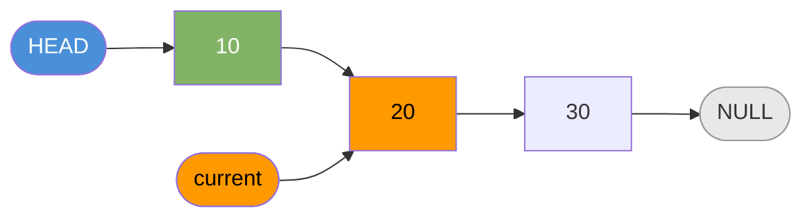
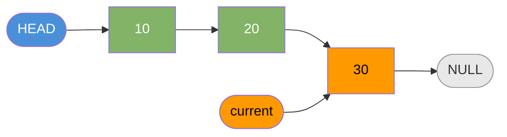
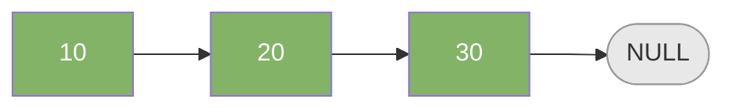

# Linked List

A chain of nodes. Each node holds a value and a pointer to the next node.

---

## Intuition

Arrays store items in a fixed block of memory. Linked lists scatter nodes anywhere in memory and connect them with pointers. You trade fast random access for cheap insert and delete at the head.

---

## Operations

| Operation | Time | Notes |
|-----------|------|-------|
| Access by index | O(n) | Must walk from head |
| Search | O(n) | Must walk from head |
| Insert at head | O(1) | Update one pointer |
| Insert at tail | O(n) | Must walk to end first |
| Delete at head | O(1) | Move head to next |
| Delete at middle | O(n) | Must find the node first |

---

## Sample Input

```
10 → 20 → 30 → NULL
```

This list is used in all examples below.

---

## Visual Representation

**Node structure:**



**Types of linked lists:**







---

## Step-by-step Trace — Traversal

Input: `10 → 20 → 30 → NULL`

```java
// Time: O(n)  Space: O(1)
void traverse(Node head) {
    Node current = head;
    while (current != null) {
        System.out.println(current.data);
        current = current.next;
    }
}
```

| Step | current | current.data | Action |
|------|---------|--------------|--------|
| init | Node(10) | 10 | current = head |
| 1 | Node(10) | 10 | print 10 → advance to Node(20) |
| 2 | Node(20) | 20 | print 20 → advance to Node(30) |
| 3 | Node(30) | 30 | print 30 → advance to null |
| 4 | null | — | condition false → exit loop |

**Output:** `10  20  30`

**Traversal state — step by step:**

Initial:


After visiting 10:


After visiting 10, 20:


Done:


---

## Java Implementation

### Node Class

```java
class Node {
    int data;
    Node next;

    Node(int data) {
        this.data = data;
        this.next = null;
    }
}
```

### LinkedList Class

```java
class LinkedList {
    Node head;

    // Time: O(1)
    void addToFront(int data) {
        Node node = new Node(data);
        node.next = head;
        head = node;
    }

    // Time: O(n)
    void addToEnd(int data) {
        Node node = new Node(data);
        if (head == null) { head = node; return; }
        Node current = head;
        while (current.next != null) current = current.next;
        current.next = node;
    }

    // Time: O(1)
    void deleteFromFront() {
        if (head != null) head = head.next;
    }

    // Time: O(n)
    void traverse() {
        Node current = head;
        while (current != null) {
            System.out.print(current.data + " ");
            current = current.next;
        }
    }

    // Time: O(n)
    int size() {
        int count = 0;
        Node current = head;
        while (current != null) { count++; current = current.next; }
        return count;
    }
}
```

### Build the Sample List

```java
Node head = new Node(10);
head.next = new Node(20);
head.next.next = new Node(30);
// 10 → 20 → 30 → NULL
```

---

## Common Mistakes

- **Not checking `null` before accessing `.next`.** Always guard: `if (current != null)` before `current.next`.
- **Losing the head reference.** If you overwrite `head` without saving it, the whole list is gone.
- **Off-by-one in traversal.** Stop condition is `current != null`, not `current.next != null` (that skips the last node).
- **Forgetting to update `next` on insert.** When inserting between two nodes, link the new node to the next node *before* updating the previous node's pointer.
- **Confusing singly vs doubly.** Doubly linked list needs both `prev` and `next` updated on every insert and delete.

---

## Practice Problems

| Difficulty | Problem | Link |
|------------|---------|------|
| Easy | Reverse Linked List | [LeetCode 206](https://leetcode.com/problems/reverse-linked-list/) |
| Easy | Palindrome Linked List | [LeetCode 234](https://leetcode.com/problems/palindrome-linked-list/) |
| Medium | Add Two Numbers | [LeetCode 2](https://leetcode.com/problems/add-two-numbers/) |

---

## Deep Dive

### Array vs Linked List

| Operation | Array | Linked List |
|-----------|-------|-------------|
| Access by index | O(1) | O(n) |
| Insert at head | O(n) | O(1) |
| Insert at tail | O(1)* | O(n) |
| Delete at head | O(n) | O(1) |
| Memory layout | Contiguous | Scattered |
| Cache performance | Great | Poor |

*Amortized for dynamic arrays.

**Use a linked list when** you insert or delete at the head frequently and never need random access. Use an array when you need fast index-based access.

### Memory Layout

Each linked list node uses extra memory for the pointer field. On a 64-bit system a pointer is 8 bytes. A list of 1000 integers uses 1000 × (4 bytes data + 8 bytes pointer) = 12 KB, versus an array's 4 KB. The pointer overhead matters at scale.
