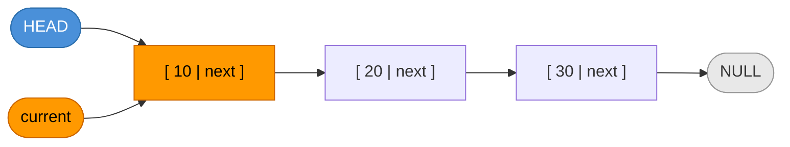
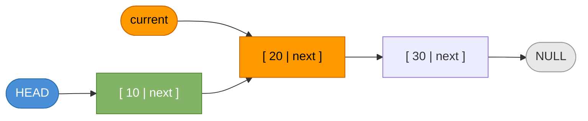
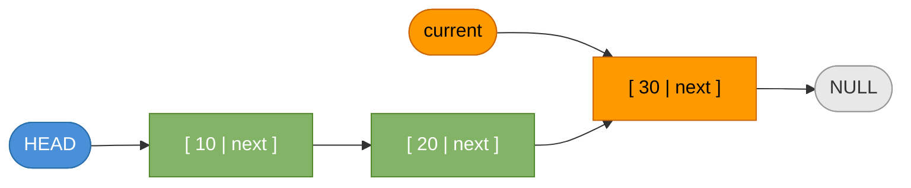
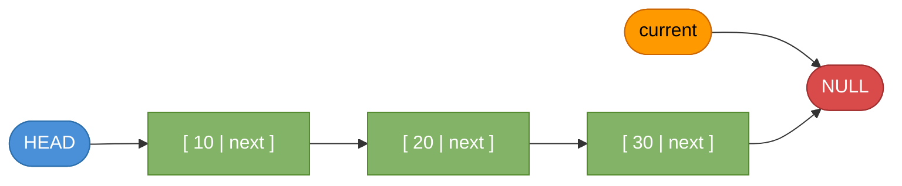

# Linked List — Traversal

## Algorithm

Start at the `head` node and follow `next` pointers until `current` becomes `NULL`.

```java
void traverse(Node head) {
    Node current = head;
    while (current != null) {
        System.out.println(current.data);
        current = current.next;
    }
}
```

**Time complexity:** O(n)  
**Space complexity:** O(1)

---

## Example List

We will traverse: **10 → 20 → 30 → NULL**

---

## Step-by-Step Traversal

### Step 0 — Initial State

The list exists in memory. `head` points to the first node. Nothing has been visited yet.


---

### Step 1 — `current = head`

Set `current` to point to the head node (node with data `10`).  
The loop condition `current != null` is **true** → enter the loop.

```java
Node current = head;  // current → Node(10)
```



> `current` is at **Node(10)**. Loop condition: `current != null` → **true**

---

### Step 2 — Visit Node(10), advance `current`

Print `10`. Then move `current` to `current.next` which is Node(20).

```java
System.out.println(current.data);  // prints: 10
current = current.next;            // current → Node(20)
```



> Node(10) is **visited** (green). `current` now points to **Node(20)**.

---

### Step 3 — Visit Node(20), advance `current`

Print `20`. Then move `current` to `current.next` which is Node(30).

```java
System.out.println(current.data);  // prints: 20
current = current.next;            // current → Node(30)
```



> Node(10) and Node(20) are **visited** (green). `current` now points to **Node(30)**.

---

### Step 4 — Visit Node(30), advance `current`

Print `30`. Then move `current` to `current.next` which is `NULL`.

```java
System.out.println(current.data);  // prints: 30
current = current.next;            // current → null
```



> All nodes **visited** (green). `current` is now `null`.

---

### Step 5 — Loop Ends

Loop condition `current != null` is **false** → exit the loop. Traversal is complete.


**Output:**
```
10
20
30
```

---

## Full Java Program

```java
public class LinkedListTraversal {

    static class Node {
        int data;
        Node next;

        Node(int data) {
            this.data = data;
            this.next = null;
        }
    }

    static void traverse(Node head) {
        Node current = head;
        while (current != null) {
            System.out.println(current.data);
            current = current.next;
        }
    }

    public static void main(String[] args) {
        // Build: 10 -> 20 -> 30 -> NULL
        Node head = new Node(10);
        head.next = new Node(20);
        head.next.next = new Node(30);

        traverse(head);
    }
}
```

**Output:**
```
10
20
30
```
