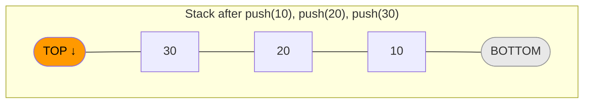
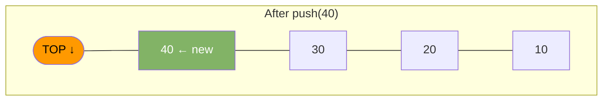
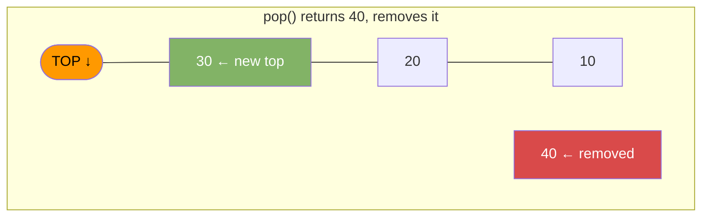

# Stack

A stack stores items in LIFO order. Last in, first out. Think of a stack of plates — add to the top, remove from the top.

---

## Operations

| Operation  | Description                    | Time |
|------------|--------------------------------|------|
| push(x)    | Add x to the top               | O(1) |
| pop()      | Remove and return top item     | O(1) |
| peek()     | Read top item without removing | O(1) |
| isEmpty()  | True if stack has no items     | O(1) |

---

## Diagram



### push(40)



### pop()



---

## Java Implementation

Use `ArrayDeque`. Avoid `java.util.Stack` — it is synchronized and slow.

```java
import java.util.ArrayDeque;
import java.util.Deque;

Deque<Integer> stack = new ArrayDeque<>();

stack.push(10);
stack.push(20);
stack.push(30);

int top     = stack.peek();    // 30 — no removal
int removed = stack.pop();     // 30 — removes it
boolean empty = stack.isEmpty(); // false
int size    = stack.size();    // 2
```

### Manual Implementation

```java
public class Stack<T> {
    private Object[] items;
    private int top;

    Stack(int capacity) {
        items = new Object[capacity];
        top = -1;
    }

    void push(T item) {
        if (top == items.length - 1) throw new RuntimeException("Stack full");
        items[++top] = item;
    }

    @SuppressWarnings("unchecked")
    T pop() {
        if (isEmpty()) throw new RuntimeException("Stack empty");
        return (T) items[top--];
    }

    @SuppressWarnings("unchecked")
    T peek() {
        if (isEmpty()) throw new RuntimeException("Stack empty");
        return (T) items[top];
    }

    boolean isEmpty() { return top == -1; }
    int size()        { return top + 1; }
}
```

---

## Common Use Cases

| Use Case                    | How Stack Helps                              |
|-----------------------------|----------------------------------------------|
| Function call tracking      | Runtime call stack — each frame is a push    |
| Undo / redo                 | Push actions, pop to undo                    |
| Balanced parentheses        | Push open brackets, pop and match on close   |
| Browser back button         | Push each page, pop to go back               |
| DFS graph traversal         | Push nodes to visit, pop to process          |
| Expression evaluation       | Postfix evaluation uses a stack              |

---

## Example — Balanced Parentheses

```java
boolean isBalanced(String s) {
    Deque<Character> stack = new ArrayDeque<>();
    for (char c : s.toCharArray()) {
        if (c == '(' || c == '[' || c == '{') {
            stack.push(c);
        } else {
            if (stack.isEmpty()) return false;
            char top = stack.pop();
            if (c == ')' && top != '(') return false;
            if (c == ']' && top != '[') return false;
            if (c == '}' && top != '{') return false;
        }
    }
    return stack.isEmpty();
}
```
