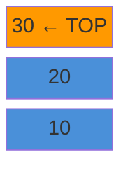
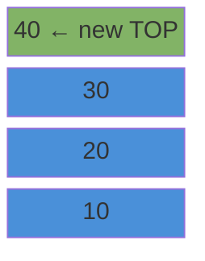

# Stack

A LIFO structure. Last item in is the first item out.

---

## Intuition

Think of a stack of plates. You add a plate to the top. You take a plate from the top. You can never reach the bottom without removing everything above it first.

---

## Operations

| Operation | Description | Time |
|-----------|-------------|------|
| push(x) | Add x to the top | O(1) |
| pop() | Remove and return the top item | O(1) |
| peek() | Read the top item without removing | O(1) |
| isEmpty() | True if the stack has no items | O(1) |

---

## Sample Input

```
push(10), push(20), push(30), push(40), pop()
```

---

## Visual Representation

**After push(10), push(20), push(30):**



**After push(40):**



**After pop() — returns 40:**


---

## Step-by-step Trace

Input: `push(10), push(20), push(30), push(40), peek(), pop()`

| Step | Operation | Stack (bottom → top) | Returns |
|------|-----------|----------------------|---------|
| 1 | push(10) | [10] | — |
| 2 | push(20) | [10, 20] | — |
| 3 | push(30) | [10, 20, 30] | — |
| 4 | push(40) | [10, 20, 30, 40] | — |
| 5 | peek() | [10, 20, 30, 40] | 40 |
| 6 | pop() | [10, 20, 30] | 40 |

---

## Java Implementation

Use `ArrayDeque`. Never use `java.util.Stack` — it is synchronized and slow.

```java
Deque<Integer> stack = new ArrayDeque<>();

stack.push(10);
stack.push(20);
stack.push(30);
stack.push(40);

int top   = stack.peek();  // 40 — no removal
int val   = stack.pop();   // 40 — removes it
boolean e = stack.isEmpty(); // false
int size  = stack.size();  // 3
```

### Build Your Own Stack

```java
class Stack<T> {
    private final Object[] items;
    private int top = -1;

    Stack(int capacity) { items = new Object[capacity]; }

    // Time: O(1)
    void push(T item) {
        if (top == items.length - 1) throw new RuntimeException("Stack full");
        items[++top] = item;
    }

    // Time: O(1)
    @SuppressWarnings("unchecked")
    T pop() {
        if (isEmpty()) throw new RuntimeException("Stack empty");
        return (T) items[top--];
    }

    // Time: O(1)
    @SuppressWarnings("unchecked")
    T peek() {
        if (isEmpty()) throw new RuntimeException("Stack empty");
        return (T) items[top];
    }

    boolean isEmpty() { return top == -1; }
    int size()        { return top + 1; }
}
```

### Pattern — Balanced Parentheses

```java
// Time: O(n)  Space: O(n)
boolean isBalanced(String s) {
    Deque<Character> stack = new ArrayDeque<>();
    for (char c : s.toCharArray()) {
        if (c == '(' || c == '[' || c == '{') {
            stack.push(c);
        } else {
            if (stack.isEmpty()) return false;
            char top = stack.pop();
            if (c == ')' && top != '(') return false;
            if (c == ']' && top != '[') return false;
            if (c == '}' && top != '{') return false;
        }
    }
    return stack.isEmpty();
}
```

---

## Common Mistakes

- **Calling pop() or peek() on an empty stack.** Always check `isEmpty()` first.
- **Using `java.util.Stack`.** It extends `Vector`, is thread-synchronized, and has poor performance. Use `ArrayDeque` instead.
- **Confusing peek() and pop().** `peek()` reads without removing. `pop()` removes. Using `pop()` when you meant `peek()` destroys the top element.
- **Forgetting the stack is empty at the end.** For balanced parentheses, the stack must be empty after processing all characters — not just non-empty at no point.

---

## Practice Problems

| Difficulty | Problem | Link |
|------------|---------|------|
| Easy | Valid Parentheses | [LeetCode 20](https://leetcode.com/problems/valid-parentheses/) |
| Medium | Min Stack | [LeetCode 155](https://leetcode.com/problems/min-stack/) |
| Medium | Daily Temperatures | [LeetCode 739](https://leetcode.com/problems/daily-temperatures/) |

---

## Deep Dive

### Where Stacks Appear in Real Systems

| Use Case | How Stack Helps |
|----------|----------------|
| Function call tracking | The CPU call stack — each function call is a push, each return is a pop |
| Undo / redo | Push actions, pop to undo |
| Browser back button | Push each page visited, pop to go back |
| DFS traversal | Push nodes to visit, pop to process next |
| Expression evaluation | Postfix (Reverse Polish Notation) uses a stack |

### Why ArrayDeque Beats java.util.Stack

`java.util.Stack` extends `Vector`, which synchronizes every method with a mutex lock. In single-threaded code (most interview problems and most app code) you pay the lock cost for no benefit. `ArrayDeque` has the same O(1) push/pop with no locking overhead.
