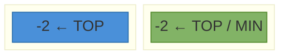
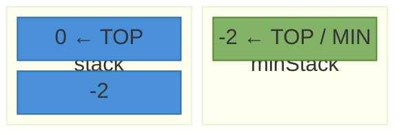
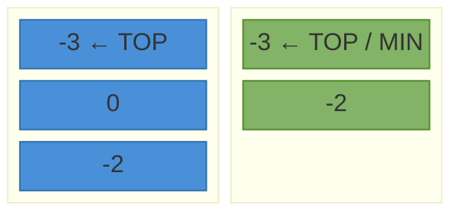
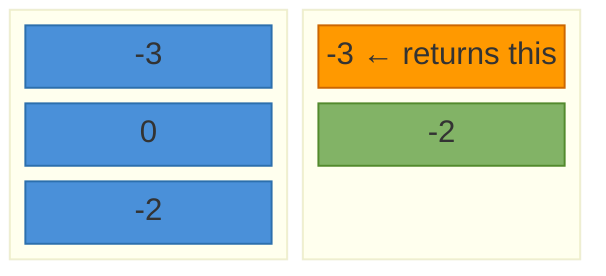
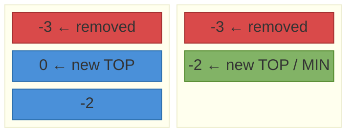
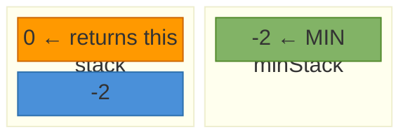
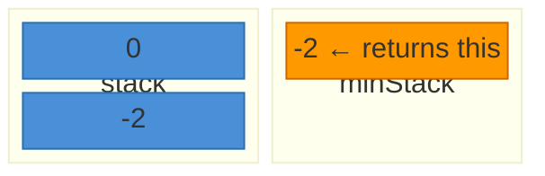

# MinStack

Design a stack that supports push, pop, top, and `getMin()` — all in O(1) time.

---

## Operations

| Method    | Description                             | Time |
|-----------|-----------------------------------------|------|
| push(val) | Push val onto the stack                 | O(1) |
| pop()     | Remove the top element                  | O(1) |
| top()     | Return the top element                  | O(1) |
| getMin()  | Return the minimum element in the stack | O(1) |

---

## The Problem with a Single Stack

`getMin()` on a plain stack requires scanning every element — O(n). When you pop the current minimum, you must know the *previous* minimum. A single stack cannot recall that.

---

## Solution — Two Stacks

Run two stacks in parallel:

- **`stack`** — holds all values, behaves like a normal stack.
- **`minStack`** — tracks the minimum at each state. Push only when new value ≤ current minimum. Pop only when the popped value equals the current minimum.

`getMin()` reads the top of `minStack` — always O(1).

---

## Step-by-Step: push(-2), push(0), push(-3), getMin, pop, top, getMin

### Step 1 — `push(-2)`

`-2` is the first element. Both stacks are empty, so push to both.



---

### Step 2 — `push(0)`

`0 > -2` (current min). Push to `stack` only. `minStack` unchanged.



> Minimum is still `-2`.

---

### Step 3 — `push(-3)`

`-3 ≤ -2` (current min). Push to both stacks.



---

### Step 4 — `getMin()` → `-3`

Read top of `minStack`. No modification to either stack.



---

### Step 5 — `pop()` removes `-3`

`-3` equals top of `minStack` — pop both stacks.



> `minStack` restores the previous minimum: `-2`.

---

### Step 6 — `top()` → `0`

Read top of `stack`. No modification.



---

### Step 7 — `getMin()` → `-2`

Read top of `minStack`. Returns `-2`.



---

## Java Implementation

```java
import java.util.ArrayDeque;
import java.util.Deque;

class MinStack {
    private Deque<Integer> stack    = new ArrayDeque<>();
    private Deque<Integer> minStack = new ArrayDeque<>();

    void push(int val) {
        stack.push(val);
        if (minStack.isEmpty() || val <= minStack.peek()) {
            minStack.push(val);
        }
    }

    void pop() {
        int val = stack.pop();
        if (val == minStack.peek()) {
            minStack.pop();
        }
    }

    int top() {
        return stack.peek();
    }

    int getMin() {
        return minStack.peek();
    }
}
```

---

## Usage

```java
MinStack minStack = new MinStack();
minStack.push(-2);
minStack.push(0);
minStack.push(-3);
System.out.println(minStack.getMin()); // -3
minStack.pop();
System.out.println(minStack.top());    // 0
System.out.println(minStack.getMin()); // -2
```

**Output:**
```
-3
0
-2
```

---

## Why `≤` and Not `<` in Push

Using `<` means duplicate minimums skip `minStack`. If the minimum is popped, the previous copy is gone.

```
push(2), push(2) — min is 2
pop()            — removes one 2
getMin()         — should still return 2, but minStack is empty if < was used
```

Always use `≤` to handle duplicates correctly.

---

## Edge Cases

| Case                          | Behaviour                                       |
|-------------------------------|-------------------------------------------------|
| Push duplicate minimum        | `≤` ensures both copies tracked in `minStack`   |
| Pop a non-minimum element     | Only `stack` pops, `minStack` unchanged         |
| Pop the only element          | Both stacks become empty                        |
| getMin on empty stack         | Undefined — guard with `isEmpty()` if needed    |
