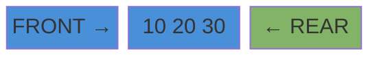
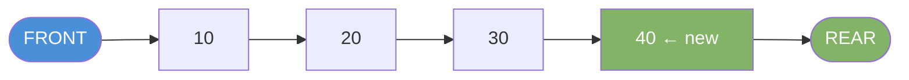
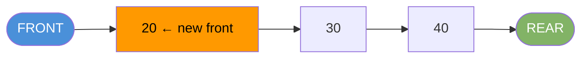

# Queue

A FIFO structure. First item in is the first item out.

---

## Intuition

Think of a line at a ticket counter. The first person in line gets served first. New people join at the back. Nobody cuts in.

---

## Operations

| Operation | Description | Time |
|-----------|-------------|------|
| enqueue(x) | Add x to the rear | O(1) |
| dequeue() | Remove and return the front item | O(1) |
| peek() | Read the front item without removing | O(1) |
| isEmpty() | True if the queue has no items | O(1) |

---

## Sample Input

```
enqueue(10), enqueue(20), enqueue(30), enqueue(40), dequeue()
```

---

## Visual Representation

**After enqueue(10), enqueue(20), enqueue(30):**



**After enqueue(40):**



**After dequeue() — removes 10:**



---

## Step-by-step Trace

Input: `enqueue(10), enqueue(20), enqueue(30), enqueue(40), peek(), dequeue()`

| Step | Operation | Queue (front → rear) | Returns |
|------|-----------|----------------------|---------|
| 1 | enqueue(10) | [10] | — |
| 2 | enqueue(20) | [10, 20] | — |
| 3 | enqueue(30) | [10, 20, 30] | — |
| 4 | enqueue(40) | [10, 20, 30, 40] | — |
| 5 | peek() | [10, 20, 30, 40] | 10 |
| 6 | dequeue() | [20, 30, 40] | 10 |

---

## Java Implementation

Use `ArrayDeque` as a `Queue`. Use `offer/poll/peek` — not `add/remove` (those throw exceptions instead of returning null).

```java
Queue<Integer> queue = new ArrayDeque<>();

queue.offer(10);
queue.offer(20);
queue.offer(30);
queue.offer(40);

int front = queue.peek();   // 10 — no removal
int val   = queue.poll();   // 10 — removes it
boolean e = queue.isEmpty(); // false
int size  = queue.size();   // 3
```

### Build Your Own Queue (Circular Array)

```java
class Queue<T> {
    private final Object[] items;
    private int front = 0, rear = -1, size = 0;
    private final int capacity;

    Queue(int capacity) {
        this.capacity = capacity;
        items = new Object[capacity];
    }

    // Time: O(1)
    void enqueue(T item) {
        if (size == capacity) throw new RuntimeException("Queue full");
        rear = (rear + 1) % capacity;
        items[rear] = item;
        size++;
    }

    // Time: O(1)
    @SuppressWarnings("unchecked")
    T dequeue() {
        if (isEmpty()) throw new RuntimeException("Queue empty");
        T item = (T) items[front];
        front = (front + 1) % capacity;
        size--;
        return item;
    }

    // Time: O(1)
    @SuppressWarnings("unchecked")
    T peek() {
        if (isEmpty()) throw new RuntimeException("Queue empty");
        return (T) items[front];
    }

    boolean isEmpty() { return size == 0; }
    int size()        { return size; }
}
```

### Priority Queue

Dequeues by priority, not arrival order. Default is min-heap (smallest first).

```java
PriorityQueue<Integer> pq = new PriorityQueue<>();
pq.offer(30);
pq.offer(10);
pq.offer(20);

int min = pq.poll(); // 10 — always the smallest
```

### Queue Variants

| Variant | Description | Java Class |
|---------|-------------|------------|
| Simple Queue | FIFO | `ArrayDeque` |
| Priority Queue | Dequeue by priority (min or max) | `PriorityQueue` |
| Deque | Insert and remove at both ends | `ArrayDeque` |
| Blocking Queue | Thread-safe, blocks on empty/full | `LinkedBlockingQueue` |

---

## Common Mistakes

- **Using `add/remove` instead of `offer/poll`.** `add` throws `IllegalStateException` when full. `offer` returns false. In interview code, `offer/poll` is safer.
- **Calling `poll()` on an empty queue returns `null`, not an exception.** Dereferencing that null causes a NullPointerException. Always check `isEmpty()` first.
- **Confusing queue with stack.** Queue removes from the front. Stack removes from the top (same end as insert). Drawing it out helps.
- **Using `LinkedList` as a queue.** It works but wastes memory with per-node pointers. `ArrayDeque` is faster and leaner.

---

## Practice Problems

| Difficulty | Problem | Link |
|------------|---------|------|
| Medium | Binary Tree Level Order Traversal | [LeetCode 102](https://leetcode.com/problems/binary-tree-level-order-traversal/) |
| Medium | Rotting Oranges | [LeetCode 994](https://leetcode.com/problems/rotting-oranges/) |
| Hard | Sliding Window Maximum | [LeetCode 239](https://leetcode.com/problems/sliding-window-maximum/) |

---

## Deep Dive

### Why a Circular Array?

A naive array queue shifts all elements left on every dequeue — O(n). A circular array uses two pointers (`front` and `rear`) and wraps around using modulo. Enqueue and dequeue both stay O(1) with no shifting.

### Where Queues Appear in Real Systems

| Use Case | Why Queue? |
|----------|------------|
| BFS traversal | Process nodes level by level |
| Task scheduling | Execute tasks in arrival order |
| Print spooler | First document sent prints first |
| Producer-consumer | Decouple production and consumption rates |
| Rate limiting | Buffer requests that exceed throughput |
