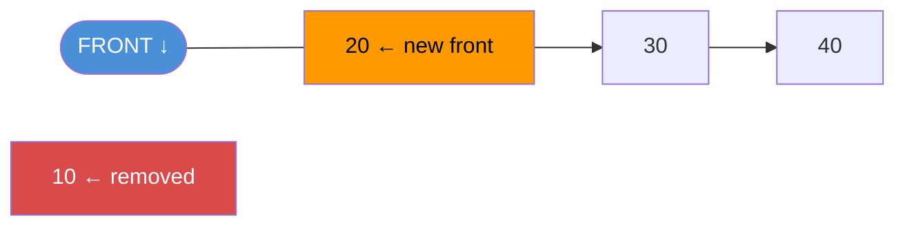

# Queue

A queue stores items in FIFO order. First in, first out. Think of a line at a counter — the first person in line gets served first.

---

## Operations

| Operation   | Description                      | Time |
|-------------|----------------------------------|------|
| enqueue(x)  | Add x to the rear                | O(1) |
| dequeue()   | Remove and return the front item | O(1) |
| peek()      | Read front item without removing | O(1) |
| isEmpty()   | True if queue has no items       | O(1) |

---

## Diagram


### enqueue(40)


### dequeue()



---

## Java Implementation

Use `ArrayDeque`. It implements `Deque` and serves as both a stack and a queue.

```java
import java.util.ArrayDeque;
import java.util.Queue;

Queue<Integer> queue = new ArrayDeque<>();

queue.offer(10);  // enqueue
queue.offer(20);
queue.offer(30);

int front   = queue.peek();   // 10 — no removal
int removed = queue.poll();   // 10 — removes it
boolean empty = queue.isEmpty(); // false
int size    = queue.size();   // 2
```

### Manual Implementation (Circular Array)

```java
public class Queue<T> {
    private Object[] items;
    private int front, rear, size, capacity;

    Queue(int capacity) {
        this.capacity = capacity;
        items = new Object[capacity];
        front = 0;
        rear = -1;
        size = 0;
    }

    void enqueue(T item) {
        if (size == capacity) throw new RuntimeException("Queue full");
        rear = (rear + 1) % capacity;
        items[rear] = item;
        size++;
    }

    @SuppressWarnings("unchecked")
    T dequeue() {
        if (isEmpty()) throw new RuntimeException("Queue empty");
        T item = (T) items[front];
        front = (front + 1) % capacity;
        size--;
        return item;
    }

    @SuppressWarnings("unchecked")
    T peek() {
        if (isEmpty()) throw new RuntimeException("Queue empty");
        return (T) items[front];
    }

    boolean isEmpty() { return size == 0; }
    int size()        { return size; }
}
```

---

## Queue Variants

| Variant         | Description                                   | Java Class          |
|-----------------|-----------------------------------------------|---------------------|
| Simple Queue    | FIFO                                          | `ArrayDeque`        |
| Priority Queue  | Dequeue by priority (min or max)              | `PriorityQueue`     |
| Deque           | Insert and remove at both ends                | `ArrayDeque`        |
| Blocking Queue  | Thread-safe, blocks on empty/full             | `LinkedBlockingQueue` |

---

## Priority Queue Example

```java
import java.util.PriorityQueue;

PriorityQueue<Integer> minHeap = new PriorityQueue<>();
minHeap.offer(30);
minHeap.offer(10);
minHeap.offer(20);

int min = minHeap.poll(); // 10 — always removes smallest
```

---

## Common Use Cases

| Use Case                       | Why Queue?                                 |
|--------------------------------|--------------------------------------------|
| BFS graph traversal            | Process nodes level by level               |
| Task scheduling                | Execute tasks in arrival order             |
| Print spooler                  | First document sent prints first           |
| Producer-consumer problems     | Decouple production and consumption rates  |
| Cache replacement (LRU)        | Deque tracks recently used order           |
