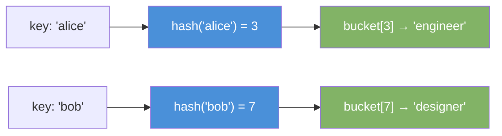
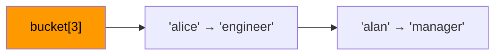

# Hash Map

A hash map stores key-value pairs. It maps a key to a value using a hash function. Lookup, insert, and delete all run in O(1) on average.

---

## How It Works

1. You provide a key (e.g. `"name"`).
2. A hash function converts the key to an integer index.
3. The value stores at that index in an internal array (called a bucket array).
4. On lookup, the same hash function finds the index instantly.



---

## Collision

Two keys can hash to the same index. This is a collision.

**Chaining** — each bucket holds a linked list. Multiple entries share one bucket.



**Open Addressing** — probe the next available bucket when a collision occurs.

---

## Operations

| Operation   | Average | Worst Case | Notes                         |
|-------------|---------|------------|-------------------------------|
| get(key)    | O(1)    | O(n)       | Worst case on many collisions |
| put(key, v) | O(1)    | O(n)       | Triggers resize at load factor|
| remove(key) | O(1)    | O(n)       |                               |
| containsKey | O(1)    | O(n)       |                               |

---

## Java Implementation

```java
import java.util.HashMap;
import java.util.Map;

Map<String, Integer> scores = new HashMap<>();

scores.put("alice", 95);
scores.put("bob", 82);
scores.put("carol", 91);

int score  = scores.get("alice");          // 95
boolean has = scores.containsKey("bob");   // true
scores.remove("carol");

// Default value if key missing
int val = scores.getOrDefault("dave", 0); // 0

// Iterate entries
for (Map.Entry<String, Integer> entry : scores.entrySet()) {
    System.out.println(entry.getKey() + " → " + entry.getValue());
}
```

### Frequency Count Pattern

```java
int[] freq(int[] nums) {
    Map<Integer, Integer> count = new HashMap<>();
    for (int n : nums) {
        count.put(n, count.getOrDefault(n, 0) + 1);
    }
    return count;
}
```

---

## Load Factor and Resize

Java's `HashMap` resizes when load factor exceeds **0.75**.

```
load factor = number of entries / number of buckets
```

When full, it doubles the bucket array and rehashes all keys. This costs O(n) but happens rarely, so amortized insert stays O(1).

---

## HashMap vs LinkedHashMap vs TreeMap

| Class           | Order         | Time      | Use When                          |
|-----------------|---------------|-----------|-----------------------------------|
| `HashMap`       | None          | O(1)*     | Fast lookup, order doesn't matter |
| `LinkedHashMap` | Insertion order| O(1)*    | Need insertion order preserved    |
| `TreeMap`       | Sorted by key | O(log n)  | Need keys in sorted order         |

---

## Common Use Cases

| Use Case                   | Pattern                                      |
|----------------------------|----------------------------------------------|
| Count element frequency    | `map.getOrDefault(k, 0) + 1`                 |
| Cache / memoization        | Store computed results by input key          |
| Graph adjacency list       | `Map<Node, List<Node>>`                      |
| Deduplication              | Use map to track seen elements               |
| Two-sum problem            | Store complement → index                     |
