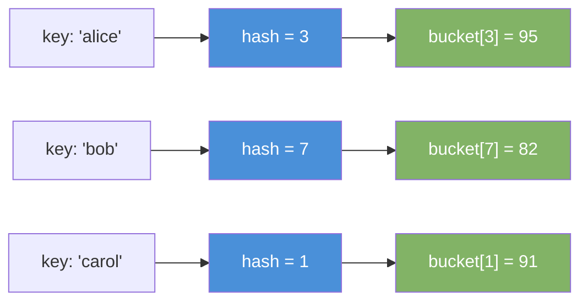
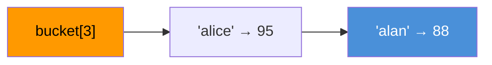

# Hash Map

Stores key-value pairs. Lookup, insert, and delete all run in O(1) on average.

---

## Intuition

A hash map is a dictionary. You look up a word (key) and get its definition (value) instantly. Under the hood, a hash function converts the key to an array index. That index tells you exactly where the value lives — no searching needed.

---

## Operations

| Operation | Average | Worst Case | Notes |
|-----------|---------|------------|-------|
| get(key) | O(1) | O(n) | Worst case on many collisions |
| put(key, val) | O(1) | O(n) | May trigger resize |
| remove(key) | O(1) | O(n) | |
| containsKey(key) | O(1) | O(n) | |

---

## Sample Input

```
put("alice", 95)
put("bob", 82)
put("carol", 91)
get("alice")
```

---

## Visual Representation

**Key → hash function → bucket:**



**Collision — two keys hash to the same bucket (chaining):**



---

## Step-by-step Trace

Input: `put("alice", 95), put("bob", 82), put("carol", 91), get("alice")`

| Step | Operation | Key | Value | Map state |
|------|-----------|-----|-------|-----------|
| 1 | put | "alice" | 95 | {alice=95} |
| 2 | put | "bob" | 82 | {alice=95, bob=82} |
| 3 | put | "carol" | 91 | {alice=95, bob=82, carol=91} |
| 4 | get | "alice" | — | hash("alice") → bucket[3] → **95** |

---

## Java Implementation

```java
Map<String, Integer> scores = new HashMap<>();

scores.put("alice", 95);
scores.put("bob", 82);
scores.put("carol", 91);

int score   = scores.get("alice");          // 95
boolean has = scores.containsKey("bob");    // true
scores.remove("carol");
int val     = scores.getOrDefault("dave", 0); // 0 — key missing

// Iterate all entries
for (Map.Entry<String, Integer> e : scores.entrySet())
    System.out.println(e.getKey() + " → " + e.getValue());

// Iterate keys only
for (String key : scores.keySet())
    System.out.println(key);
```

### Frequency Count Pattern

```java
// Time: O(n)  Space: O(n)
Map<Integer, Integer> count = new HashMap<>();
for (int n : nums)
    count.put(n, count.getOrDefault(n, 0) + 1);
```

### Map Variants

| Class | Order | Time | Use when |
|-------|-------|------|----------|
| `HashMap` | None | O(1)* | Fast lookup, order doesn't matter |
| `LinkedHashMap` | Insertion order | O(1)* | Need insertion order preserved |
| `TreeMap` | Sorted by key | O(log n) | Need keys in sorted order |

---

## Common Mistakes

- **Calling `get()` on a missing key returns `null`, not an exception.** Auto-unboxing `null` to `int` throws NullPointerException. Use `getOrDefault` or check `containsKey` first.
- **Using mutable objects as keys.** If you change the key after inserting it, the hash changes and you can never find the entry again. Use immutable keys (String, Integer).
- **Expecting a specific iteration order.** `HashMap` gives no order guarantee. Use `LinkedHashMap` for insertion order or `TreeMap` for sorted order.
- **Forgetting worst-case is O(n).** Many collisions (e.g. a crafted input with the same hash) degrade every operation to O(n). Java 8+ converts long chains to red-black trees to cap this at O(log n).

---

## Practice Problems

| Difficulty | Problem | Link |
|------------|---------|------|
| Easy | Two Sum | [LeetCode 1](https://leetcode.com/problems/two-sum/) |
| Medium | Group Anagrams | [LeetCode 49](https://leetcode.com/problems/group-anagrams/) |
| Medium | Longest Consecutive Sequence | [LeetCode 128](https://leetcode.com/problems/longest-consecutive-sequence/) |

---

## Deep Dive

### How the Hash Function Works

Java calls `key.hashCode()` then applies a secondary mix to spread bits. The bucket index is `(hash ^ (hash >>> 16)) & (capacity - 1)`. Capacity is always a power of 2, so the `& (capacity - 1)` replaces a slow modulo operation.

### Load Factor and Resize

Java's `HashMap` resizes when the number of entries exceeds `capacity × 0.75`. It doubles the array and rehashes every key into the new positions. This costs O(n) but happens so rarely that insert stays O(1) amortized.

### Java 8 Treeification

When a single bucket's chain exceeds 8 entries, Java converts it from a linked list to a red-black tree. Worst-case lookup in that bucket drops from O(n) to O(log n). This protects against hash-collision attacks.
