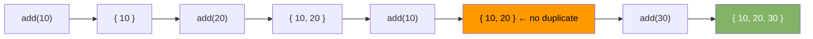

# Hash Set

A hash set stores unique elements. It has no duplicates and no key-value pairs — just values. Backed by a hash map internally.

---

## Operations

| Operation      | Average | Worst | Notes                    |
|----------------|---------|-------|--------------------------|
| add(x)         | O(1)    | O(n)  | No-op if x already exists|
| remove(x)      | O(1)    | O(n)  |                          |
| contains(x)    | O(1)    | O(n)  | Membership test          |
| size()         | O(1)    | —     |                          |

---

## Diagram



---

## Java Implementation

```java
import java.util.HashSet;
import java.util.Set;

Set<Integer> seen = new HashSet<>();

seen.add(10);
seen.add(20);
seen.add(10);  // ignored — already present

boolean has = seen.contains(20);  // true
seen.remove(10);
int size = seen.size();           // 1
```

### Set Operations

```java
Set<Integer> a = new HashSet<>(Set.of(1, 2, 3, 4));
Set<Integer> b = new HashSet<>(Set.of(3, 4, 5, 6));

// Union
Set<Integer> union = new HashSet<>(a);
union.addAll(b);           // {1, 2, 3, 4, 5, 6}

// Intersection
Set<Integer> intersect = new HashSet<>(a);
intersect.retainAll(b);    // {3, 4}

// Difference
Set<Integer> diff = new HashSet<>(a);
diff.removeAll(b);         // {1, 2}
```

---

## HashSet vs LinkedHashSet vs TreeSet

| Class           | Order          | Time      | Use When                          |
|-----------------|----------------|-----------|-----------------------------------|
| `HashSet`       | None           | O(1)*     | Fast membership, order irrelevant |
| `LinkedHashSet` | Insertion order| O(1)*     | Need insertion order              |
| `TreeSet`       | Sorted         | O(log n)  | Need elements in sorted order     |

---

## Common Use Cases

| Use Case                      | Why Set?                                  |
|-------------------------------|-------------------------------------------|
| Deduplication                 | Add all elements, duplicates drop         |
| Visited tracking (BFS/DFS)    | O(1) check if node was already visited    |
| Anagram / character check     | Track characters seen                     |
| Intersection of two lists     | Convert both to sets, call retainAll      |
| Longest consecutive sequence  | Put all in set, probe sequences in O(1)   |

---

## Example — Find Duplicates

```java
int[] findDuplicates(int[] nums) {
    Set<Integer> seen = new HashSet<>();
    List<Integer> duplicates = new ArrayList<>();
    for (int n : nums) {
        if (!seen.add(n)) {  // add returns false if already present
            duplicates.add(n);
        }
    }
    return duplicates.stream().mapToInt(i -> i).toArray();
}
```

## Example — First Non-Repeating Character

```java
char firstUnique(String s) {
    Map<Character, Integer> count = new LinkedHashMap<>();
    for (char c : s.toCharArray()) {
        count.merge(c, 1, Integer::sum);
    }
    for (Map.Entry<Character, Integer> e : count.entrySet()) {
        if (e.getValue() == 1) return e.getKey();
    }
    return '\0';
}
```
