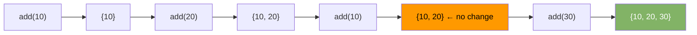

# Hash Set

Stores unique values. No duplicates. No key-value pairs — just values.

---

## Intuition

A hash set is a hash map where only the keys matter. Adding the same value twice has no effect. The main use: fast membership testing — "have I seen this before?"

---

## Operations

| Operation | Average | Worst | Notes |
|-----------|---------|-------|-------|
| add(x) | O(1) | O(n) | No-op if x already exists |
| remove(x) | O(1) | O(n) | |
| contains(x) | O(1) | O(n) | Membership test |
| size() | O(1) | — | |

---

## Sample Input

```
add(10), add(20), add(10), add(30), contains(20), remove(10)
```

---

## Visual Representation



---

## Step-by-step Trace

Input: `add(10), add(20), add(10), add(30), contains(20), remove(10)`

| Step | Operation | Set state | Returns | Notes |
|------|-----------|-----------|---------|-------|
| 1 | add(10) | {10} | true | Added |
| 2 | add(20) | {10, 20} | true | Added |
| 3 | add(10) | {10, 20} | false | Already present — ignored |
| 4 | add(30) | {10, 20, 30} | true | Added |
| 5 | contains(20) | {10, 20, 30} | **true** | Found |
| 6 | remove(10) | {20, 30} | true | Removed |

---

## Java Implementation

```java
Set<Integer> seen = new HashSet<>();

seen.add(10);
seen.add(20);
seen.add(10); // ignored

boolean has  = seen.contains(20); // true
seen.remove(10);
int size     = seen.size();       // 1
```

### Set Operations

```java
Set<Integer> a = new HashSet<>(Set.of(1, 2, 3, 4));
Set<Integer> b = new HashSet<>(Set.of(3, 4, 5, 6));

// Union — all elements from both
Set<Integer> union = new HashSet<>(a);
union.addAll(b);        // {1, 2, 3, 4, 5, 6}

// Intersection — elements in both
Set<Integer> inter = new HashSet<>(a);
inter.retainAll(b);     // {3, 4}

// Difference — in a but not b
Set<Integer> diff = new HashSet<>(a);
diff.removeAll(b);      // {1, 2}
```

### Pattern — Find Duplicates

```java
// Time: O(n)  Space: O(n)
List<Integer> findDuplicates(int[] nums) {
    Set<Integer> seen = new HashSet<>();
    List<Integer> dupes = new ArrayList<>();
    for (int n : nums)
        if (!seen.add(n)) dupes.add(n); // add returns false if already present
    return dupes;
}
```

### Set Variants

| Class | Order | Time | Use when |
|-------|-------|------|----------|
| `HashSet` | None | O(1)* | Fast membership, order irrelevant |
| `LinkedHashSet` | Insertion order | O(1)* | Need insertion order preserved |
| `TreeSet` | Sorted | O(log n) | Need elements in sorted order |

---

## Common Mistakes

- **`add()` returns false for duplicates — not an exception.** Check the return value when you care whether the element was new.
- **`HashSet` has no guaranteed order.** Never rely on iteration order. Use `LinkedHashSet` or `TreeSet` if order matters.
- **Using mutable objects as elements.** If an object's `hashCode` changes after insertion, `contains` can no longer find it.
- **Forgetting `equals`/`hashCode` for custom objects.** Two objects that are logically equal but have different `hashCode` values are treated as different set entries.

---

## Practice Problems

| Difficulty | Problem | Link |
|------------|---------|------|
| Easy | Contains Duplicate | [LeetCode 217](https://leetcode.com/problems/contains-duplicate/) |
| Medium | Longest Consecutive Sequence | [LeetCode 128](https://leetcode.com/problems/longest-consecutive-sequence/) |
| Medium | Intersection of Two Arrays | [LeetCode 349](https://leetcode.com/problems/intersection-of-two-arrays/) |

---

## Deep Dive

### How HashSet Uses HashMap Internally

Java's `HashSet<E>` is literally a `HashMap<E, Object>` with a dummy `PRESENT` value. Every `add(x)` calls `map.put(x, PRESENT)`. Every `contains(x)` calls `map.containsKey(x)`. The set semantics come for free from the map's key-uniqueness guarantee.

### When to Use Set vs Map

Use a set when you only need to track existence. Use a map when you need to associate additional data with each key (count, index, value). A frequency counter needs a map; a visited-nodes tracker needs a set.
