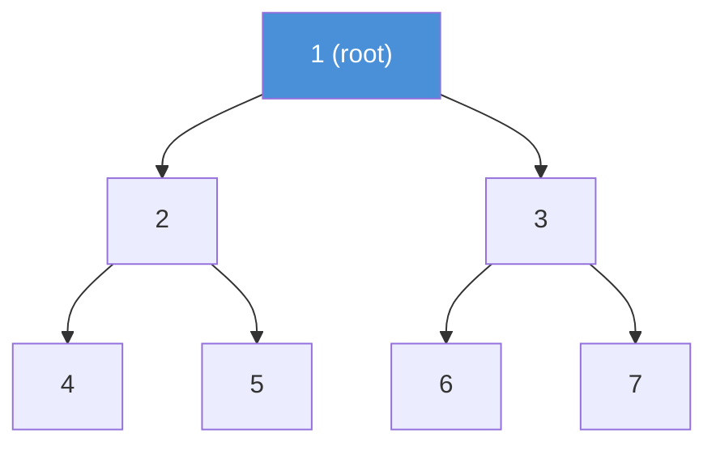

# Binary Tree

A tree where each node has at most two children — a left child and a right child.

---

## Intuition

A binary tree is a family tree. One root at the top. Each person has at most two children. You reach any node by walking down from the root — left or right at each step.

---

## Operations

| Operation | Time | Notes |
|-----------|------|-------|
| Search | O(n) | Must check every node |
| Insert | O(n) | Find position first |
| Delete | O(n) | Find node first |
| Traversal | O(n) | Visits every node once |
| Height | O(n) | Visits every node once |

---

## Sample Input

```
Tree:
        1
       / \
      2   3
     / \ / \
    4  5 6  7
```

---

## Visual Representation



---

## Step-by-step Trace — Inorder Traversal

Input: tree above. Inorder visits: Left → Root → Right.

```java
// Time: O(n)  Space: O(h) where h = height
void inorder(TreeNode node) {
    if (node == null) return;
    inorder(node.left);
    System.out.print(node.val + " ");
    inorder(node.right);
}
```

| Step | Node | Action | Output so far |
|------|------|--------|---------------|
| 1 | 1 | go left → 2 | |
| 2 | 2 | go left → 4 | |
| 3 | 4 | go left → null, **visit 4**, go right → null | 4 |
| 4 | 2 | **visit 2** | 4 2 |
| 5 | 5 | go left → null, **visit 5**, go right → null | 4 2 5 |
| 6 | 1 | **visit 1** | 4 2 5 1 |
| 7 | 3 | go left → 6 → **visit 6** | 4 2 5 1 6 |
| 8 | 3 | **visit 3** | 4 2 5 1 6 3 |
| 9 | 7 | go left → null, **visit 7** | **4 2 5 1 6 3 7** |

---

## Java Implementation

### Node Structure

```java
class TreeNode {
    int val;
    TreeNode left, right;
    TreeNode(int val) { this.val = val; }
}
```

### Build the Sample Tree

```java
TreeNode root = new TreeNode(1);
root.left        = new TreeNode(2);
root.right       = new TreeNode(3);
root.left.left   = new TreeNode(4);
root.left.right  = new TreeNode(5);
root.right.left  = new TreeNode(6);
root.right.right = new TreeNode(7);
```

### Three DFS Traversals

```java
void inorder(TreeNode n)   { if (n==null) return; inorder(n.left); visit(n); inorder(n.right); }
void preorder(TreeNode n)  { if (n==null) return; visit(n); preorder(n.left); preorder(n.right); }
void postorder(TreeNode n) { if (n==null) return; postorder(n.left); postorder(n.right); visit(n); }
```

| Traversal | Order | Output on sample | Use |
|-----------|-------|------------------|-----|
| Inorder | Left, Root, Right | 4 2 5 1 6 3 7 | Sorted output on BST |
| Preorder | Root, Left, Right | 1 2 4 5 3 6 7 | Copy or serialize tree |
| Postorder | Left, Right, Root | 4 5 2 6 7 3 1 | Delete tree, eval expressions |

### Level Order (BFS)

```java
// Time: O(n)  Space: O(n)
void levelOrder(TreeNode root) {
    if (root == null) return;
    Queue<TreeNode> q = new ArrayDeque<>();
    q.offer(root);
    while (!q.isEmpty()) {
        TreeNode node = q.poll();
        System.out.print(node.val + " ");
        if (node.left  != null) q.offer(node.left);
        if (node.right != null) q.offer(node.right);
    }
}
// Output: 1 2 3 4 5 6 7
```

### Height and Size

```java
// Time: O(n)  Space: O(h)
int height(TreeNode node) {
    if (node == null) return 0;
    return 1 + Math.max(height(node.left), height(node.right));
}

int size(TreeNode node) {
    if (node == null) return 0;
    return 1 + size(node.left) + size(node.right);
}
```

### Types of Binary Trees

| Type | Rule |
|------|------|
| Full | Every node has 0 or 2 children |
| Complete | All levels full except last; last fills left to right |
| Perfect | All internal nodes have 2 children; all leaves same level |
| Balanced | Height difference between subtrees ≤ 1 at every node |
| Degenerate | Every node has one child — acts like a linked list |

---

## Common Mistakes

- **Not handling `null` nodes.** Every recursive traversal must start with `if (node == null) return;`.
- **Confusing height and depth.** Height is measured from a node down to the farthest leaf. Depth is measured from the root down to the node.
- **Confusing inorder, preorder, postorder.** Draw the tree and trace by hand when unsure.
- **Level order needs a queue, not a stack.** A common error is using a stack for BFS — that gives DFS instead.

---

## Practice Problems

| Difficulty | Problem | Link |
|------------|---------|------|
| Easy | Maximum Depth of Binary Tree | [LeetCode 104](https://leetcode.com/problems/maximum-depth-of-binary-tree/) |
| Easy | Invert Binary Tree | [LeetCode 226](https://leetcode.com/problems/invert-binary-tree/) |
| Medium | Binary Tree Level Order Traversal | [LeetCode 102](https://leetcode.com/problems/binary-tree-level-order-traversal/) |

---

## Deep Dive

### Why O(n) for All Operations?

A plain binary tree has no ordering rule. To find a value, you may need to check every node. This is why BSTs and AVL trees add ordering rules — to make search O(log n).

### Recursive Call Stack Space

Each recursive call uses O(1) stack space. The total depth equals the tree height h. For a balanced tree h = O(log n). For a degenerate tree h = O(n). This is why height matters: a degenerate tree blows the call stack on large inputs.
