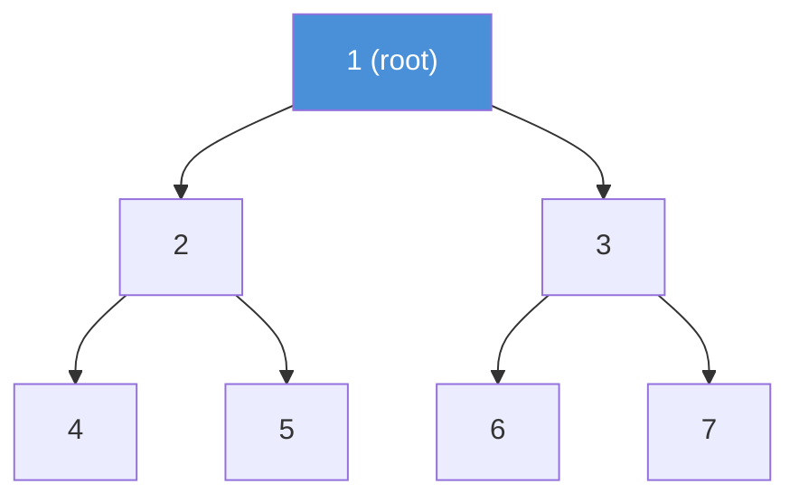
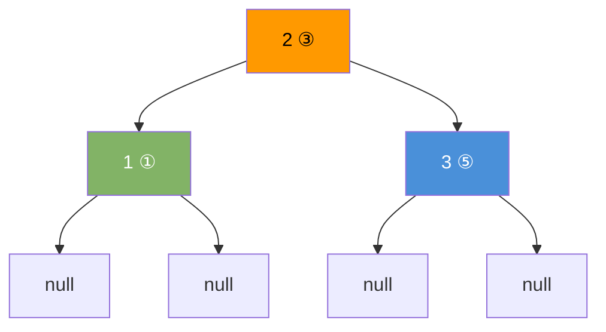

# Binary Tree

A binary tree is a tree where each node has at most two children — a left child and a right child.

---

## Node Structure

```java
class TreeNode {
    int val;
    TreeNode left;
    TreeNode right;

    TreeNode(int val) {
        this.val = val;
    }
}
```

---

## Diagram



---

## Types of Binary Trees

| Type             | Rule                                                   |
|------------------|--------------------------------------------------------|
| Full             | Every node has 0 or 2 children                         |
| Complete         | All levels full except last; last level fills left     |
| Perfect          | All internal nodes have 2 children; all leaves same level |
| Balanced         | Height difference between subtrees ≤ 1 at every node  |
| Degenerate       | Every node has one child — behaves like a linked list  |

---

## Tree Traversals

Three main ways to visit every node. Order of visiting differs.

### Inorder — Left, Root, Right

Visits nodes in ascending order for a BST.



```java
void inorder(TreeNode node) {
    if (node == null) return;
    inorder(node.left);
    System.out.print(node.val + " ");  // visit
    inorder(node.right);
}
// Output for tree above: 1 2 3
```

### Preorder — Root, Left, Right

Useful for copying or serializing a tree.

```java
void preorder(TreeNode node) {
    if (node == null) return;
    System.out.print(node.val + " ");  // visit
    preorder(node.left);
    preorder(node.right);
}
// Output: 2 1 3
```

### Postorder — Left, Right, Root

Useful for deletion or evaluating expression trees.

```java
void postorder(TreeNode node) {
    if (node == null) return;
    postorder(node.left);
    postorder(node.right);
    System.out.print(node.val + " ");  // visit
}
// Output: 1 3 2
```

### Level Order (BFS) — Level by Level

```java
import java.util.ArrayDeque;
import java.util.Queue;

void levelOrder(TreeNode root) {
    if (root == null) return;
    Queue<TreeNode> queue = new ArrayDeque<>();
    queue.offer(root);
    while (!queue.isEmpty()) {
        TreeNode node = queue.poll();
        System.out.print(node.val + " ");
        if (node.left  != null) queue.offer(node.left);
        if (node.right != null) queue.offer(node.right);
    }
}
// Output: 1 2 3 4 5 6 7
```

---

## Height and Size

```java
int height(TreeNode node) {
    if (node == null) return 0;
    return 1 + Math.max(height(node.left), height(node.right));
}

int size(TreeNode node) {
    if (node == null) return 0;
    return 1 + size(node.left) + size(node.right);
}
```

---

## Build a Tree

```java
TreeNode root = new TreeNode(1);
root.left       = new TreeNode(2);
root.right      = new TreeNode(3);
root.left.left  = new TreeNode(4);
root.left.right = new TreeNode(5);
root.right.left = new TreeNode(6);
root.right.right= new TreeNode(7);
```

---

## Complexity

| Operation     | Average  | Worst (Degenerate) |
|---------------|----------|--------------------|
| Search        | O(n)     | O(n)               |
| Insert        | O(n)     | O(n)               |
| Delete        | O(n)     | O(n)               |
| Height        | O(n)     | O(n)               |
| Traversal     | O(n)     | O(n)               |

> Use BST for ordered operations. Binary tree alone gives no ordering guarantee.
