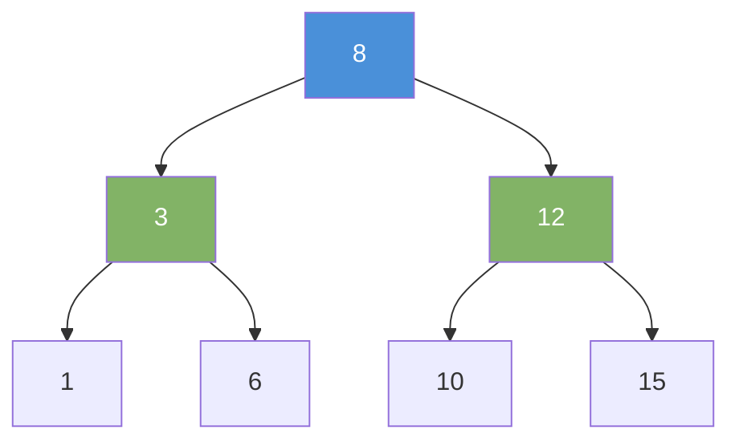
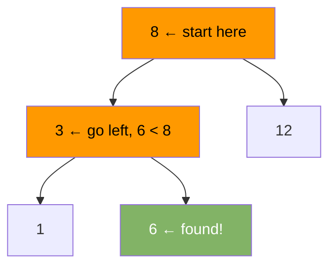

# Binary Search Tree (BST)

A BST is a binary tree with one rule: for every node, all values in the left subtree are smaller, and all values in the right subtree are larger.

---

## BST Property



For node `8`: left subtree has `{1, 3, 6}` — all < 8. Right subtree has `{10, 12, 15}` — all > 8.

---

## Node Structure

```java
class BST {
    int val;
    BST left, right;

    BST(int val) { this.val = val; }
}
```

---

## Search

Start at root. Go left if target < current. Go right if target > current. Stop when found or null.



```java
BST search(BST node, int target) {
    if (node == null || node.val == target) return node;
    if (target < node.val) return search(node.left, target);
    return search(node.right, target);
}
```

---

## Insert

Walk down like search. Insert at the null spot where the value belongs.

```java
BST insert(BST node, int val) {
    if (node == null) return new BST(val);
    if (val < node.val) node.left  = insert(node.left, val);
    else if (val > node.val) node.right = insert(node.right, val);
    return node;
}
```

---

## Delete

Three cases:

| Case             | Action                                               |
|------------------|------------------------------------------------------|
| Node has no child | Remove it directly                                  |
| Node has one child| Replace node with its child                         |
| Node has two children | Replace with inorder successor (smallest in right subtree) |

```java
BST delete(BST node, int val) {
    if (node == null) return null;
    if (val < node.val) {
        node.left = delete(node.left, val);
    } else if (val > node.val) {
        node.right = delete(node.right, val);
    } else {
        if (node.left == null)  return node.right;
        if (node.right == null) return node.left;
        // Two children: find inorder successor
        BST successor = findMin(node.right);
        node.val = successor.val;
        node.right = delete(node.right, successor.val);
    }
    return node;
}

BST findMin(BST node) {
    while (node.left != null) node = node.left;
    return node;
}
```

---

## Inorder Traversal = Sorted Output

Inorder traversal of a BST always produces values in ascending order.

```java
void inorder(BST node) {
    if (node == null) return;
    inorder(node.left);
    System.out.print(node.val + " ");
    inorder(node.right);
}
// Output for tree above: 1 3 6 8 10 12 15
```

---

## Complexity

| Operation | Average  | Worst (Unbalanced) |
|-----------|----------|--------------------|
| Search    | O(log n) | O(n)               |
| Insert    | O(log n) | O(n)               |
| Delete    | O(log n) | O(n)               |

Worst case happens when you insert sorted data — the tree becomes a straight line (degenerate). Use AVL or Red-Black trees to stay balanced.

---

## BST vs Java TreeMap

Java's `TreeMap` is a Red-Black tree — self-balancing BST. Use it when you need sorted keys with O(log n) guaranteed.

```java
import java.util.TreeMap;

TreeMap<Integer, String> map = new TreeMap<>();
map.put(8, "root");
map.put(3, "left");
map.put(12, "right");

int first = map.firstKey();  // 3  — smallest
int last  = map.lastKey();   // 12 — largest
Map<Integer, String> sub = map.subMap(3, 10); // keys from 3 to 9
```
