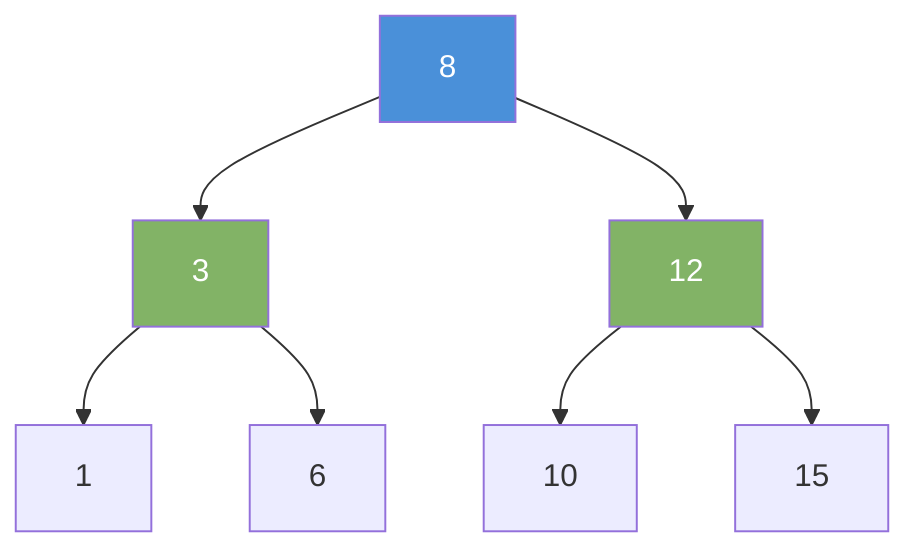

# Binary Search Tree (BST)

A binary tree with one rule: left subtree values are smaller, right subtree values are larger.

---

## Intuition

A BST turns a tree into a sorted structure. At every node, everything to the left is smaller and everything to the right is larger. This lets you cut the search space in half at each step — just like binary search on an array.

---

## Operations

| Operation | Average | Worst (Unbalanced) | Notes |
|-----------|---------|-------------------|-------|
| Search | O(log n) | O(n) | Degenerate tree = linked list |
| Insert | O(log n) | O(n) | |
| Delete | O(log n) | O(n) | |
| Inorder traversal | O(n) | O(n) | Gives sorted output |

---

## Sample Input

```
Insert: 8, 3, 12, 1, 6, 10, 15
Search: 6
```

---

## Visual Representation



---

## Step-by-step Trace — Search for 6

Input: BST above, target = 6

```java
// Time: O(log n) average  Space: O(h)
TreeNode search(TreeNode node, int target) {
    if (node == null || node.val == target) return node;
    if (target < node.val) return search(node.left, target);
    return search(node.right, target);
}
```

| Step | Node | node.val | Compare | Direction |
|------|------|----------|---------|-----------|
| 1 | root | 8 | 6 < 8 | go left |
| 2 | left | 3 | 6 > 3 | go right |
| 3 | right | 6 | 6 == 6 | **found!** |

3 comparisons instead of scanning all 7 nodes.

---

## Java Implementation

### Node and BST Class

```java
class BST {
    int val;
    BST left, right;
    BST(int val) { this.val = val; }
}
```

### Build the Sample Tree

```java
BST root = null;
for (int v : new int[]{8, 3, 12, 1, 6, 10, 15})
    root = insert(root, v);
```

### Insert

```java
// Time: O(log n) average
BST insert(BST node, int val) {
    if (node == null) return new BST(val);
    if (val < node.val)      node.left  = insert(node.left, val);
    else if (val > node.val) node.right = insert(node.right, val);
    return node;
}
```

### Search

```java
// Time: O(log n) average
BST search(BST node, int target) {
    if (node == null || node.val == target) return node;
    if (target < node.val) return search(node.left, target);
    return search(node.right, target);
}
```

### Delete

Three cases: no child, one child, two children.

```java
// Time: O(log n) average
BST delete(BST node, int val) {
    if (node == null) return null;
    if (val < node.val) {
        node.left = delete(node.left, val);
    } else if (val > node.val) {
        node.right = delete(node.right, val);
    } else {
        if (node.left == null)  return node.right;
        if (node.right == null) return node.left;
        // Two children: replace with inorder successor (smallest in right subtree)
        BST successor = findMin(node.right);
        node.val = successor.val;
        node.right = delete(node.right, successor.val);
    }
    return node;
}

BST findMin(BST node) {
    while (node.left != null) node = node.left;
    return node;
}
```

### Inorder = Sorted Output

```java
void inorder(BST node) {
    if (node == null) return;
    inorder(node.left);
    System.out.print(node.val + " ");
    inorder(node.right);
}
// Output: 1 3 6 8 10 12 15
```

### Java TreeMap — Built-in BST

```java
TreeMap<Integer, String> map = new TreeMap<>();
map.put(8, "root");
map.put(3, "left");
map.put(12, "right");

int first = map.firstKey();  // 3  — smallest key
int last  = map.lastKey();   // 12 — largest key
SortedMap<Integer, String> sub = map.subMap(3, 10); // keys 3–9
```

---

## Common Mistakes

- **Inserting sorted data creates a degenerate tree.** Inserting 1, 2, 3, 4, 5 in order produces a straight right-leaning chain. Search becomes O(n). Use a self-balancing tree (AVL, Red-Black) for untrusted input.
- **Deleting a two-child node incorrectly.** You must replace it with the inorder successor (smallest in right subtree) or inorder predecessor — not just remove the node.
- **Assuming BST search is always O(log n).** It is only O(log n) on a balanced tree. Always state the assumption.
- **Not updating the parent's pointer on delete.** The recursive `delete` method returns the updated subtree root. Callers must assign: `node.left = delete(node.left, val)`.

---

## Practice Problems

| Difficulty | Problem | Link |
|------------|---------|------|
| Medium | Validate Binary Search Tree | [LeetCode 98](https://leetcode.com/problems/validate-binary-search-tree/) |
| Medium | Kth Smallest Element in a BST | [LeetCode 230](https://leetcode.com/problems/kth-smallest-element-in-a-bst/) |
| Medium | Delete Node in a BST | [LeetCode 450](https://leetcode.com/problems/delete-node-in-a-bst/) |

---

## Deep Dive

### Why O(log n)?

Each comparison eliminates half the tree. With n nodes, you make at most log₂(n) comparisons before reaching a leaf. This is only true when the tree is balanced — when the left and right subtrees have roughly equal sizes.

### Balanced vs Unbalanced

| Input order | Tree shape | Search time |
|-------------|------------|-------------|
| Random | Roughly balanced | O(log n) |
| Sorted ascending | Right-leaning chain | O(n) |
| Alternating large/small | Balanced | O(log n) |

Self-balancing trees (AVL, Red-Black) automatically rebalance after every insert or delete. Java's `TreeMap` uses a Red-Black tree internally — it guarantees O(log n) in all cases.
