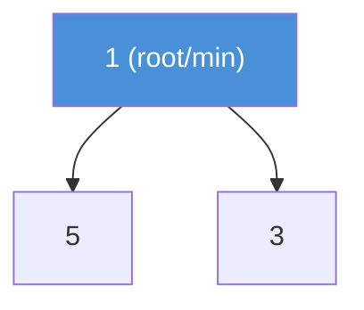
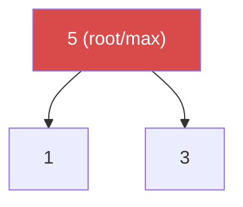

# Heap / Priority Queue

A complete binary tree where the root is always the minimum (min-heap) or maximum (max-heap).

---

## Intuition

A heap is a tree that always keeps its most important element at the top. You can grab the minimum (or maximum) in O(1). Inserting or removing costs O(log n) as the heap reshuffles to maintain order.

---

## Operations

| Operation | Time | Notes |
|-----------|------|-------|
| peek() | O(1) | Read min/max without removing |
| offer(x) | O(log n) | Insert and bubble up |
| poll() | O(log n) | Remove root and bubble down |
| heapify | O(n) | Build heap from unsorted array |

---

## Sample Input

```
Min-heap: offer(5), offer(1), offer(3), peek(), poll()
```

---

## Visual Representation

**Min-Heap after offer(5), offer(1), offer(3):**



**Max-Heap (same values):**



---

## Step-by-step Trace — Insert into Min-Heap

Input: start with empty heap, offer(5), offer(1), offer(3)

| Step | Operation | Heap array | Root | Action |
|------|-----------|------------|------|--------|
| 1 | offer(5) | [5] | 5 | Add at end |
| 2 | offer(1) | [5, 1] → [1, 5] | 1 | 1 < 5 → bubble up, swap |
| 3 | offer(3) | [1, 5, 3] | 1 | 3 > 1 → no swap needed |
| 4 | peek() | [1, 5, 3] | **1** | Return root without removing |
| 5 | poll() | [5, 3] → [3, 5] | 3 | Remove 1, move last to root, bubble down |

**Stored as array (no pointers needed):**

```
index:  0   1   2
value: [1] [5] [3]

Parent of i  = (i - 1) / 2
Left child   = 2*i + 1
Right child  = 2*i + 2
```

---

## Java Implementation

```java
// Min-heap (default)
PriorityQueue<Integer> minHeap = new PriorityQueue<>();
minHeap.offer(5);
minHeap.offer(1);
minHeap.offer(3);

int min = minHeap.peek();  // 1 — no removal
int val = minHeap.poll();  // 1 — removes it

// Max-heap
PriorityQueue<Integer> maxHeap = new PriorityQueue<>(Collections.reverseOrder());
maxHeap.offer(5);
maxHeap.offer(1);
maxHeap.offer(3);
int max = maxHeap.poll(); // 5
```

### Custom Comparator

```java
// Min-heap by second element of int[] pair
PriorityQueue<int[]> pq = new PriorityQueue<>((a, b) -> a[1] - b[1]);
pq.offer(new int[]{1, 5});
pq.offer(new int[]{2, 1});
pq.offer(new int[]{3, 3});
int[] next = pq.poll(); // {2, 1} — smallest priority value
```

### Pattern — K Largest Elements

```java
// Time: O(n log k)  Space: O(k)
int[] kLargest(int[] nums, int k) {
    PriorityQueue<Integer> minHeap = new PriorityQueue<>();
    for (int n : nums) {
        minHeap.offer(n);
        if (minHeap.size() > k) minHeap.poll(); // evict smallest
    }
    return minHeap.stream().mapToInt(i -> i).toArray();
}
```

---

## Common Mistakes

- **`peek()` on empty heap throws `NoSuchElementException`.** Use `isEmpty()` first, or use `PriorityQueue` which returns `null` from `peek()` when empty.
- **Expecting sorted order from `PriorityQueue`.** Iterating a `PriorityQueue` does not give sorted order. Only `poll()` guarantees the minimum each time.
- **Using max-heap with `Collections.reverseOrder()` but comparing wrong type.** For custom objects, write the comparator explicitly — don't rely on `reverseOrder()`.
- **Forgetting heapify is O(n), not O(n log n).** Building a heap from an array by calling `offer()` n times is O(n log n). Using the constructor `new PriorityQueue<>(Arrays.asList(arr))` internally runs heapify in O(n).

---

## Practice Problems

| Difficulty | Problem | Link |
|------------|---------|------|
| Medium | Kth Largest Element in an Array | [LeetCode 215](https://leetcode.com/problems/kth-largest-element-in-an-array/) |
| Medium | Top K Frequent Elements | [LeetCode 347](https://leetcode.com/problems/top-k-frequent-elements/) |
| Hard | Merge K Sorted Lists | [LeetCode 23](https://leetcode.com/problems/merge-k-sorted-lists/) |

---

## Deep Dive

### Why Store a Heap as an Array?

A complete binary tree maps perfectly to an array. The parent-child index formulas eliminate the need for pointers. This makes heaps cache-friendly and memory-efficient — no extra pointer fields per node.

### Common Use Cases

| Use Case | Heap type | Why |
|----------|-----------|-----|
| Dijkstra shortest path | Min-heap | Always process lowest-cost vertex |
| K largest elements | Min-heap of size k | Evict smallest, keep k largest |
| K smallest elements | Max-heap of size k | Evict largest, keep k smallest |
| Merge k sorted lists | Min-heap | Always pick the smallest next element |
| Median of a data stream | Min-heap + Max-heap | Balance two halves |
