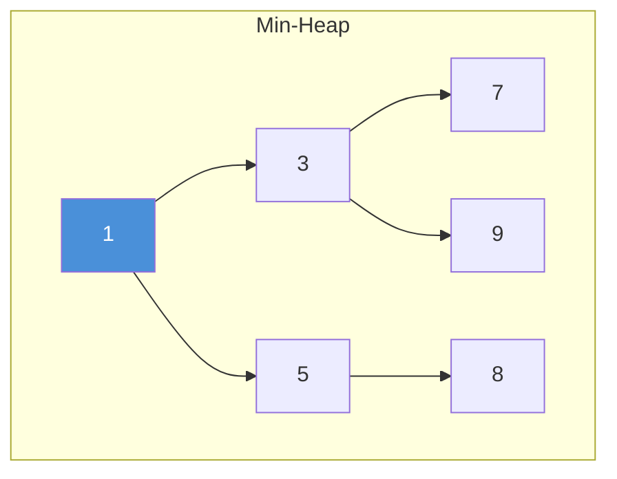
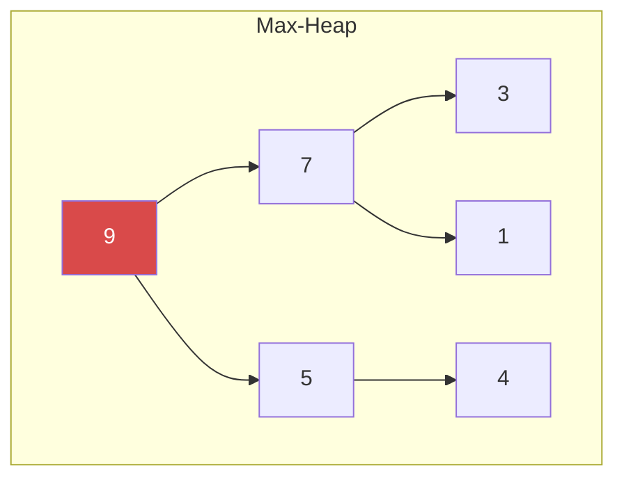
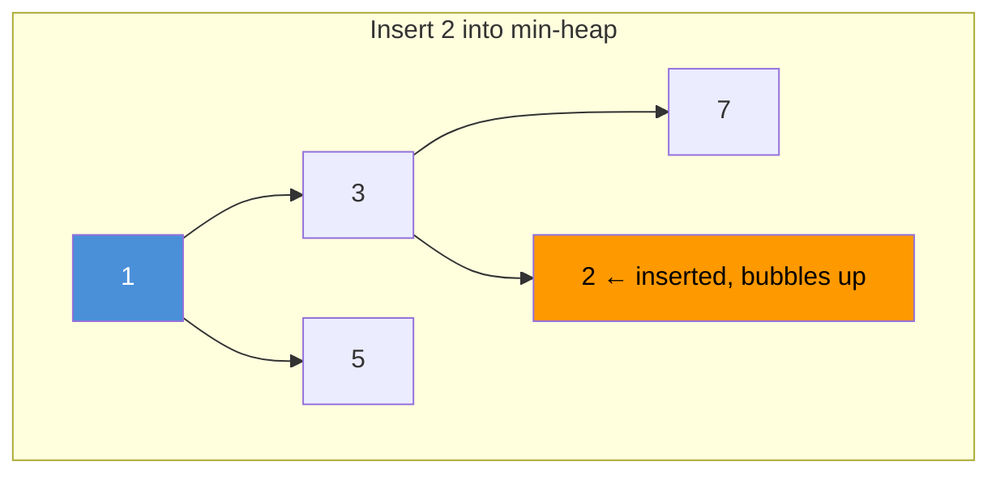
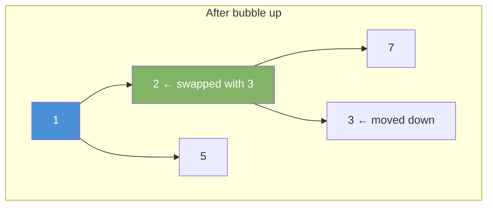

# Heap / Priority Queue

A heap is a complete binary tree that satisfies the heap property. A min-heap always puts the smallest element at the top. A max-heap puts the largest at the top.

---

## Heap Property

**Min-Heap:** Every parent ≤ its children.
**Max-Heap:** Every parent ≥ its children.





---

## Stored as Array

A heap maps to an array without pointers.

```
index:   0   1   2   3   4   5
values: [1]  [3] [5] [7] [9] [8]

Parent of i  → (i - 1) / 2
Left child   → 2*i + 1
Right child  → 2*i + 2
```

---

## Operations

| Operation   | Time     | Notes                                  |
|-------------|----------|----------------------------------------|
| peek()      | O(1)     | Read min (or max) without removing     |
| offer(x)    | O(log n) | Insert and bubble up                   |
| poll()      | O(log n) | Remove root and bubble down            |
| heapify     | O(n)     | Build heap from unsorted array         |

---

## Java PriorityQueue

Java's `PriorityQueue` is a min-heap by default.

```java
import java.util.PriorityQueue;

// Min-heap
PriorityQueue<Integer> minHeap = new PriorityQueue<>();
minHeap.offer(5);
minHeap.offer(1);
minHeap.offer(3);

int min = minHeap.peek();  // 1 — does not remove
int removed = minHeap.poll(); // 1 — removes it
```

```java
// Max-heap — reverse the comparator
PriorityQueue<Integer> maxHeap = new PriorityQueue<>(Collections.reverseOrder());
maxHeap.offer(5);
maxHeap.offer(1);
maxHeap.offer(3);

int max = maxHeap.poll(); // 5
```

### Custom Objects

```java
PriorityQueue<int[]> pq = new PriorityQueue<>((a, b) -> a[1] - b[1]);
pq.offer(new int[]{1, 5}); // {id, priority}
pq.offer(new int[]{2, 1});
pq.offer(new int[]{3, 3});

int[] next = pq.poll(); // {2, 1} — lowest priority value first
```

---

## Insert (Bubble Up)

Add element at end. Swap with parent until heap property holds.





---

## Remove Min (Bubble Down)

Swap root with last element. Remove last. Bubble root down by swapping with the smaller child.

---

## Heap Sort

Build a max-heap. Repeatedly pop the max to sort in ascending order.

```java
void heapSort(int[] arr) {
    PriorityQueue<Integer> maxHeap = new PriorityQueue<>(Collections.reverseOrder());
    for (int n : arr) maxHeap.offer(n);
    int i = arr.length - 1;
    while (!maxHeap.isEmpty()) {
        arr[i--] = maxHeap.poll();
    }
}
```

---

## Common Use Cases

| Use Case                      | Heap Type  | Why                                 |
|-------------------------------|------------|-------------------------------------|
| Dijkstra shortest path        | Min-heap   | Always process lowest cost node     |
| K largest elements            | Min-heap   | Keep heap size at k                 |
| K smallest elements           | Max-heap   | Keep heap size at k                 |
| Merge k sorted lists          | Min-heap   | Always pick the smallest next node  |
| Median of data stream         | Min + Max  | Balance two heaps                   |
| Task scheduling by priority   | Max-heap   | Always run highest priority task    |

---

## K Largest Elements

```java
int[] kLargest(int[] nums, int k) {
    PriorityQueue<Integer> minHeap = new PriorityQueue<>();
    for (int n : nums) {
        minHeap.offer(n);
        if (minHeap.size() > k) minHeap.poll(); // remove smallest
    }
    return minHeap.stream().mapToInt(i -> i).toArray();
}
```
