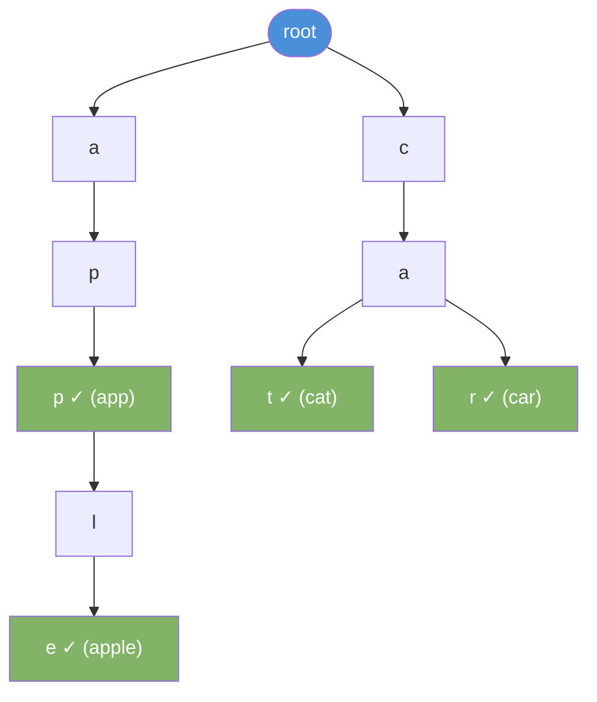
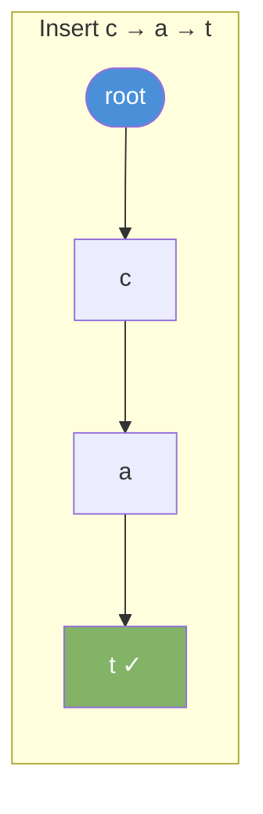
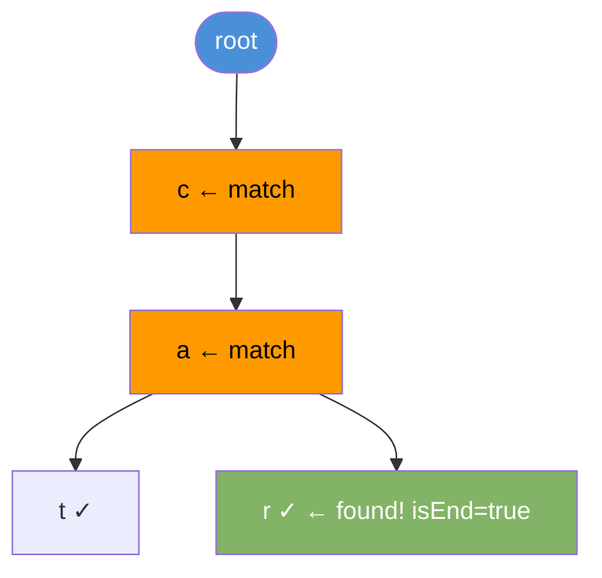

# Trie (Prefix Tree)

A trie stores strings character by character. Each path from root to a marked node forms a word. Ideal for prefix search and autocomplete.

---

## Structure



Words stored: `app`, `apple`, `cat`, `car`. The ✓ marks end of a complete word.

---

## Operations

| Operation      | Time | Notes                           |
|----------------|------|---------------------------------|
| insert(word)   | O(m) | m = length of word              |
| search(word)   | O(m) | Exact match                     |
| startsWith(prefix) | O(m) | Prefix match               |
| delete(word)   | O(m) | Remove word, clean unused nodes |

---

## Java Implementation

```java
class TrieNode {
    TrieNode[] children = new TrieNode[26];
    boolean isEnd = false;
}

class Trie {
    private TrieNode root = new TrieNode();

    void insert(String word) {
        TrieNode node = root;
        for (char c : word.toCharArray()) {
            int i = c - 'a';
            if (node.children[i] == null) {
                node.children[i] = new TrieNode();
            }
            node = node.children[i];
        }
        node.isEnd = true;
    }

    boolean search(String word) {
        TrieNode node = root;
        for (char c : word.toCharArray()) {
            int i = c - 'a';
            if (node.children[i] == null) return false;
            node = node.children[i];
        }
        return node.isEnd;
    }

    boolean startsWith(String prefix) {
        TrieNode node = root;
        for (char c : prefix.toCharArray()) {
            int i = c - 'a';
            if (node.children[i] == null) return false;
            node = node.children[i];
        }
        return true;
    }
}
```

---

## Step-by-Step: Insert "cat"



---

## Step-by-Step: Search "car" in {cat, car}



---

## Trie vs HashMap for String Lookup

| Feature               | Trie           | HashMap              |
|-----------------------|----------------|----------------------|
| Exact search          | O(m)           | O(m) average         |
| Prefix search         | O(m)           | Not supported natively|
| Space                 | More (nodes)   | Less                 |
| Autocomplete          | Natural fit    | Requires extra work  |

---

## Common Use Cases

| Use Case                  | How Trie Helps                          |
|---------------------------|-----------------------------------------|
| Autocomplete              | All words that start with a prefix      |
| Spell checker             | Find closest matching word              |
| IP routing                | Longest prefix match                    |
| Word search in grid       | Build trie of words, DFS the grid       |
| Dictionary lookup         | Faster than scanning all words          |

---

## Autocomplete Example

```java
List<String> autocomplete(Trie trie, String prefix) {
    List<String> results = new ArrayList<>();
    TrieNode node = trie.root;
    for (char c : prefix.toCharArray()) {
        int i = c - 'a';
        if (node.children[i] == null) return results;
        node = node.children[i];
    }
    collectWords(node, new StringBuilder(prefix), results);
    return results;
}

void collectWords(TrieNode node, StringBuilder current, List<String> results) {
    if (node.isEnd) results.add(current.toString());
    for (int i = 0; i < 26; i++) {
        if (node.children[i] != null) {
            current.append((char) ('a' + i));
            collectWords(node.children[i], current, results);
            current.deleteCharAt(current.length() - 1);
        }
    }
}
```
