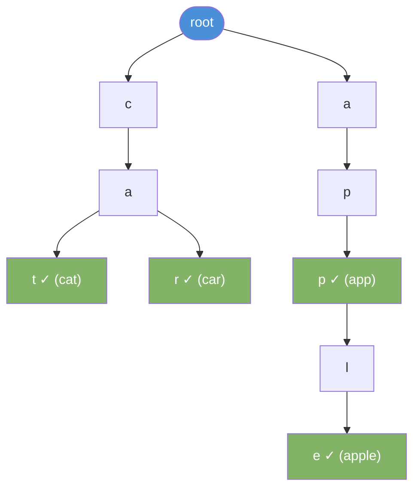

# Trie (Prefix Tree)

A tree that stores strings character by character. Each path from root to a marked node forms a complete word.

---

## Intuition

A trie is a spell-checker's data structure. Each level holds one character. Words that share a prefix share the same path from the root. Finding all words that start with "ca" means walking to the "c" node, then "a", then collecting everything below.

---

## Operations

| Operation | Time | Notes |
|-----------|------|-------|
| insert(word) | O(m) | m = word length |
| search(word) | O(m) | Exact match |
| startsWith(prefix) | O(m) | Prefix match |
| delete(word) | O(m) | Remove word, clean unused nodes |

---

## Sample Input

```
insert("cat"), insert("car"), insert("app"), insert("apple")
search("car")
startsWith("ca")
```

---

## Visual Representation



The ✓ marks end of a complete word.

---

## Step-by-step Trace — Search "car"

Input: trie contains "cat", "car", "app", "apple". Search for "car".

| Step | Char | Node found? | isEnd? | Action |
|------|------|-------------|--------|--------|
| 1 | 'c' | Yes | No | Move to 'c' node |
| 2 | 'a' | Yes | No | Move to 'a' node |
| 3 | 'r' | Yes | **Yes** | **return true** |

Search "dog" would fail at step 1 — no 'd' child on root.

---

## Java Implementation

```java
class TrieNode {
    TrieNode[] children = new TrieNode[26];
    boolean isEnd = false;
}

class Trie {
    private final TrieNode root = new TrieNode();

    // Time: O(m)
    void insert(String word) {
        TrieNode node = root;
        for (char c : word.toCharArray()) {
            int i = c - 'a';
            if (node.children[i] == null)
                node.children[i] = new TrieNode();
            node = node.children[i];
        }
        node.isEnd = true;
    }

    // Time: O(m)
    boolean search(String word) {
        TrieNode node = root;
        for (char c : word.toCharArray()) {
            int i = c - 'a';
            if (node.children[i] == null) return false;
            node = node.children[i];
        }
        return node.isEnd;
    }

    // Time: O(m)
    boolean startsWith(String prefix) {
        TrieNode node = root;
        for (char c : prefix.toCharArray()) {
            int i = c - 'a';
            if (node.children[i] == null) return false;
            node = node.children[i];
        }
        return true;
    }
}
```

### Autocomplete

```java
// Time: O(m + k) where k = number of matching words
List<String> autocomplete(String prefix) {
    List<String> results = new ArrayList<>();
    TrieNode node = root;
    for (char c : prefix.toCharArray()) {
        int i = c - 'a';
        if (node.children[i] == null) return results;
        node = node.children[i];
    }
    collect(node, new StringBuilder(prefix), results);
    return results;
}

void collect(TrieNode node, StringBuilder current, List<String> results) {
    if (node.isEnd) results.add(current.toString());
    for (int i = 0; i < 26; i++) {
        if (node.children[i] != null) {
            current.append((char)('a' + i));
            collect(node.children[i], current, results);
            current.deleteCharAt(current.length() - 1);
        }
    }
}
```

---

## Common Mistakes

- **`search` vs `startsWith`.** `search("app")` requires `isEnd = true`. `startsWith("app")` only requires the path to exist — `isEnd` doesn't matter.
- **Array index for characters.** Use `c - 'a'` for lowercase letters. For uppercase or mixed, use a `HashMap<Character, TrieNode>` instead.
- **Memory per node.** Each `TrieNode` allocates a 26-element array — even if only one child exists. A sparse trie with many unique characters wastes memory. Use `HashMap<Character, TrieNode>` for space efficiency.
- **Forgetting to set `isEnd = true`.** Without this, `search("cat")` returns false even if "cat" was inserted.

---

## Practice Problems

| Difficulty | Problem | Link |
|------------|---------|------|
| Medium | Implement Trie (Prefix Tree) | [LeetCode 208](https://leetcode.com/problems/implement-trie-prefix-tree/) |
| Medium | Word Search II | [LeetCode 212](https://leetcode.com/problems/word-search-ii/) |
| Medium | Replace Words | [LeetCode 648](https://leetcode.com/problems/replace-words/) |

---

## Deep Dive

### Trie vs HashMap for String Lookup

| Feature | Trie | HashMap |
|---------|------|---------|
| Exact search | O(m) | O(m) average |
| Prefix search | O(m) | Not supported natively |
| Space | More (node per char) | Less |
| Autocomplete | Natural | Requires extra work |

Use a trie when prefix queries matter. Use a HashMap when you only need exact lookups.

### Space Optimization

The 26-child array uses 26 × 8 = 208 bytes per node. For a dictionary with 100,000 words averaging 6 characters, that's 600,000 nodes × 208 bytes = ~125 MB. Switching to `HashMap<Character, TrieNode>` cuts memory to only the children that exist.
