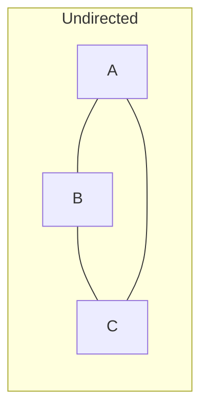
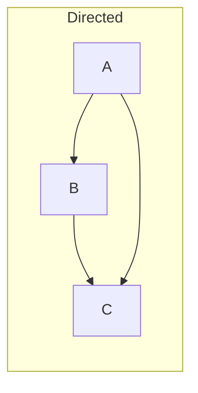
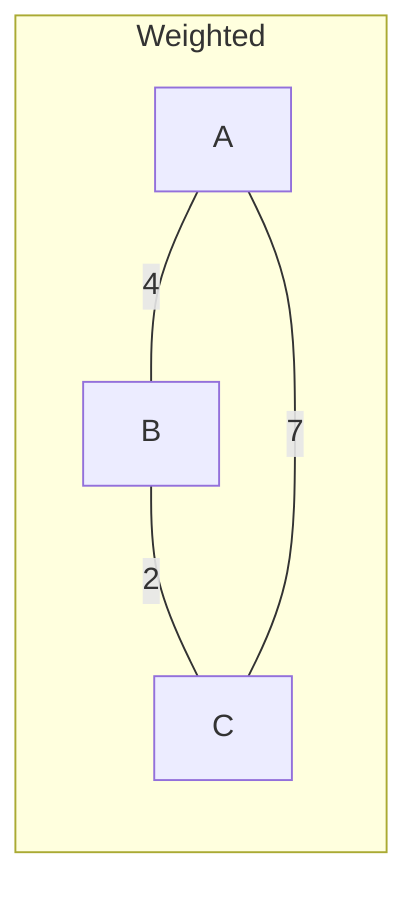
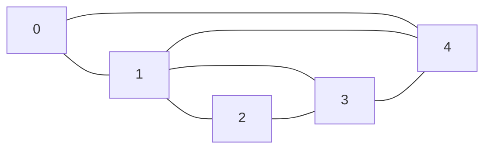

# Graph

A set of vertices (nodes) connected by edges. Graphs model networks — roads, social connections, dependencies, web links.

---

## Intuition

A graph is a map. Cities are vertices. Roads are edges. Some roads are one-way (directed). Some roads have distances (weighted). Graphs let you answer questions like "is there a path?" and "what is the shortest route?"

---

## Operations

| Operation | Adjacency List | Adjacency Matrix |
|-----------|---------------|-----------------|
| Add vertex | O(1) | O(V²) — resize |
| Add edge | O(1) | O(1) |
| Check edge | O(degree) | O(1) |
| Get neighbors | O(degree) | O(V) |
| Space | O(V + E) | O(V²) |

---

## Sample Input

```
Vertices: 0, 1, 2, 3, 4
Edges: 0-1, 0-4, 1-2, 1-3, 1-4, 2-3, 3-4
```

---

## Visual Representation

**Types of graphs:**







**Sample graph:**



---

## Step-by-step Trace — Build Adjacency List

Input: edges 0-1, 0-4, 1-2, 1-3

| Step | addEdge | Adjacency list state |
|------|---------|----------------------|
| 1 | addEdge(0,1) | 0→[1], 1→[0] |
| 2 | addEdge(0,4) | 0→[1,4], 4→[0] |
| 3 | addEdge(1,2) | 1→[0,2], 2→[1] |
| 4 | addEdge(1,3) | 1→[0,2,3], 3→[1] |

---

## Java Implementation

### Adjacency List (preferred for sparse graphs)

```java
class Graph {
    private final int V;
    private final Map<Integer, List<Integer>> adj = new HashMap<>();

    Graph(int V) {
        this.V = V;
        for (int i = 0; i < V; i++) adj.put(i, new ArrayList<>());
    }

    // Time: O(1)
    void addEdge(int u, int v) {
        adj.get(u).add(v);
        adj.get(v).add(u); // remove this line for directed graph
    }

    List<Integer> neighbors(int v) { return adj.get(v); }
}
```

### Adjacency Matrix (preferred for dense graphs)

```java
int V = 5;
int[][] matrix = new int[V][V];

// Add edge 0 → 1
matrix[0][1] = 1;
matrix[1][0] = 1; // remove for directed graph

// Check edge
boolean hasEdge = matrix[0][1] == 1;
```

### Weighted Graph

```java
class WeightedGraph {
    private final Map<Integer, List<int[]>> adj = new HashMap<>();

    void addEdge(int u, int v, int weight) {
        adj.computeIfAbsent(u, k -> new ArrayList<>()).add(new int[]{v, weight});
        adj.computeIfAbsent(v, k -> new ArrayList<>()).add(new int[]{u, weight});
    }

    List<int[]> neighbors(int u) {
        return adj.getOrDefault(u, Collections.emptyList());
    }
}
```

### Terminology

| Term | Meaning |
|------|---------|
| Vertex (V) | A node in the graph |
| Edge (E) | A connection between two vertices |
| Directed | Edges have direction (A → B ≠ B → A) |
| Undirected | Edges have no direction (A — B = B — A) |
| Weighted | Each edge carries a cost or distance |
| Cycle | A path that starts and ends at the same vertex |
| Connected | Every vertex is reachable from every other |
| Degree | Number of edges connected to a vertex |

---

## Common Mistakes

- **Forgetting to add both directions for undirected graphs.** `addEdge(u, v)` must also call `addEdge(v, u)`.
- **Not initializing adjacency list entries.** Calling `adj.get(v)` on a vertex that was never added returns null. Always pre-populate in the constructor.
- **Using adjacency matrix for sparse graphs.** A matrix with 10,000 vertices uses 10,000² = 100 million entries. Most will be 0. Use an adjacency list.
- **Forgetting the `visited` array in BFS/DFS.** Without it, a cycle causes infinite looping.

---

## Practice Problems

| Difficulty | Problem | Link |
|------------|---------|------|
| Medium | Number of Islands | [LeetCode 200](https://leetcode.com/problems/number-of-islands/) |
| Medium | Clone Graph | [LeetCode 133](https://leetcode.com/problems/clone-graph/) |
| Medium | Course Schedule | [LeetCode 207](https://leetcode.com/problems/course-schedule/) |

---

## Deep Dive

### Adjacency List vs Matrix

| | Adjacency List | Adjacency Matrix |
|--|---------------|-----------------|
| Space | O(V + E) | O(V²) |
| Check if edge exists | O(degree) | O(1) |
| Get all neighbors | O(degree) | O(V) |
| Best for | Sparse graphs | Dense graphs |

Most real-world graphs (social networks, road maps) are sparse — each vertex connects to a small number of others. Adjacency lists are the standard choice.

### Common Graph Algorithms

| Use Case | Algorithm | Time |
|----------|-----------|------|
| Shortest path, unweighted | BFS | O(V + E) |
| Shortest path, weighted | Dijkstra | O((V + E) log V) |
| Detect cycle | DFS with colors | O(V + E) |
| Topological ordering | DFS or Kahn's | O(V + E) |
| Connected components | BFS/DFS | O(V + E) |
| Minimum spanning tree | Prim's/Kruskal's | O(E log E) |
