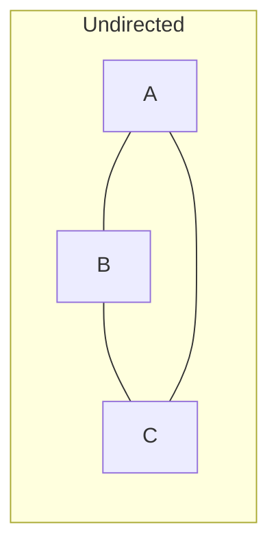
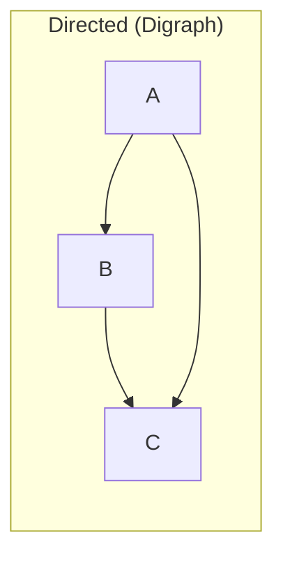
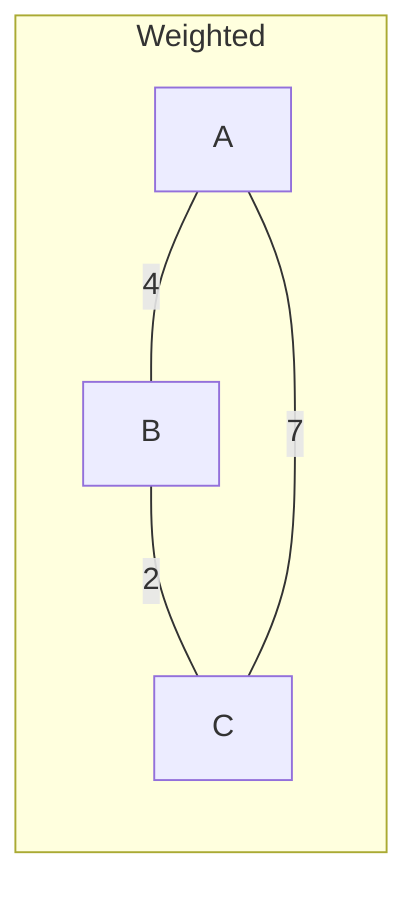
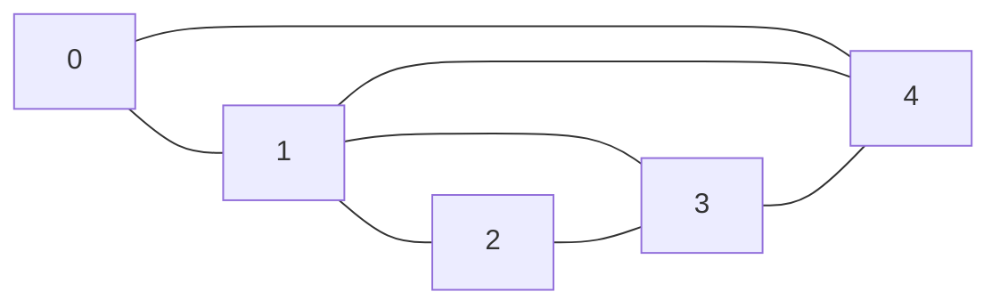

# Graph

A graph has vertices (nodes) and edges (connections between nodes). Graphs model networks — social connections, roads, dependencies, web links.

---

## Terminology

| Term             | Meaning                                             |
|------------------|-----------------------------------------------------|
| Vertex (V)       | A node in the graph                                 |
| Edge (E)         | A connection between two vertices                   |
| Directed         | Edges have direction (A → B ≠ B → A)               |
| Undirected       | Edges have no direction (A — B = B — A)             |
| Weighted         | Each edge carries a cost or distance                |
| Cycle            | A path that starts and ends at the same vertex      |
| Connected        | Every vertex is reachable from every other          |
| Degree           | Number of edges connected to a vertex               |

---

## Types of Graphs







---

## Representations

### Adjacency Matrix

A 2D array where `matrix[i][j] = 1` means an edge exists from i to j.

```
     A  B  C  D
A  [ 0, 1, 0, 1 ]
B  [ 1, 0, 1, 0 ]
C  [ 0, 1, 0, 1 ]
D  [ 1, 0, 1, 0 ]
```

```java
int V = 4;
int[][] matrix = new int[V][V];
matrix[0][1] = 1; // edge A → B
matrix[1][0] = 1; // edge B → A (undirected)
```

| Property     | Value    |
|--------------|----------|
| Space        | O(V²)    |
| Add edge     | O(1)     |
| Check edge   | O(1)     |
| Get neighbors| O(V)     |
| Best for     | Dense graphs|

### Adjacency List

Each vertex stores a list of its neighbors.

```
A → [B, D]
B → [A, C]
C → [B, D]
D → [A, C]
```

```java
int V = 4;
List<List<Integer>> adj = new ArrayList<>();
for (int i = 0; i < V; i++) adj.add(new ArrayList<>());

adj.get(0).add(1); // A → B
adj.get(1).add(0); // B → A (undirected)
```

| Property     | Value    |
|--------------|----------|
| Space        | O(V + E) |
| Add edge     | O(1)     |
| Check edge   | O(degree)|
| Get neighbors| O(degree)|
| Best for     | Sparse graphs|

---

## Java Graph Implementation

```java
import java.util.*;

class Graph {
    private int V;
    private Map<Integer, List<Integer>> adj;

    Graph(int V) {
        this.V = V;
        adj = new HashMap<>();
        for (int i = 0; i < V; i++) adj.put(i, new ArrayList<>());
    }

    void addEdge(int u, int v) {
        adj.get(u).add(v);
        adj.get(v).add(u); // remove for directed graph
    }

    List<Integer> neighbors(int v) {
        return adj.get(v);
    }
}
```

### Weighted Graph

```java
class WeightedGraph {
    private Map<Integer, List<int[]>> adj = new HashMap<>();

    void addEdge(int u, int v, int weight) {
        adj.computeIfAbsent(u, k -> new ArrayList<>()).add(new int[]{v, weight});
        adj.computeIfAbsent(v, k -> new ArrayList<>()).add(new int[]{u, weight});
    }

    List<int[]> neighbors(int u) {
        return adj.getOrDefault(u, Collections.emptyList());
    }
}
```

---

## Graph Example



```java
Graph g = new Graph(5);
g.addEdge(0, 1);
g.addEdge(0, 4);
g.addEdge(1, 2);
g.addEdge(1, 3);
g.addEdge(1, 4);
g.addEdge(2, 3);
g.addEdge(3, 4);
```

---

## Common Use Cases

| Use Case                   | Graph Type        | Algorithm           |
|----------------------------|-------------------|---------------------|
| Shortest path (unweighted) | Undirected        | BFS                 |
| Shortest path (weighted)   | Weighted directed | Dijkstra            |
| Detect cycle               | Directed          | DFS with colors     |
| Topological ordering       | DAG               | DFS or Kahn's       |
| Connected components       | Undirected        | BFS / DFS / Union-Find|
| Minimum spanning tree      | Weighted          | Prim's / Kruskal's  |
| Social network distance    | Undirected        | BFS                 |
