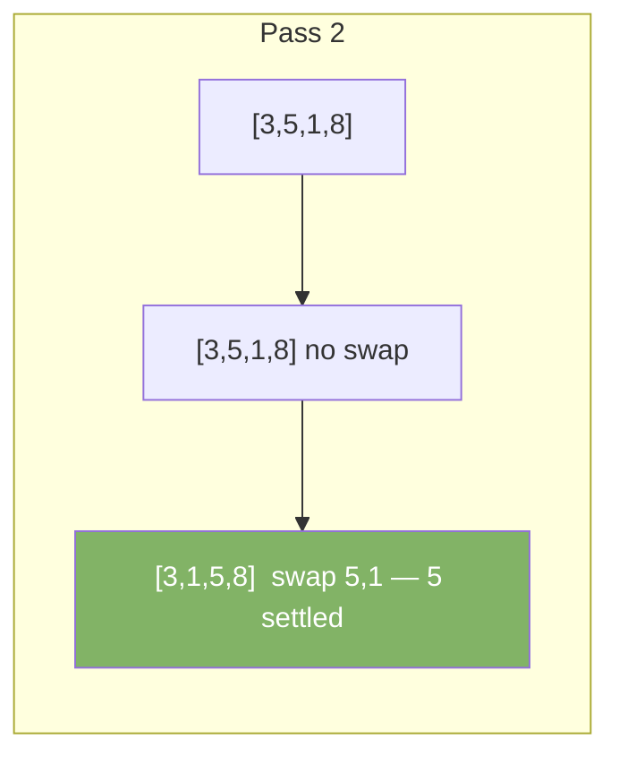
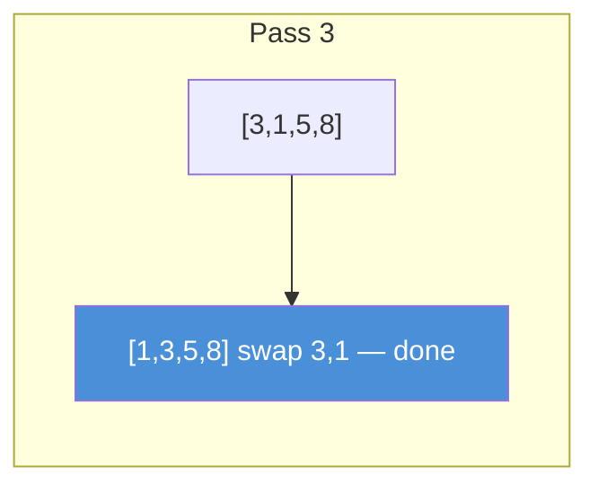

# Bubble Sort

Repeatedly swap adjacent elements that are in the wrong order. Larger elements bubble to the end.

---

## Intuition

Walk through the array. Compare each pair of neighbors. If left is bigger than right, swap them. After one full pass, the largest element is at the end. Repeat for the remaining unsorted part.

---

## Operations

| Best | Average | Worst | Space | Stable |
|------|---------|-------|-------|--------|
| O(n) | O(n²) | O(n²) | O(1) | Yes |

Best case O(n) only when using the early-exit flag on an already-sorted array.

---

## Sample Input

```
arr = [5, 3, 8, 1]
```

---

## Visual Representation






---

## Step-by-step Trace

Input: `arr = [5, 3, 8, 1]`

| Pass | j | arr[j] vs arr[j+1] | Swap? | Array after |
|------|---|---------------------|-------|-------------|
| 1 | 0 | 5 > 3 | Yes | [3, 5, 8, 1] |
| 1 | 1 | 5 < 8 | No | [3, 5, 8, 1] |
| 1 | 2 | 8 > 1 | Yes | [3, 5, 1, **8**] |
| 2 | 0 | 3 < 5 | No | [3, 5, 1, 8] |
| 2 | 1 | 5 > 1 | Yes | [3, 1, **5**, 8] |
| 3 | 0 | 3 > 1 | Yes | [**1**, **3**, 5, 8] ✓ |

---

## Java Implementation

```java
// Time: O(n²)  Space: O(1)
void bubbleSort(int[] arr) {
    int n = arr.length;
    for (int i = 0; i < n - 1; i++) {
        boolean swapped = false;
        for (int j = 0; j < n - 1 - i; j++) {
            if (arr[j] > arr[j + 1]) {
                int temp = arr[j];
                arr[j]   = arr[j + 1];
                arr[j + 1] = temp;
                swapped = true;
            }
        }
        if (!swapped) break; // already sorted — early exit
    }
}
```

---

## Common Mistakes

- **Forgetting `n - 1 - i` in the inner loop.** The last `i` elements are already sorted. Scanning them wastes time.
- **Skipping the `swapped` flag.** Without it, best case stays O(n²). The flag gives O(n) on sorted input.
- **Using bubble sort for large arrays.** It is O(n²) in the average case. Use Merge Sort or Quick Sort for anything beyond ~20 elements.

---

## Practice Problems

| Difficulty | Problem | Link |
|------------|---------|------|
| Easy | Sort an Array | [LeetCode 912](https://leetcode.com/problems/sort-an-array/) |
| Easy | Squares of a Sorted Array | [LeetCode 977](https://leetcode.com/problems/squares-of-a-sorted-array/) |
| Medium | Sort Colors | [LeetCode 75](https://leetcode.com/problems/sort-colors/) |

---

## Deep Dive

### Why It's Called "Bubble" Sort

After each pass, the largest unsorted element has "bubbled up" to its final position at the end. After pass 1, the largest is at index n-1. After pass 2, the second largest is at n-2. The sorted portion grows from the right.

### Stability

Bubble sort is stable — equal elements keep their original relative order. The swap condition is `arr[j] > arr[j+1]` (strictly greater), so equal elements are never swapped.
