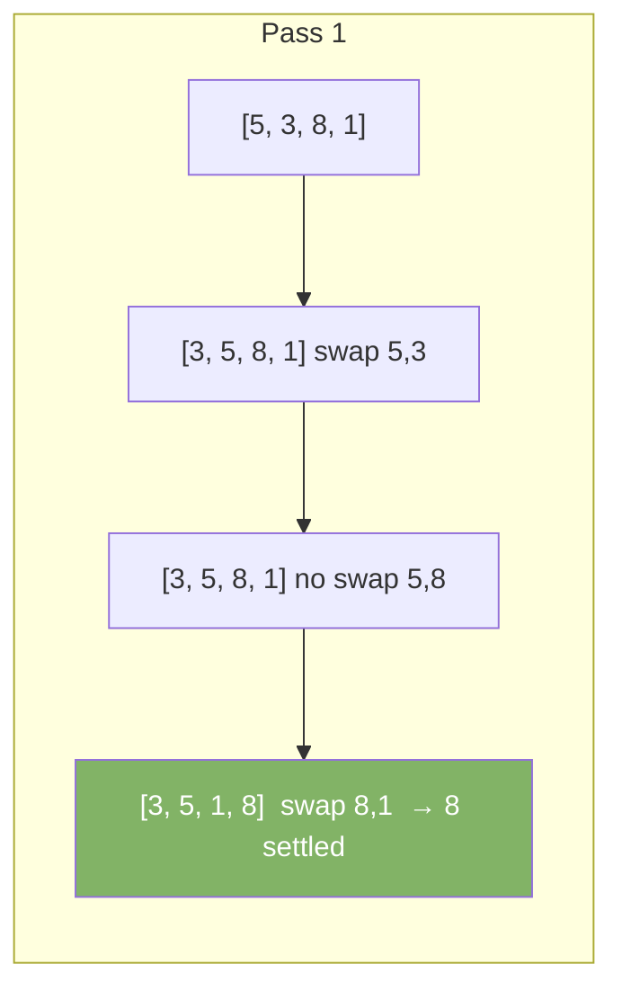
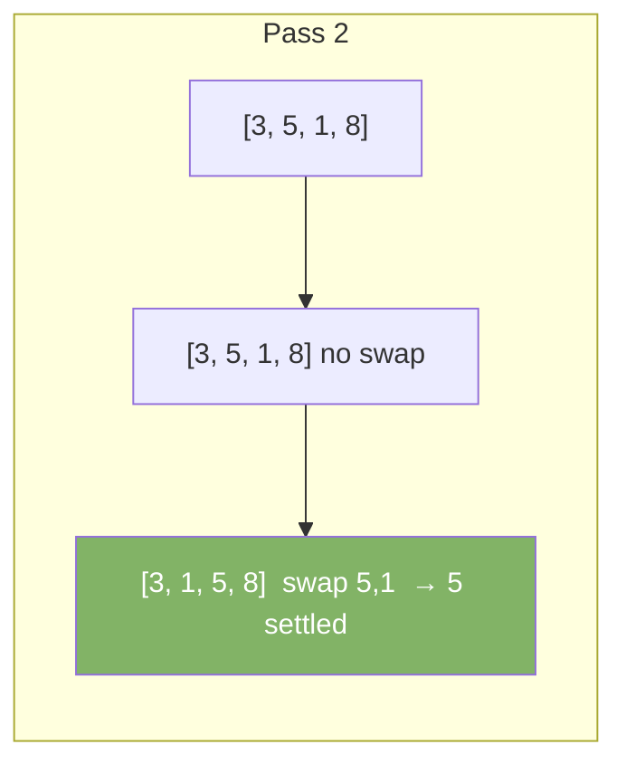
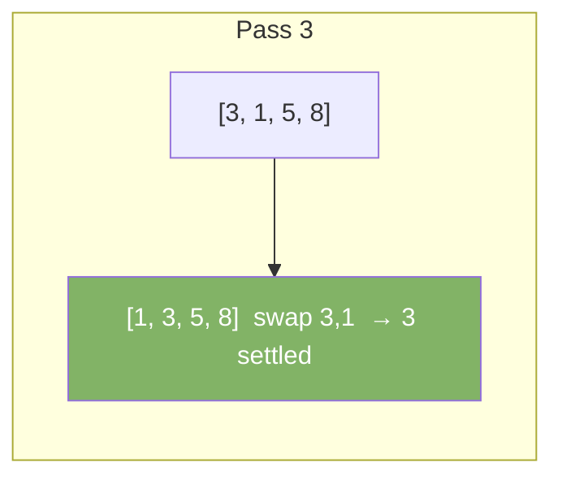
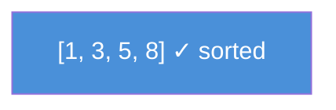

# Bubble Sort

Bubble sort repeatedly steps through the array. It compares adjacent elements and swaps them if they are in the wrong order. Larger elements "bubble" to the end.

| Best | Average | Worst | Space | Stable |
|------|---------|-------|-------|--------|
| O(n) | O(n²)  | O(n²) | O(1)  | Yes    |

---

## How It Works

Each pass through the array moves the largest unsorted element to its correct position.

### Step-by-Step: Sort [5, 3, 8, 1]









---

## Java Implementation

```java
void bubbleSort(int[] arr) {
    int n = arr.length;
    for (int i = 0; i < n - 1; i++) {
        boolean swapped = false;
        for (int j = 0; j < n - 1 - i; j++) {
            if (arr[j] > arr[j + 1]) {
                int temp = arr[j];
                arr[j] = arr[j + 1];
                arr[j + 1] = temp;
                swapped = true;
            }
        }
        if (!swapped) break; // already sorted — early exit
    }
}
```

The `swapped` flag gives O(n) best case. If no swaps happen in a pass, the array is already sorted.

---

## When to Use

Bubble sort is simple to understand but slow. Use it only for:
- Teaching purposes
- Very small arrays (< 10 elements)
- Already nearly sorted data (with early exit)

For production use Merge Sort or Quick Sort.
