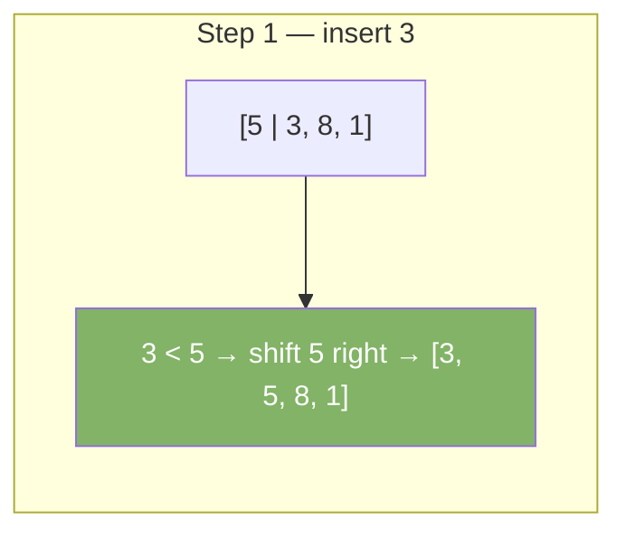
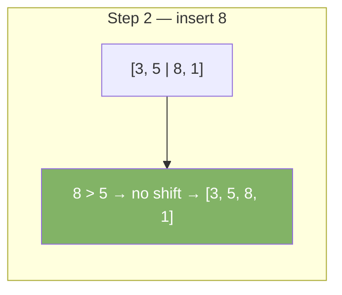
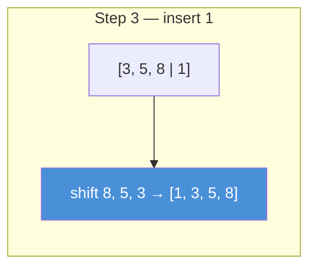

# Insertion Sort

Build the sorted array one element at a time. Pick each element and insert it into its correct position among the already-sorted elements to its left.

---

## Intuition

Think of sorting playing cards in your hand. You pick one card at a time. You slide it left until it is in the right spot among the cards you already hold. The left side is always sorted. The right side is unsorted.

---

## Operations

| Best | Average | Worst | Space | Stable |
|------|---------|-------|-------|--------|
| O(n) | O(n²) | O(n²) | O(1) | Yes |

Best case O(n) on already-sorted input — the inner loop exits immediately each time.

---

## Sample Input

```
arr = [5, 3, 8, 1]
```

---

## Visual Representation







---

## Step-by-step Trace

Input: `arr = [5, 3, 8, 1]`

| i | key | j | arr[j] > key? | Shift? | Array after |
|---|-----|---|---------------|--------|-------------|
| 1 | 3 | 0 | 5 > 3 Yes | Shift 5 right | [5, 5, 8, 1] |
| 1 | 3 | -1 | — | Place key | [**3**, 5, 8, 1] |
| 2 | 8 | 1 | 5 > 8 No | Stop | [3, 5, **8**, 1] |
| 3 | 1 | 2 | 8 > 1 Yes | Shift 8 | [3, 5, 8, 8, ...] |
| 3 | 1 | 1 | 5 > 1 Yes | Shift 5 | [3, 5, 5, 8, ...] |
| 3 | 1 | 0 | 3 > 1 Yes | Shift 3 | [3, 3, 5, 8, ...] |
| 3 | 1 | -1 | — | Place key | [**1**, 3, 5, 8] ✓ |

---

## Java Implementation

```java
// Time: O(n²)  Space: O(1)
void insertionSort(int[] arr) {
    for (int i = 1; i < arr.length; i++) {
        int key = arr[i];
        int j = i - 1;
        while (j >= 0 && arr[j] > key) {
            arr[j + 1] = arr[j]; // shift right
            j--;
        }
        arr[j + 1] = key; // place key in correct position
    }
}
```

---

## Common Mistakes

- **Starting the outer loop at `i = 0`.** Index 0 is trivially sorted — start at `i = 1`.
- **Using `>=` in the while condition instead of `>`.** Using `>=` makes the sort unstable — equal elements get shifted unnecessarily.
- **Forgetting `arr[j + 1] = key` at the end.** The while loop shifts elements right but never places `key`. Without this line, the key is lost.

---

## Practice Problems

| Difficulty | Problem | Link |
|------------|---------|------|
| Easy | Sort an Array | [LeetCode 912](https://leetcode.com/problems/sort-an-array/) |
| Medium | Insertion Sort List | [LeetCode 147](https://leetcode.com/problems/insertion-sort-list/) |
| Medium | Sort Colors | [LeetCode 75](https://leetcode.com/problems/sort-colors/) |

---

## Deep Dive

### Why Insertion Sort Beats Bubble Sort in Practice

Both are O(n²) worst case. But insertion sort makes fewer writes. Bubble sort swaps elements (3 writes per swap). Insertion sort shifts elements (1 write per shift) then places the key once. Fewer memory writes means faster in practice.

### Real-World Use

Timsort (Java's built-in sort for objects) uses insertion sort for subarrays smaller than ~32 elements. For small inputs, insertion sort's low overhead beats the recursive cost of merge sort. This hybrid approach is why `Arrays.sort` on Object arrays is so fast.
