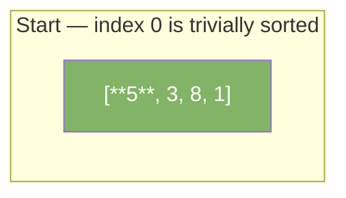
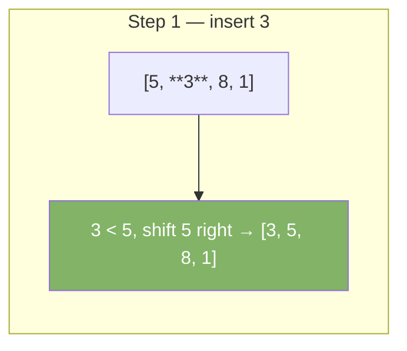
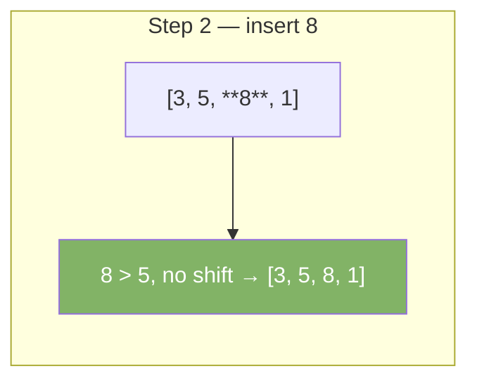
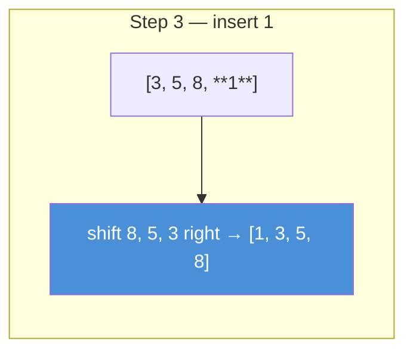

# Insertion Sort

Insertion sort builds the sorted array one element at a time. It picks each element and inserts it into the correct position among the already-sorted elements to its left.

| Best | Average | Worst | Space | Stable |
|------|---------|-------|-------|--------|
| O(n) | O(n²)  | O(n²) | O(1)  | Yes    |

---

## How It Works

Think of sorting playing cards in your hand. You pick one card at a time and slide it into the right spot among the cards you already hold.

### Step-by-Step: Sort [5, 3, 8, 1]









---

## Java Implementation

```java
void insertionSort(int[] arr) {
    for (int i = 1; i < arr.length; i++) {
        int key = arr[i];
        int j = i - 1;
        // Shift elements greater than key one position right
        while (j >= 0 && arr[j] > key) {
            arr[j + 1] = arr[j];
            j--;
        }
        arr[j + 1] = key;
    }
}
```

---

## Why It Is Efficient for Nearly Sorted Data

If the array is almost sorted, few shifts happen. The inner `while` loop exits early. This gives O(n) performance in practice for nearly sorted input.

---

## Comparison with Bubble Sort

| Property          | Insertion Sort | Bubble Sort  |
|-------------------|---------------|--------------|
| Best case         | O(n)          | O(n)         |
| Worst case        | O(n²)         | O(n²)        |
| Number of swaps   | Fewer         | More         |
| Practical speed   | Faster        | Slower       |
| Stable            | Yes           | Yes          |

Insertion sort makes fewer writes. It is preferred over bubble sort in practice.

---

## When to Use

- Small arrays (< 20 elements)
- Nearly sorted data
- Online sorting — data arrives one item at a time
- As the base case in hybrid sorts (Timsort uses insertion sort for small subarrays)
