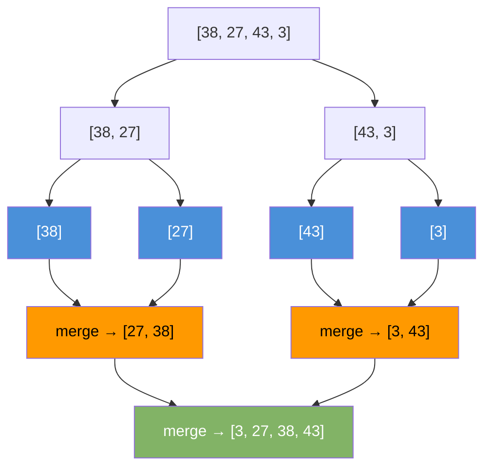

# Merge Sort

Divide the array in half, sort each half, then merge the two sorted halves back together.

---

## Intuition

Split the problem until it is trivial — a single element is always sorted. Then merge pairs of sorted arrays. Merging two sorted arrays is easy: compare the fronts, take the smaller one. Repeat until both are empty.

---

## Operations

| Best | Average | Worst | Space | Stable |
|------|---------|-------|-------|--------|
| O(n log n) | O(n log n) | O(n log n) | O(n) | Yes |

Always O(n log n) — no worst-case degradation like Quick Sort.

---

## Sample Input

```
arr = [38, 27, 43, 3]
```

---

## Visual Representation



---

## Step-by-step Trace — Merge [27, 38] and [3, 43]

| Step | Left ptr | Right ptr | Compare | Pick | Result so far |
|------|----------|-----------|---------|------|---------------|
| 1 | 27 | 3 | 3 < 27 | 3 | [3] |
| 2 | 27 | 43 | 27 < 43 | 27 | [3, 27] |
| 3 | 38 | 43 | 38 < 43 | 38 | [3, 27, 38] |
| 4 | — | 43 | left empty | 43 | [3, 27, 38, 43] ✓ |

---

## Java Implementation

```java
// Time: O(n log n)  Space: O(n)
void mergeSort(int[] arr, int left, int right) {
    if (left >= right) return;
    int mid = left + (right - left) / 2;
    mergeSort(arr, left, mid);
    mergeSort(arr, mid + 1, right);
    merge(arr, left, mid, right);
}

void merge(int[] arr, int left, int mid, int right) {
    int[] L = Arrays.copyOfRange(arr, left, mid + 1);
    int[] R = Arrays.copyOfRange(arr, mid + 1, right + 1);

    int i = 0, j = 0, k = left;
    while (i < L.length && j < R.length)
        arr[k++] = (L[i] <= R[j]) ? L[i++] : R[j++];
    while (i < L.length) arr[k++] = L[i++];
    while (j < R.length) arr[k++] = R[j++];
}

// Call: mergeSort(arr, 0, arr.length - 1);
```

---

## Common Mistakes

- **Using `(left + right) / 2` for mid.** This overflows when `left + right > Integer.MAX_VALUE`. Use `left + (right - left) / 2`.
- **Off-by-one in merge.** `mid` belongs to the left half: copy `left..mid` into L and `mid+1..right` into R.
- **Forgetting to drain the remaining elements.** After one pointer runs out, copy the rest of the other array into the result.
- **Assuming merge sort sorts in-place.** It needs O(n) extra space for the temporary arrays. It is not an in-place sort.

---

## Practice Problems

| Difficulty | Problem | Link |
|------------|---------|------|
| Medium | Sort an Array | [LeetCode 912](https://leetcode.com/problems/sort-an-array/) |
| Medium | Sort List | [LeetCode 148](https://leetcode.com/problems/sort-list/) |
| Hard | Count of Smaller Numbers After Self | [LeetCode 315](https://leetcode.com/problems/count-of-smaller-numbers-after-self/) |

---

## Deep Dive

### Why O(n log n)?

The array splits in half at each level — log₂(n) levels total. At every level, the merge step processes all n elements. Total work: n × log n.

### When to Choose Merge Sort Over Quick Sort

| Scenario | Choose |
|----------|--------|
| Need stable sort | Merge sort |
| Sorting a linked list | Merge sort (no random access needed) |
| Worst-case guarantee matters | Merge sort |
| Memory is tight | Quick sort |
| Sorting primitive arrays | Quick sort (better cache) |

Java uses Timsort (merge sort variant) for `Arrays.sort(Object[])` and `Collections.sort()` because object sorts require stability.
