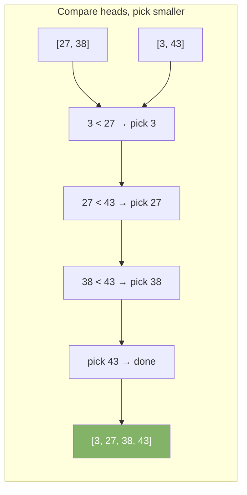

# Merge Sort

Merge sort uses divide and conquer. It splits the array in half, sorts each half recursively, then merges the two sorted halves.

| Best       | Average    | Worst      | Space | Stable |
|------------|------------|------------|-------|--------|
| O(n log n) | O(n log n) | O(n log n) | O(n)  | Yes    |

---

## How It Works

Split until each piece has one element. One element is always sorted. Merge sorted pieces back together.

### Step-by-Step: Sort [38, 27, 43, 3]


---

## Merge Step Detail

Merge `[27, 38]` and `[3, 43]` into `[3, 27, 38, 43]`:



---

## Java Implementation

```java
void mergeSort(int[] arr, int left, int right) {
    if (left >= right) return;
    int mid = left + (right - left) / 2;
    mergeSort(arr, left, mid);
    mergeSort(arr, mid + 1, right);
    merge(arr, left, mid, right);
}

void merge(int[] arr, int left, int mid, int right) {
    int n1 = mid - left + 1;
    int n2 = right - mid;

    int[] L = new int[n1];
    int[] R = new int[n2];

    System.arraycopy(arr, left, L, 0, n1);
    System.arraycopy(arr, mid + 1, R, 0, n2);

    int i = 0, j = 0, k = left;
    while (i < n1 && j < n2) {
        if (L[i] <= R[j]) arr[k++] = L[i++];
        else               arr[k++] = R[j++];
    }
    while (i < n1) arr[k++] = L[i++];
    while (j < n2) arr[k++] = R[j++];
}

// Call: mergeSort(arr, 0, arr.length - 1);
```

---

## Advantages

- Always O(n log n) — no worst case degradation
- Stable — equal elements keep their original order
- Predictable — used in Java's `Arrays.sort` for objects (`TimSort`)

## Disadvantages

- Needs O(n) extra space for the temporary arrays
- Slower than Quick Sort in practice for small arrays due to overhead

---

## When to Use

- When stability matters (preserving relative order of equal elements)
- Sorting linked lists — merge sort works without random access
- External sorting — data too large to fit in memory
- When worst-case O(n log n) is required
