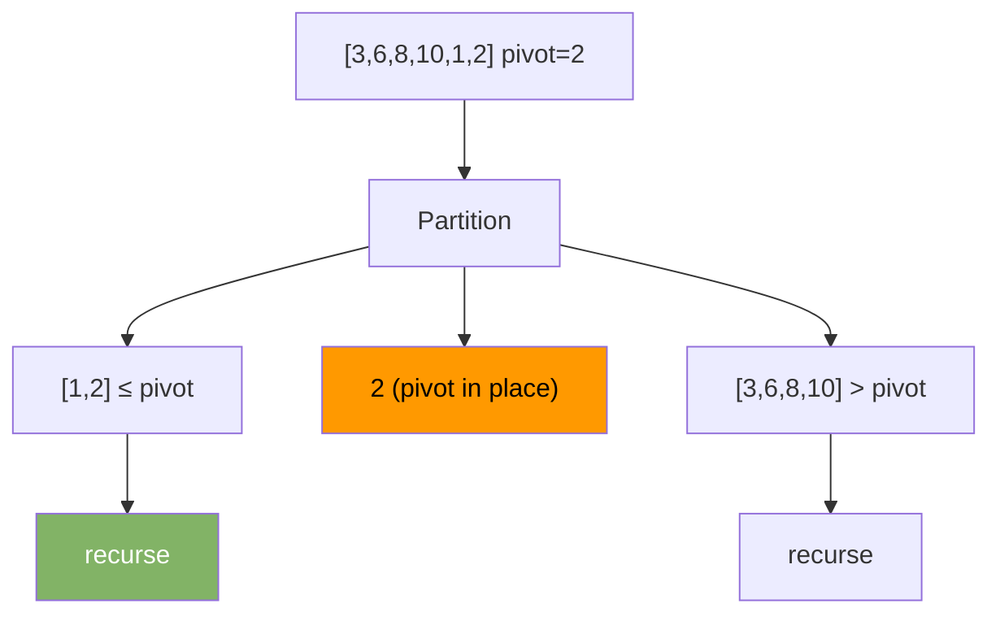

# Quick Sort

Pick a pivot. Partition the array so everything smaller is left of the pivot and everything larger is right. Sort each side recursively.

---

## Intuition

Find one element's correct final position (the pivot). Every element smaller goes left. Every element larger goes right. Now the pivot is in its final spot. Recursively sort the two sides. No merging needed.

---

## Operations

| Best | Average | Worst | Space | Stable |
|------|---------|-------|-------|--------|
| O(n log n) | O(n log n) | O(n²) | O(log n) | No |

Worst case happens when the pivot is always the smallest or largest element (sorted input, bad pivot).

---

## Sample Input

```
arr = [3, 6, 8, 10, 1, 2]  pivot = last element (2)
```

---

## Visual Representation



---

## Step-by-step Trace — Partition [3, 6, 8, 10, 1, 2]

Pivot = 2 (last element). `i` tracks the boundary of elements ≤ pivot.

| j | arr[j] | arr[j] ≤ 2? | i | Action | Array |
|---|--------|-------------|---|--------|-------|
| 0 | 3 | No | -1 | skip | [3,6,8,10,1,2] |
| 1 | 6 | No | -1 | skip | [3,6,8,10,1,2] |
| 2 | 8 | No | -1 | skip | [3,6,8,10,1,2] |
| 3 | 10 | No | -1 | skip | [3,6,8,10,1,2] |
| 4 | 1 | Yes | 0 | i++, swap j,i | [**1**,6,8,10,**3**,2] |
| end | — | — | — | swap pivot to i+1 | [1,**2**,8,10,3,6] |

Pivot 2 is now at index 1 — its final position.

---

## Java Implementation

```java
// Time: O(n log n) average  Space: O(log n)
void quickSort(int[] arr, int low, int high) {
    if (low < high) {
        int pi = partition(arr, low, high);
        quickSort(arr, low, pi - 1);
        quickSort(arr, pi + 1, high);
    }
}

int partition(int[] arr, int low, int high) {
    int pivot = arr[high];
    int i = low - 1;
    for (int j = low; j < high; j++) {
        if (arr[j] <= pivot) {
            i++;
            int tmp = arr[i]; arr[i] = arr[j]; arr[j] = tmp;
        }
    }
    int tmp = arr[i+1]; arr[i+1] = arr[high]; arr[high] = tmp;
    return i + 1;
}

// Call: quickSort(arr, 0, arr.length - 1);
```

### Random Pivot (avoids worst case)

```java
void quickSortRandom(int[] arr, int low, int high) {
    if (low < high) {
        int r = low + (int)(Math.random() * (high - low + 1));
        int tmp = arr[r]; arr[r] = arr[high]; arr[high] = tmp;
        int pi = partition(arr, low, high);
        quickSortRandom(arr, low, pi - 1);
        quickSortRandom(arr, pi + 1, high);
    }
}
```

### Pivot Strategies

| Strategy | Worst-case input | Notes |
|----------|-----------------|-------|
| Last element | Sorted array | Simple but risky |
| First element | Sorted array | Same risk |
| Random element | Very rare | Good in practice |
| Median of three | Hard to construct | Best practical choice |

---

## Common Mistakes

- **Always picking first or last element as pivot on sorted input.** This gives O(n²). Use random pivot or median-of-three.
- **Forgetting the base case `if (low < high)`.** Without it, recursion never stops.
- **Inclusive vs exclusive bounds.** The recursive calls are `quickSort(arr, low, pi-1)` and `quickSort(arr, pi+1, high)`. The pivot at `pi` is already in its final position — exclude it from both sides.
- **Confusing Quick Sort with Quick Select.** Quick Select finds the kth smallest element in O(n) average — it only recurses on one side.

---

## Practice Problems

| Difficulty | Problem | Link |
|------------|---------|------|
| Medium | Sort an Array | [LeetCode 912](https://leetcode.com/problems/sort-an-array/) |
| Medium | Kth Largest Element in an Array | [LeetCode 215](https://leetcode.com/problems/kth-largest-element-in-an-array/) |
| Medium | Sort Colors | [LeetCode 75](https://leetcode.com/problems/sort-colors/) |

---

## Deep Dive

### Quick Sort vs Merge Sort

| Property | Quick Sort | Merge Sort |
|----------|-----------|-----------|
| Average case | O(n log n) | O(n log n) |
| Worst case | O(n²) | O(n log n) |
| Space | O(log n) | O(n) |
| Cache performance | Better | Worse |
| Stable | No | Yes |
| In-place | Yes | No |

Quick Sort is faster in practice due to better cache locality — it accesses elements sequentially during partition. Merge Sort creates and copies to separate arrays, causing more cache misses.

### Java's Dual-Pivot Quick Sort

Java uses dual-pivot quick sort for `Arrays.sort(int[])`. It picks two pivots and partitions into three parts: less than pivot1, between pivots, greater than pivot2. This reduces the average number of comparisons and performs better than single-pivot in practice.
