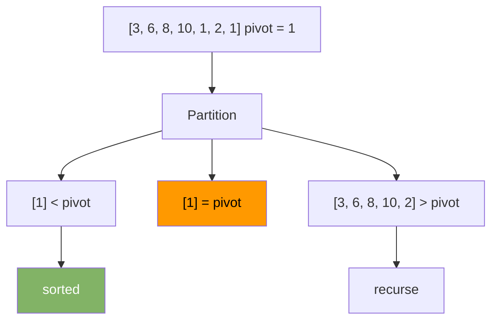
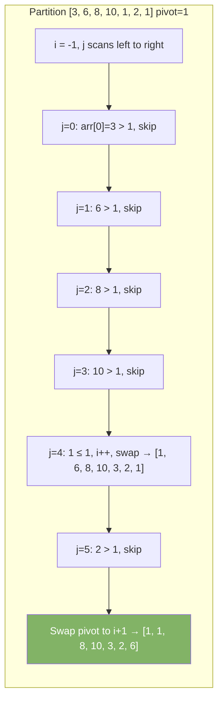

# Quick Sort

Quick sort picks a pivot element and partitions the array so that all elements smaller than the pivot go left and all larger go right. Then it sorts each side recursively.

| Best       | Average    | Worst | Space    | Stable |
|------------|------------|-------|----------|--------|
| O(n log n) | O(n log n) | O(n²) | O(log n) | No     |

Worst case happens when the pivot is always the smallest or largest element (sorted input with bad pivot choice).

---

## How It Works

### Step-by-Step: Sort [3, 6, 8, 10, 1, 2, 1] — pivot = last element



---

## Partition (Lomuto Scheme)

The pivot goes to its correct final position. Elements left of it are smaller. Elements right are larger.



---

## Java Implementation

```java
void quickSort(int[] arr, int low, int high) {
    if (low < high) {
        int pi = partition(arr, low, high);
        quickSort(arr, low, pi - 1);
        quickSort(arr, pi + 1, high);
    }
}

int partition(int[] arr, int low, int high) {
    int pivot = arr[high];
    int i = low - 1;
    for (int j = low; j < high; j++) {
        if (arr[j] <= pivot) {
            i++;
            int temp = arr[i]; arr[i] = arr[j]; arr[j] = temp;
        }
    }
    int temp = arr[i + 1]; arr[i + 1] = arr[high]; arr[high] = temp;
    return i + 1;
}

// Call: quickSort(arr, 0, arr.length - 1);
```

---

## Pivot Strategies

| Strategy         | Worst Case Input           | Notes                          |
|------------------|----------------------------|--------------------------------|
| Last element     | Already sorted array       | Simple, but risky              |
| First element    | Already sorted array       | Same risk                      |
| Random element   | Very rare                  | Good in practice               |
| Median of three  | Hard to construct          | Best practical choice          |

```java
// Random pivot — swap random element with last, then partition normally
void quickSortRandom(int[] arr, int low, int high) {
    if (low < high) {
        int r = low + (int)(Math.random() * (high - low + 1));
        int temp = arr[r]; arr[r] = arr[high]; arr[high] = temp;
        int pi = partition(arr, low, high);
        quickSortRandom(arr, low, pi - 1);
        quickSortRandom(arr, pi + 1, high);
    }
}
```

---

## Quick Sort vs Merge Sort

| Property          | Quick Sort    | Merge Sort    |
|-------------------|---------------|---------------|
| Average case      | O(n log n)    | O(n log n)    |
| Worst case        | O(n²)         | O(n log n)    |
| Space             | O(log n)      | O(n)          |
| Cache performance | Better        | Worse         |
| Stable            | No            | Yes           |
| In-place          | Yes           | No            |

Quick sort is faster in practice due to better cache locality. Java uses a dual-pivot quick sort for primitive arrays.

---

## When to Use

- Sorting primitive arrays (Java's default for `int[]`, `long[]`, etc.)
- When in-place sorting matters (no extra memory)
- Average performance matters more than worst-case guarantee

Avoid quick sort on nearly sorted data unless you use random pivot.
