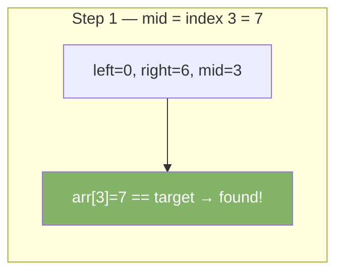
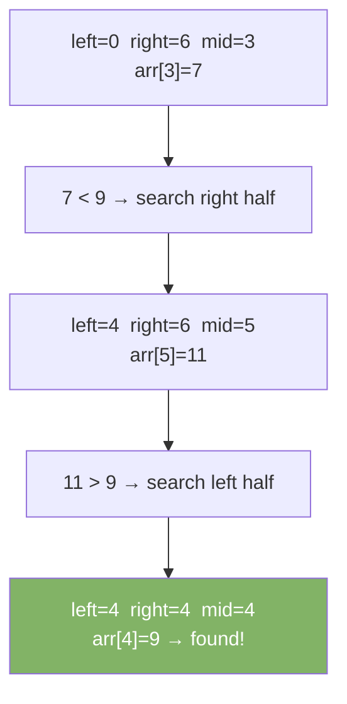

# Binary Search

Binary search finds a target in a sorted array. It halves the search space each step. Much faster than scanning every element.

| Best | Average  | Worst    | Space |
|------|----------|----------|-------|
| O(1) | O(log n) | O(log n) | O(1)  |

**Requirement:** The array must be sorted.

---

## How It Works

Keep a `left` and `right` pointer. Check the middle element. If it matches, done. If target is smaller, search the left half. If larger, search the right half.

### Step-by-Step: Find 7 in [1, 3, 5, 7, 9, 11, 13]



### Step-by-Step: Find 9 in [1, 3, 5, 7, 9, 11, 13]



---

## Java Implementation

### Iterative

```java
int binarySearch(int[] arr, int target) {
    int left = 0, right = arr.length - 1;
    while (left <= right) {
        int mid = left + (right - left) / 2; // avoids integer overflow
        if (arr[mid] == target) return mid;
        if (arr[mid] < target) left = mid + 1;
        else                   right = mid - 1;
    }
    return -1; // not found
}
```

### Recursive

```java
int binarySearch(int[] arr, int target, int left, int right) {
    if (left > right) return -1;
    int mid = left + (right - left) / 2;
    if (arr[mid] == target) return mid;
    if (arr[mid] < target)  return binarySearch(arr, target, mid + 1, right);
    return binarySearch(arr, target, left, mid - 1);
}
```

### Java Built-in

```java
int[] arr = {1, 3, 5, 7, 9, 11, 13};
int idx = Arrays.binarySearch(arr, 7); // returns 3
```

---

## Variants

### Find First Occurrence

```java
int findFirst(int[] arr, int target) {
    int left = 0, right = arr.length - 1, result = -1;
    while (left <= right) {
        int mid = left + (right - left) / 2;
        if (arr[mid] == target) {
            result = mid;
            right = mid - 1; // keep searching left
        } else if (arr[mid] < target) {
            left = mid + 1;
        } else {
            right = mid - 1;
        }
    }
    return result;
}
```

### Find Last Occurrence

```java
int findLast(int[] arr, int target) {
    int left = 0, right = arr.length - 1, result = -1;
    while (left <= right) {
        int mid = left + (right - left) / 2;
        if (arr[mid] == target) {
            result = mid;
            left = mid + 1; // keep searching right
        } else if (arr[mid] < target) {
            left = mid + 1;
        } else {
            right = mid - 1;
        }
    }
    return result;
}
```

### Search in Rotated Sorted Array

```java
int searchRotated(int[] arr, int target) {
    int left = 0, right = arr.length - 1;
    while (left <= right) {
        int mid = left + (right - left) / 2;
        if (arr[mid] == target) return mid;
        if (arr[left] <= arr[mid]) { // left half is sorted
            if (target >= arr[left] && target < arr[mid]) right = mid - 1;
            else left = mid + 1;
        } else { // right half is sorted
            if (target > arr[mid] && target <= arr[right]) left = mid + 1;
            else right = mid - 1;
        }
    }
    return -1;
}
```

---

## Common Pitfalls

| Pitfall                     | Fix                                      |
|-----------------------------|------------------------------------------|
| `mid = (left + right) / 2`  | Use `left + (right - left) / 2` to avoid overflow |
| `left < right` vs `left <= right` | Use `<=` for exact match; `<` for finding boundary |
| Forgetting array must be sorted | Always confirm sort order before applying |
