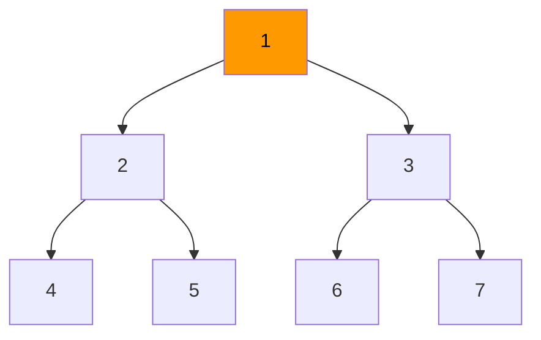
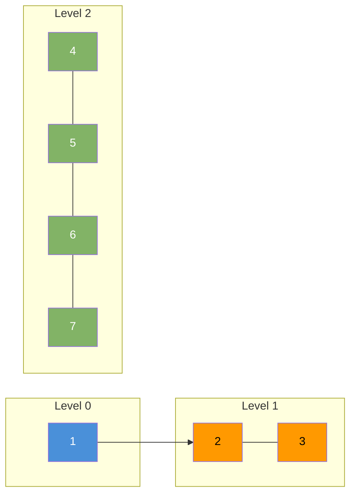
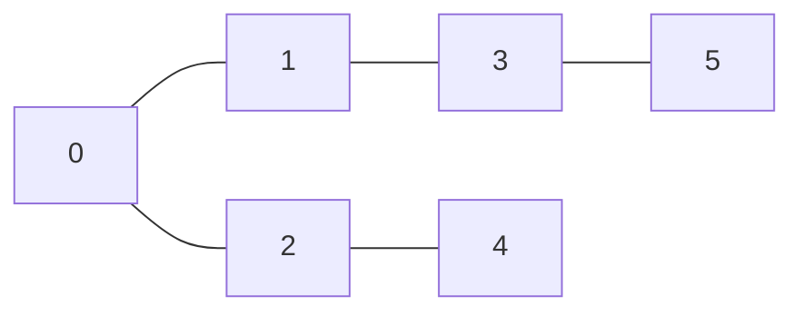

# BFS — Breadth First Search

BFS explores a graph or tree level by level. It visits all neighbors of a node before moving to the next level. Uses a queue.

| Time     | Space    |
|----------|----------|
| O(V + E) | O(V)     |

---

## How It Works

1. Enqueue the start node. Mark it visited.
2. Dequeue a node. Process it.
3. Enqueue all unvisited neighbors. Mark them visited.
4. Repeat until the queue is empty.

---

## BFS on a Tree



Visit order: **1 → 2 → 3 → 4 → 5 → 6 → 7**



---

## Java — BFS on Tree

```java
void bfsTree(TreeNode root) {
    if (root == null) return;
    Queue<TreeNode> queue = new ArrayDeque<>();
    queue.offer(root);
    while (!queue.isEmpty()) {
        TreeNode node = queue.poll();
        System.out.print(node.val + " ");
        if (node.left  != null) queue.offer(node.left);
        if (node.right != null) queue.offer(node.right);
    }
}
```

---

## BFS on Graph



Start at 0. Visit order: **0 → 1 → 2 → 3 → 4 → 5**

```java
void bfsGraph(List<List<Integer>> adj, int start) {
    boolean[] visited = new boolean[adj.size()];
    Queue<Integer> queue = new ArrayDeque<>();

    queue.offer(start);
    visited[start] = true;

    while (!queue.isEmpty()) {
        int node = queue.poll();
        System.out.print(node + " ");
        for (int neighbor : adj.get(node)) {
            if (!visited[neighbor]) {
                visited[neighbor] = true;
                queue.offer(neighbor);
            }
        }
    }
}
```

---

## BFS Level by Level

Useful when you need to know which level (depth) each node is at.

```java
List<List<Integer>> levelOrder(TreeNode root) {
    List<List<Integer>> result = new ArrayList<>();
    if (root == null) return result;

    Queue<TreeNode> queue = new ArrayDeque<>();
    queue.offer(root);

    while (!queue.isEmpty()) {
        int levelSize = queue.size();
        List<Integer> level = new ArrayList<>();
        for (int i = 0; i < levelSize; i++) {
            TreeNode node = queue.poll();
            level.add(node.val);
            if (node.left  != null) queue.offer(node.left);
            if (node.right != null) queue.offer(node.right);
        }
        result.add(level);
    }
    return result;
}
```

---

## Shortest Path (Unweighted Graph)

BFS finds the shortest path in an unweighted graph. The first time BFS reaches a node, that path is the shortest.

```java
int shortestPath(List<List<Integer>> adj, int start, int end) {
    boolean[] visited = new boolean[adj.size()];
    Queue<int[]> queue = new ArrayDeque<>(); // {node, distance}
    queue.offer(new int[]{start, 0});
    visited[start] = true;

    while (!queue.isEmpty()) {
        int[] curr = queue.poll();
        int node = curr[0], dist = curr[1];
        if (node == end) return dist;
        for (int neighbor : adj.get(node)) {
            if (!visited[neighbor]) {
                visited[neighbor] = true;
                queue.offer(new int[]{neighbor, dist + 1});
            }
        }
    }
    return -1; // not reachable
}
```

---

## Common Use Cases

| Use Case                       | Why BFS                                 |
|--------------------------------|-----------------------------------------|
| Shortest path (unweighted)     | First path found is always shortest     |
| Level-order tree traversal     | Natural level-by-level processing       |
| Connected components           | BFS from each unvisited node            |
| Web crawler                    | Explore links level by level            |
| Social network friend distance | BFS gives degree of separation          |
| Cycle detection (undirected)   | Re-visiting a visited node means cycle  |
