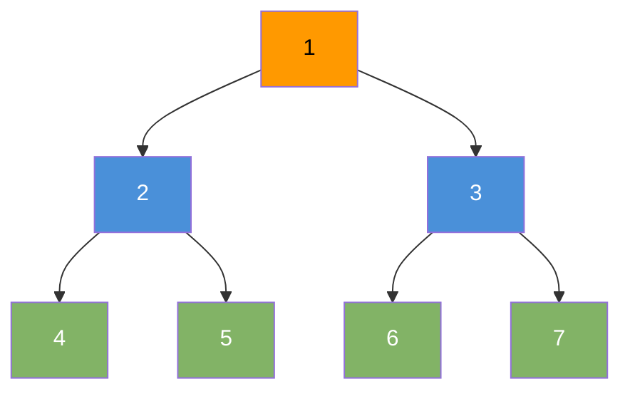

# BFS — Breadth First Search

Explore a graph or tree level by level. Visit all neighbors before going deeper.

---

## Intuition

BFS is like ripples in water. Drop a stone at the start node. The wave spreads outward one layer at a time. Every node at distance 1 is visited before any node at distance 2. This guarantees the shortest path in an unweighted graph.

---

## Operations

| Time | Space |
|------|-------|
| O(V + E) | O(V) |

V = vertices, E = edges.

---

## Sample Input

```
Tree:
        1
       / \
      2   3
     / \ / \
    4  5 6  7

Start: node 1
```

---

## Visual Representation



Visit order: **1 → 2 → 3 → 4 → 5 → 6 → 7**

---

## Step-by-step Trace

Input: tree above, start at node 1

| Step | Dequeue | Queue after | Visited |
|------|---------|-------------|---------|
| init | — | [1] | {} |
| 1 | 1 | [2, 3] | {1} |
| 2 | 2 | [3, 4, 5] | {1, 2} |
| 3 | 3 | [4, 5, 6, 7] | {1, 2, 3} |
| 4 | 4 | [5, 6, 7] | {1, 2, 3, 4} |
| 5 | 5 | [6, 7] | {1, 2, 3, 4, 5} |
| 6 | 6 | [7] | {1, 2, 3, 4, 5, 6} |
| 7 | 7 | [] | {1, 2, 3, 4, 5, 6, 7} |

---

## Java Implementation

### BFS on Tree

```java
// Time: O(n)  Space: O(n)
void bfsTree(TreeNode root) {
    if (root == null) return;
    Queue<TreeNode> q = new ArrayDeque<>();
    q.offer(root);
    while (!q.isEmpty()) {
        TreeNode node = q.poll();
        System.out.print(node.val + " ");
        if (node.left  != null) q.offer(node.left);
        if (node.right != null) q.offer(node.right);
    }
}
// Output: 1 2 3 4 5 6 7
```

### BFS on Graph

```java
// Time: O(V + E)  Space: O(V)
void bfsGraph(List<List<Integer>> adj, int start) {
    boolean[] visited = new boolean[adj.size()];
    Queue<Integer> q = new ArrayDeque<>();
    q.offer(start);
    visited[start] = true;
    while (!q.isEmpty()) {
        int node = q.poll();
        System.out.print(node + " ");
        for (int neighbor : adj.get(node))
            if (!visited[neighbor]) {
                visited[neighbor] = true;
                q.offer(neighbor);
            }
    }
}
```

### Level-by-Level (track depth)

```java
// Time: O(n)  Space: O(n)
List<List<Integer>> levelOrder(TreeNode root) {
    List<List<Integer>> result = new ArrayList<>();
    if (root == null) return result;
    Queue<TreeNode> q = new ArrayDeque<>();
    q.offer(root);
    while (!q.isEmpty()) {
        int size = q.size();
        List<Integer> level = new ArrayList<>();
        for (int i = 0; i < size; i++) {
            TreeNode node = q.poll();
            level.add(node.val);
            if (node.left  != null) q.offer(node.left);
            if (node.right != null) q.offer(node.right);
        }
        result.add(level);
    }
    return result;
}
```

### Shortest Path (unweighted graph)

```java
// Time: O(V + E)  Space: O(V)
int shortestPath(List<List<Integer>> adj, int start, int end) {
    boolean[] visited = new boolean[adj.size()];
    Queue<int[]> q = new ArrayDeque<>();
    q.offer(new int[]{start, 0});
    visited[start] = true;
    while (!q.isEmpty()) {
        int[] curr = q.poll();
        int node = curr[0], dist = curr[1];
        if (node == end) return dist;
        for (int neighbor : adj.get(node))
            if (!visited[neighbor]) {
                visited[neighbor] = true;
                q.offer(new int[]{neighbor, dist + 1});
            }
    }
    return -1;
}
```

---

## Common Mistakes

- **Not marking nodes visited when enqueuing.** If you mark visited only when dequeuing, the same node gets enqueued multiple times. Mark visited immediately on enqueue.
- **Using a stack instead of a queue.** A stack gives DFS, not BFS. BFS requires a queue.
- **Forgetting to check for null root.** Always guard with `if (root == null) return` before enqueuing.
- **Not tracking depth when needed.** Use the `int size = q.size()` trick at the start of each level to process nodes level by level.

---

## Practice Problems

| Difficulty | Problem | Link |
|------------|---------|------|
| Medium | Binary Tree Level Order Traversal | [LeetCode 102](https://leetcode.com/problems/binary-tree-level-order-traversal/) |
| Medium | Rotting Oranges | [LeetCode 994](https://leetcode.com/problems/rotting-oranges/) |
| Hard | Word Ladder | [LeetCode 127](https://leetcode.com/problems/word-ladder/) |

---

## Deep Dive

### Why BFS Finds the Shortest Path

BFS visits nodes in order of their distance from the start. The first time it reaches a node, it has taken the fewest hops to get there. Any later path to that node would be longer. This guarantee only holds for unweighted graphs — for weighted graphs, use Dijkstra.

### BFS vs DFS

| Property | BFS | DFS |
|----------|-----|-----|
| Data structure | Queue | Stack (or recursion) |
| Shortest path | Yes (unweighted) | No |
| Memory | O(width) — wide trees hurt | O(depth) — deep trees hurt |
| Use for | Level order, shortest path | Cycle detection, path finding, topological sort |
