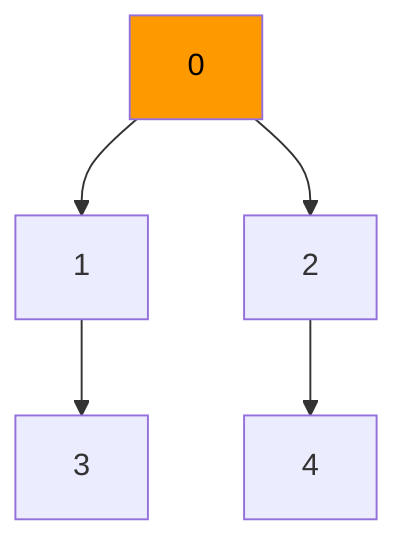

# DFS — Depth First Search

Explore as far as possible down one path before backtracking. Uses a stack (or recursion).

---

## Intuition

DFS is like exploring a maze. Pick a direction and go. Keep going until you hit a dead end. Then backtrack and try a different direction. DFS goes deep before it goes wide.

---

## Operations

| Time | Space |
|------|-------|
| O(V + E) | O(V) |

V = vertices, E = edges.

---

## Sample Input

```
Graph edges: 0-1, 0-2, 1-3, 2-4
Start: node 0
```

---

## Visual Representation



Visit order: **0 → 1 → 3 → 2 → 4**

---

## Step-by-step Trace — DFS from node 0

| Step | Node | Action | Visited | Stack / Call |
|------|------|--------|---------|--------------|
| 1 | 0 | visit 0 | {0} | call dfs(1), dfs(2) |
| 2 | 1 | visit 1 | {0,1} | call dfs(3) |
| 3 | 3 | visit 3 | {0,1,3} | no unvisited neighbors → backtrack |
| 4 | 1 | backtrack | {0,1,3} | return to 0 |
| 5 | 2 | visit 2 | {0,1,3,2} | call dfs(4) |
| 6 | 4 | visit 4 | {0,1,3,2,4} | done |

---

## Java Implementation

### DFS on Tree (Recursive)

```java
// Time: O(n)  Space: O(h) — h = height
void dfs(TreeNode node) {
    if (node == null) return;
    System.out.print(node.val + " "); // preorder visit
    dfs(node.left);
    dfs(node.right);
}
```

### DFS on Graph (Recursive)

```java
// Time: O(V + E)  Space: O(V)
void dfs(List<List<Integer>> adj, boolean[] visited, int node) {
    visited[node] = true;
    System.out.print(node + " ");
    for (int neighbor : adj.get(node))
        if (!visited[neighbor])
            dfs(adj, visited, neighbor);
}

// Call:
boolean[] visited = new boolean[V];
dfs(adj, visited, 0);
```

### DFS on Graph (Iterative)

```java
// Time: O(V + E)  Space: O(V)
void dfsIterative(List<List<Integer>> adj, int start) {
    boolean[] visited = new boolean[adj.size()];
    Deque<Integer> stack = new ArrayDeque<>();
    stack.push(start);
    while (!stack.isEmpty()) {
        int node = stack.pop();
        if (visited[node]) continue;
        visited[node] = true;
        System.out.print(node + " ");
        for (int neighbor : adj.get(node))
            if (!visited[neighbor]) stack.push(neighbor);
    }
}
```

### Cycle Detection in Directed Graph

```java
// Time: O(V + E)  Space: O(V)
boolean hasCycle(List<List<Integer>> adj, int V) {
    boolean[] visited = new boolean[V];
    boolean[] inStack = new boolean[V];
    for (int i = 0; i < V; i++)
        if (!visited[i] && dfsCycle(adj, visited, inStack, i)) return true;
    return false;
}

boolean dfsCycle(List<List<Integer>> adj, boolean[] visited, boolean[] inStack, int node) {
    visited[node] = inStack[node] = true;
    for (int nb : adj.get(node)) {
        if (!visited[nb] && dfsCycle(adj, visited, inStack, nb)) return true;
        if (inStack[nb]) return true; // back edge = cycle
    }
    inStack[node] = false;
    return false;
}
```

---

## Common Mistakes

- **Not marking nodes visited.** Without a visited array, DFS loops forever in a graph with cycles.
- **Confusing iterative DFS visit order with recursive.** The iterative version using a stack visits in a different order than recursive DFS because neighbors are pushed in forward order and popped in reverse.
- **Stack overflow on deep graphs.** Recursive DFS uses the call stack. Very deep graphs (thousands of levels) cause `StackOverflowError`. Use the iterative version for production code.
- **Using DFS for shortest path.** DFS does not guarantee the shortest path. Use BFS for shortest path in unweighted graphs.

---

## Practice Problems

| Difficulty | Problem | Link |
|------------|---------|------|
| Medium | Number of Islands | [LeetCode 200](https://leetcode.com/problems/number-of-islands/) |
| Medium | Course Schedule | [LeetCode 207](https://leetcode.com/problems/course-schedule/) |
| Medium | Pacific Atlantic Water Flow | [LeetCode 417](https://leetcode.com/problems/pacific-atlantic-water-flow/) |

---

## Deep Dive

### DFS vs BFS

| Property | DFS | BFS |
|----------|-----|-----|
| Data structure | Stack (recursion) | Queue |
| Memory | O(depth) | O(width) |
| Shortest path | No | Yes (unweighted) |
| Find all paths | Yes | Finds shortest first |
| Tree traversal | Pre/In/Postorder | Level order |

### When to Use DFS

- Detecting cycles in a graph
- Topological sorting (finish-time ordering)
- Finding connected components
- Maze solving and path finding
- Generating permutations and subsets (backtracking)
