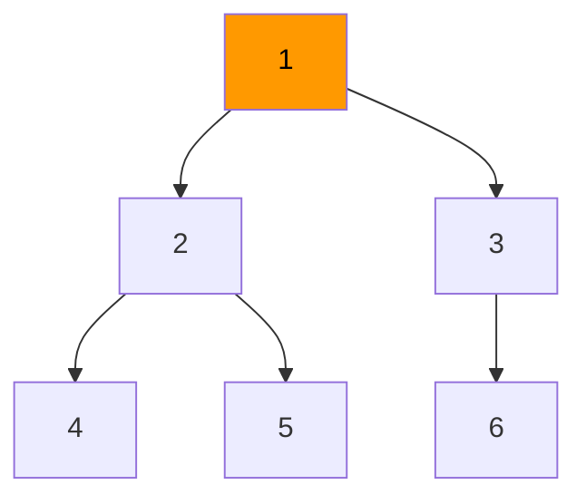
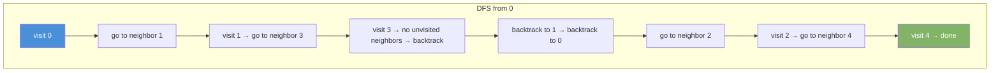

# DFS — Depth First Search

DFS explores as far as possible down one path before backtracking. Uses a stack (recursion uses the call stack implicitly).

| Time     | Space    |
|----------|----------|
| O(V + E) | O(V)     |

---

## How It Works

1. Visit the current node. Mark it visited.
2. For each unvisited neighbor, recurse (or push to stack).
3. Backtrack when no unvisited neighbors remain.

---

## DFS on a Tree



Visit order (preorder DFS): **1 → 2 → 4 → 5 → 3 → 6**

DFS goes deep before it goes wide.

---

## Java — DFS on Tree (Recursive)

```java
void dfs(TreeNode node) {
    if (node == null) return;
    System.out.print(node.val + " "); // visit
    dfs(node.left);
    dfs(node.right);
}
```

---

## Java — DFS on Graph (Recursive)

```java
void dfs(List<List<Integer>> adj, boolean[] visited, int node) {
    visited[node] = true;
    System.out.print(node + " ");
    for (int neighbor : adj.get(node)) {
        if (!visited[neighbor]) {
            dfs(adj, visited, neighbor);
        }
    }
}

// Call:
boolean[] visited = new boolean[V];
dfs(adj, visited, 0);
```

---

## Java — DFS on Graph (Iterative with Stack)

```java
void dfsIterative(List<List<Integer>> adj, int start) {
    boolean[] visited = new boolean[adj.size()];
    Deque<Integer> stack = new ArrayDeque<>();
    stack.push(start);

    while (!stack.isEmpty()) {
        int node = stack.pop();
        if (visited[node]) continue;
        visited[node] = true;
        System.out.print(node + " ");
        for (int neighbor : adj.get(node)) {
            if (!visited[neighbor]) stack.push(neighbor);
        }
    }
}
```

---

## DFS Step-by-Step: Graph [0-1, 0-2, 1-3, 2-4]



Visit order: **0 → 1 → 3 → 2 → 4**

---

## DFS vs BFS

| Property              | DFS              | BFS                  |
|-----------------------|------------------|----------------------|
| Data structure        | Stack            | Queue                |
| Memory                | O(depth)         | O(width)             |
| Shortest path         | No               | Yes (unweighted)     |
| Finds all solutions   | Yes              | Finds shortest first |
| Tree traversal        | Pre/In/Postorder | Level order          |

---

## Common Use Cases

| Use Case                     | How DFS Helps                              |
|------------------------------|--------------------------------------------|
| Detect cycle in graph        | Revisiting a node in current path = cycle  |
| Topological sort             | Push to stack on finish, reverse           |
| Path finding (maze)          | Explore one path fully, backtrack on dead end |
| Connected components         | DFS from each unvisited node               |
| Flood fill (paint bucket)    | DFS fills all connected cells              |
| Strongly connected components| Kosaraju's uses DFS twice                  |

---

## Cycle Detection in Directed Graph

```java
boolean hasCycle(List<List<Integer>> adj, int V) {
    boolean[] visited = new boolean[V];
    boolean[] inStack = new boolean[V];
    for (int i = 0; i < V; i++) {
        if (!visited[i] && dfsHasCycle(adj, visited, inStack, i)) return true;
    }
    return false;
}

boolean dfsHasCycle(List<List<Integer>> adj, boolean[] visited, boolean[] inStack, int node) {
    visited[node] = true;
    inStack[node] = true;
    for (int neighbor : adj.get(node)) {
        if (!visited[neighbor] && dfsHasCycle(adj, visited, inStack, neighbor)) return true;
        if (inStack[neighbor]) return true; // back edge = cycle
    }
    inStack[node] = false;
    return false;
}
```
