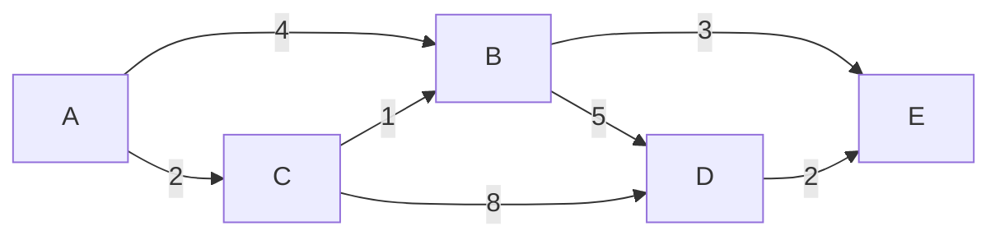
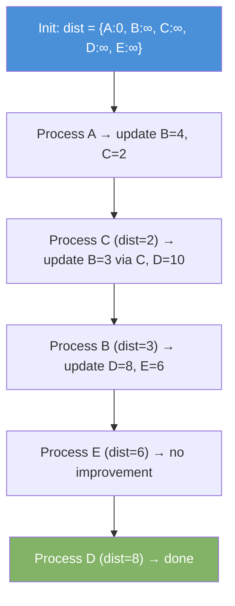

# Dijkstra's Algorithm

Dijkstra finds the shortest path from a source vertex to all other vertices in a weighted graph. All edge weights must be non-negative.

| Time              | Space |
|-------------------|-------|
| O((V + E) log V)  | O(V)  |

---

## How It Works

1. Start with distance 0 for the source. All others are infinity.
2. Use a min-heap (priority queue). Always process the vertex with the smallest known distance first.
3. For each neighbor, check if going through the current vertex gives a shorter path.
4. If yes, update the distance and add it to the heap.
5. Repeat until all vertices are processed.

---

## Example Graph



Shortest paths from A: A→B=3, A→C=2, A→D=8, A→E=6

---

## Step-by-Step from A



---

## Java Implementation

```java
import java.util.*;

int[] dijkstra(List<List<int[]>> adj, int src, int V) {
    int[] dist = new int[V];
    Arrays.fill(dist, Integer.MAX_VALUE);
    dist[src] = 0;

    // Min-heap: {distance, vertex}
    PriorityQueue<int[]> pq = new PriorityQueue<>((a, b) -> a[0] - b[0]);
    pq.offer(new int[]{0, src});

    while (!pq.isEmpty()) {
        int[] curr = pq.poll();
        int d = curr[0], u = curr[1];

        if (d > dist[u]) continue; // outdated entry

        for (int[] edge : adj.get(u)) {
            int v = edge[0], weight = edge[1];
            if (dist[u] + weight < dist[v]) {
                dist[v] = dist[u] + weight;
                pq.offer(new int[]{dist[v], v});
            }
        }
    }
    return dist;
}
```

### Build the Graph

```java
int V = 5; // A=0, B=1, C=2, D=3, E=4
List<List<int[]>> adj = new ArrayList<>();
for (int i = 0; i < V; i++) adj.add(new ArrayList<>());

adj.get(0).add(new int[]{1, 4}); // A → B, weight 4
adj.get(0).add(new int[]{2, 2}); // A → C, weight 2
adj.get(2).add(new int[]{1, 1}); // C → B, weight 1
adj.get(1).add(new int[]{3, 5}); // B → D, weight 5
adj.get(2).add(new int[]{3, 8}); // C → D, weight 8
adj.get(1).add(new int[]{4, 3}); // B → E, weight 3
adj.get(3).add(new int[]{4, 2}); // D → E, weight 2

int[] distances = dijkstra(adj, 0, V);
// distances: [0, 3, 2, 8, 6]
```

---

## Reconstruct Shortest Path

```java
int[] dijkstraWithPath(List<List<int[]>> adj, int src, int V) {
    int[] dist = new int[V];
    int[] prev = new int[V];
    Arrays.fill(dist, Integer.MAX_VALUE);
    Arrays.fill(prev, -1);
    dist[src] = 0;

    PriorityQueue<int[]> pq = new PriorityQueue<>((a, b) -> a[0] - b[0]);
    pq.offer(new int[]{0, src});

    while (!pq.isEmpty()) {
        int[] curr = pq.poll();
        int d = curr[0], u = curr[1];
        if (d > dist[u]) continue;
        for (int[] edge : adj.get(u)) {
            int v = edge[0], w = edge[1];
            if (dist[u] + w < dist[v]) {
                dist[v] = dist[u] + w;
                prev[v] = u;
                pq.offer(new int[]{dist[v], v});
            }
        }
    }
    return prev;
}

List<Integer> getPath(int[] prev, int target) {
    List<Integer> path = new ArrayList<>();
    for (int v = target; v != -1; v = prev[v]) path.add(0, v);
    return path;
}
```

---

## Limitations

| Limitation          | Alternative                        |
|---------------------|------------------------------------|
| Negative edge weights | Bellman-Ford                     |
| Very dense graphs   | Fibonacci heap variant             |
| All-pairs shortest path | Floyd-Warshall               |
