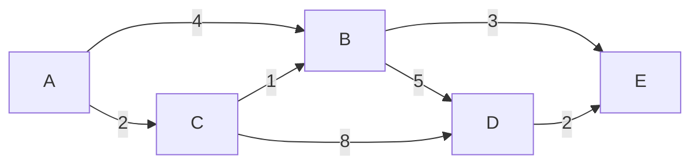

# Dijkstra's Algorithm

Find the shortest path from a source vertex to all other vertices in a weighted graph.

---

## Intuition

Always process the nearest unvisited vertex first. When you reach a neighbor, check: is the path through the current vertex shorter than what you already know? If yes, update. Repeat until all vertices are processed.

---

## Operations

| Time | Space |
|------|-------|
| O((V + E) log V) | O(V) |

All edge weights must be non-negative.

---

## Sample Input

```
Graph (A=0, B=1, C=2, D=3, E=4):
A --4--> B
A --2--> C
C --1--> B
B --5--> D
B --3--> E
C --8--> D
D --2--> E

Source: A
```

---

## Visual Representation



Shortest paths from A: A→C=2, A→B=3 (via C), A→E=6, A→D=8

---

## Step-by-step Trace

Source: A (index 0). Initial dist = {A:0, B:∞, C:∞, D:∞, E:∞}

| Step | Process | Via | Updates | dist array |
|------|---------|-----|---------|------------|
| 1 | A (dist=0) | — | B=4, C=2 | [0, 4, 2, ∞, ∞] |
| 2 | C (dist=2) | A→C | B=min(4,3)=3, D=10 | [0, 3, 2, 10, ∞] |
| 3 | B (dist=3) | A→C→B | D=min(10,8)=8, E=6 | [0, 3, 2, 8, 6] |
| 4 | E (dist=6) | — | no improvement | [0, 3, 2, 8, 6] |
| 5 | D (dist=8) | — | no improvement | **[0, 3, 2, 8, 6]** |

---

## Java Implementation

```java
// Time: O((V + E) log V)  Space: O(V)
int[] dijkstra(List<List<int[]>> adj, int src, int V) {
    int[] dist = new int[V];
    Arrays.fill(dist, Integer.MAX_VALUE);
    dist[src] = 0;

    // Min-heap: {distance, vertex}
    PriorityQueue<int[]> pq = new PriorityQueue<>((a, b) -> a[0] - b[0]);
    pq.offer(new int[]{0, src});

    while (!pq.isEmpty()) {
        int[] curr = pq.poll();
        int d = curr[0], u = curr[1];
        if (d > dist[u]) continue; // outdated entry — skip

        for (int[] edge : adj.get(u)) {
            int v = edge[0], w = edge[1];
            if (dist[u] + w < dist[v]) {
                dist[v] = dist[u] + w;
                pq.offer(new int[]{dist[v], v});
            }
        }
    }
    return dist;
}
```

### Build the Sample Graph

```java
int V = 5; // A=0, B=1, C=2, D=3, E=4
List<List<int[]>> adj = new ArrayList<>();
for (int i = 0; i < V; i++) adj.add(new ArrayList<>());

adj.get(0).add(new int[]{1, 4}); // A → B, weight 4
adj.get(0).add(new int[]{2, 2}); // A → C, weight 2
adj.get(2).add(new int[]{1, 1}); // C → B, weight 1
adj.get(1).add(new int[]{3, 5}); // B → D, weight 5
adj.get(2).add(new int[]{3, 8}); // C → D, weight 8
adj.get(1).add(new int[]{4, 3}); // B → E, weight 3
adj.get(3).add(new int[]{4, 2}); // D → E, weight 2

int[] distances = dijkstra(adj, 0, V);
// Result: [0, 3, 2, 8, 6]
```

### Reconstruct the Shortest Path

```java
int[] dijkstraWithPrev(List<List<int[]>> adj, int src, int V) {
    int[] dist = new int[V];
    int[] prev = new int[V];
    Arrays.fill(dist, Integer.MAX_VALUE);
    Arrays.fill(prev, -1);
    dist[src] = 0;

    PriorityQueue<int[]> pq = new PriorityQueue<>((a, b) -> a[0] - b[0]);
    pq.offer(new int[]{0, src});
    while (!pq.isEmpty()) {
        int[] curr = pq.poll();
        int d = curr[0], u = curr[1];
        if (d > dist[u]) continue;
        for (int[] edge : adj.get(u)) {
            int v = edge[0], w = edge[1];
            if (dist[u] + w < dist[v]) {
                dist[v] = dist[u] + w;
                prev[v] = u;
                pq.offer(new int[]{dist[v], v});
            }
        }
    }
    return prev;
}

List<Integer> getPath(int[] prev, int target) {
    List<Integer> path = new ArrayList<>();
    for (int v = target; v != -1; v = prev[v]) path.add(0, v);
    return path;
}
```

---

## Common Mistakes

- **Using Dijkstra with negative edge weights.** It gives wrong results. Use Bellman-Ford for negative weights.
- **Not skipping outdated heap entries.** When a shorter path is found, the old entry stays in the heap. The `if (d > dist[u]) continue` check discards it.
- **Initializing dist to 0 instead of MAX_VALUE.** Every unvisited vertex must start at infinity so any path is shorter.
- **Integer overflow when adding weights.** `dist[u] + w` can overflow if `dist[u]` is `Integer.MAX_VALUE`. The `d > dist[u]` skip prevents this for most cases, but be careful.

---

## Practice Problems

| Difficulty | Problem | Link |
|------------|---------|------|
| Medium | Network Delay Time | [LeetCode 743](https://leetcode.com/problems/network-delay-time/) |
| Medium | Path With Minimum Effort | [LeetCode 1631](https://leetcode.com/problems/path-with-minimum-effort/) |
| Hard | Shortest Path in a Grid with Obstacles Elimination | [LeetCode 1293](https://leetcode.com/problems/shortest-path-in-a-grid-with-obstacles-elimination/) |

---

## Deep Dive

### Why a Min-Heap?

Dijkstra always processes the vertex with the smallest known distance next. A min-heap lets you extract the minimum in O(log V). A simple array would take O(V) to find the minimum — making the total O(V²), which is worse for sparse graphs.

### Limitations

| Limitation | Alternative |
|------------|-------------|
| Negative edge weights | Bellman-Ford |
| All-pairs shortest path | Floyd-Warshall |
| Very dense graphs | Fibonacci heap (O((V + E) + V log V)) |
