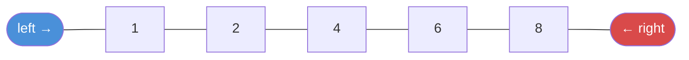

# Two Pointers

Use two index variables to scan an array or string. Moving them reduces O(n²) nested loops to O(n).

---

## Intuition

Instead of checking every pair with a nested loop, two pointers squeeze the problem from both ends — or one moves faster than the other. Each element is visited at most once. O(n) instead of O(n²).

---

## Patterns

| Pattern | Pointers start at | Move | Use when |
|---------|------------------|------|----------|
| Opposite ends | left=0, right=n-1 | Toward center | Pair sums, palindrome, container |
| Fast and slow | Both at start | Fast moves 2×, slow 1× | Cycle detection, middle of list |
| Same direction | Both at start | Fast advances on condition | Remove duplicates, partition |

---

## Sample Input

```
arr = [1, 2, 4, 6, 8, 9], target = 9
Find two numbers that sum to target.
```

---

## Visual Representation



---

## Step-by-step Trace — Two Sum (sorted array)

Input: `arr = [1, 2, 4, 6, 8, 9]`, target = 9

| Step | left | right | arr[l] | arr[r] | sum | Action |
|------|------|-------|--------|--------|-----|--------|
| 1 | 0 | 5 | 1 | 9 | 10 | sum > 9 → right-- |
| 2 | 0 | 4 | 1 | 8 | 9 | **sum == 9 → return [0, 4]** |

2 steps instead of checking all 15 pairs.

---

## Java Implementation

### Pattern 1 — Opposite Ends: Two Sum

```java
// Time: O(n)  Space: O(1)
int[] twoSum(int[] nums, int target) {
    int left = 0, right = nums.length - 1;
    while (left < right) {
        int sum = nums[left] + nums[right];
        if (sum == target) return new int[]{left, right};
        if (sum < target)  left++;
        else               right--;
    }
    return new int[]{-1, -1};
}
```

### Pattern 1 — Opposite Ends: Palindrome Check

```java
// Time: O(n)  Space: O(1)
boolean isPalindrome(String s) {
    int l = 0, r = s.length() - 1;
    while (l < r) {
        if (s.charAt(l) != s.charAt(r)) return false;
        l++; r--;
    }
    return true;
}
```

### Pattern 2 — Fast and Slow: Find Middle of Linked List

```java
// Time: O(n)  Space: O(1)
ListNode findMiddle(ListNode head) {
    ListNode slow = head, fast = head;
    while (fast != null && fast.next != null) {
        slow = slow.next;
        fast = fast.next.next;
    }
    return slow;
}
```

### Pattern 2 — Fast and Slow: Detect Cycle

```java
// Time: O(n)  Space: O(1)
boolean hasCycle(ListNode head) {
    ListNode slow = head, fast = head;
    while (fast != null && fast.next != null) {
        slow = slow.next;
        fast = fast.next.next;
        if (slow == fast) return true;
    }
    return false;
}
```

### Pattern 3 — Same Direction: Remove Duplicates

```java
// Time: O(n)  Space: O(1)
int removeDuplicates(int[] nums) {
    int slow = 0;
    for (int fast = 1; fast < nums.length; fast++)
        if (nums[fast] != nums[slow]) nums[++slow] = nums[fast];
    return slow + 1;
}
```

---

## Common Mistakes

- **Using two pointers on an unsorted array for pair sums.** The opposite-ends pattern only works on a sorted array. Use a HashMap for unsorted arrays.
- **Crossing pointers.** Stop the loop when `left < right`, not `left <= right`. When they meet, there is no valid pair left.
- **Moving the wrong pointer.** For pair sums: if the sum is too big, move `right` left. If too small, move `left` right. Getting this backwards gives wrong results.
- **Off-by-one on fast pointer.** For fast/slow, check both `fast != null` and `fast.next != null` before advancing. Checking only one causes NullPointerException.

---

## Practice Problems

| Difficulty | Problem | Link |
|------------|---------|------|
| Easy | Valid Palindrome | [LeetCode 125](https://leetcode.com/problems/valid-palindrome/) |
| Medium | 3Sum | [LeetCode 15](https://leetcode.com/problems/3sum/) |
| Medium | Container With Most Water | [LeetCode 11](https://leetcode.com/problems/container-with-most-water/) |

---

## Deep Dive

### When to Use Two Pointers vs HashMap

| Situation | Two Pointers | HashMap |
|-----------|-------------|---------|
| Array is sorted | ✓ | Works but slower |
| Array is unsorted | ✗ | ✓ |
| Need O(1) space | ✓ | ✗ (O(n) space) |
| Need the actual indices | ✓ | ✓ |

Two pointers shines when the array is sorted. HashMap handles unsorted input but uses extra space.
