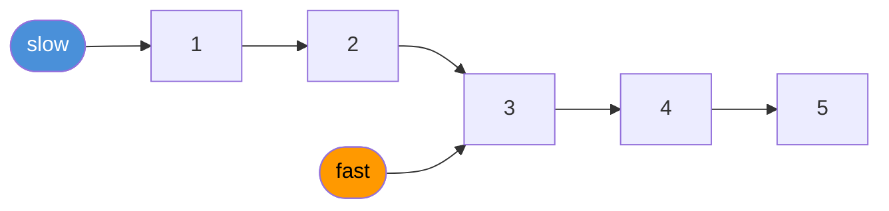
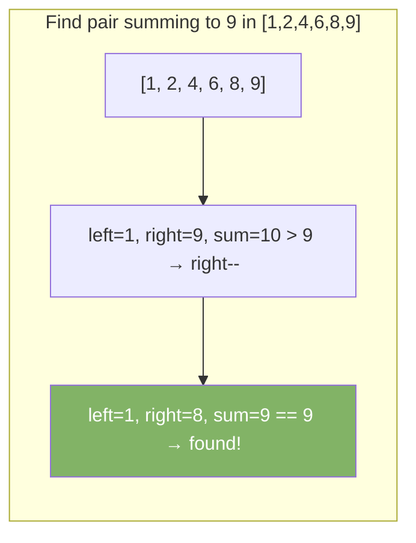

# Two Pointers

Two pointers is a technique that uses two index variables to scan an array or string. Moving them toward each other (or in the same direction) reduces nested loops from O(n²) to O(n).

---

## Patterns

### Pattern 1 — Opposite Ends

Both pointers start at opposite ends and move toward the center.


Use when: target sum, palindrome check, container with most water.

### Pattern 2 — Fast and Slow

Both pointers start at the same end. One moves faster than the other.



Use when: cycle detection, finding the middle of a list, Nth node from end.

---

## Example 1 — Two Sum (Sorted Array)

Find two numbers that add up to the target. Array is sorted.

```java
int[] twoSum(int[] nums, int target) {
    int left = 0, right = nums.length - 1;
    while (left < right) {
        int sum = nums[left] + nums[right];
        if (sum == target) return new int[]{left, right};
        if (sum < target) left++;
        else              right--;
    }
    return new int[]{-1, -1};
}
```



---

## Example 2 — Check Palindrome

```java
boolean isPalindrome(String s) {
    int left = 0, right = s.length() - 1;
    while (left < right) {
        if (s.charAt(left) != s.charAt(right)) return false;
        left++;
        right--;
    }
    return true;
}
```

---

## Example 3 — Remove Duplicates from Sorted Array

```java
int removeDuplicates(int[] nums) {
    if (nums.length == 0) return 0;
    int slow = 0;
    for (int fast = 1; fast < nums.length; fast++) {
        if (nums[fast] != nums[slow]) {
            slow++;
            nums[slow] = nums[fast];
        }
    }
    return slow + 1;
}
```

---

## Example 4 — Find Middle of Linked List

```java
ListNode findMiddle(ListNode head) {
    ListNode slow = head, fast = head;
    while (fast != null && fast.next != null) {
        slow = slow.next;
        fast = fast.next.next;
    }
    return slow; // slow is at the middle
}
```

---

## Example 5 — Detect Cycle in Linked List

```java
boolean hasCycle(ListNode head) {
    ListNode slow = head, fast = head;
    while (fast != null && fast.next != null) {
        slow = slow.next;
        fast = fast.next.next;
        if (slow == fast) return true; // they meet → cycle
    }
    return false;
}
```

---

## When to Use

| Signal in problem                         | Use two pointers?     |
|-------------------------------------------|-----------------------|
| Sorted array, find pair with target sum   | Yes — opposite ends   |
| Palindrome check                          | Yes — opposite ends   |
| Remove duplicates in-place                | Yes — fast/slow       |
| Find middle of linked list                | Yes — fast/slow       |
| Cycle detection                           | Yes — fast/slow       |
| Container with most water                 | Yes — opposite ends   |
| Merge two sorted arrays                   | Yes — one pointer per array |
