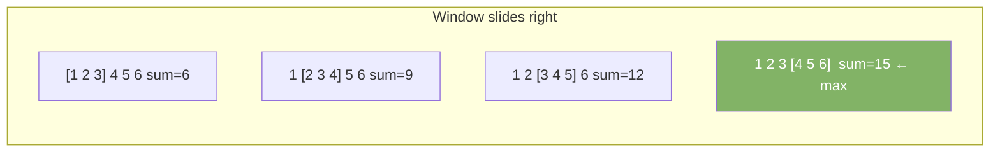

# Sliding Window

Maintain a contiguous subarray or substring. Add the incoming element. Remove the outgoing element. Avoid recomputing from scratch.

---

## Intuition

Imagine a train window sliding along a track. As the train moves, one new tree enters the view and one old tree leaves. You don't count all the trees in view from scratch — you just add one and remove one. Same idea: update the window in O(1) instead of recomputing in O(k).

---

## Patterns

| Pattern | Window size | Use when |
|---------|------------|----------|
| Fixed | Constant k | Max/min/sum over k elements |
| Variable | Expands and shrinks | Longest/shortest subarray meeting a condition |

---

## Sample Input

```
Fixed:    arr = [1, 2, 3, 4, 5, 6], k = 3  → max sum subarray
Variable: s = "abcabcbb"  → longest substring without repeating chars
```

---

## Visual Representation

**Fixed window of size 3 sliding right:**



---

## Step-by-step Trace — Maximum Sum Subarray of Size k

Input: `arr = [1, 2, 3, 4, 5, 6]`, k = 3

| i | Add | Remove | sum | max |
|---|-----|--------|-----|-----|
| 0–2 | init window | — | 6 | 6 |
| 3 | arr[3]=4 | arr[0]=1 | 9 | 9 |
| 4 | arr[4]=5 | arr[1]=2 | 12 | 12 |
| 5 | arr[5]=6 | arr[2]=3 | 15 | **15** |

---

## Java Implementation

### Fixed Window — Maximum Sum of Size k

```java
// Time: O(n)  Space: O(1)
int maxSumSubarray(int[] nums, int k) {
    int sum = 0;
    for (int i = 0; i < k; i++) sum += nums[i];
    int max = sum;
    for (int i = k; i < nums.length; i++) {
        sum += nums[i] - nums[i - k]; // add new, remove old
        max = Math.max(max, sum);
    }
    return max;
}
```

### Variable Window — Longest Substring Without Repeating Chars

```java
// Time: O(n)  Space: O(k) — k = charset size
int lengthOfLongestSubstring(String s) {
    Set<Character> window = new HashSet<>();
    int left = 0, max = 0;
    for (int right = 0; right < s.length(); right++) {
        while (window.contains(s.charAt(right))) {
            window.remove(s.charAt(left++));
        }
        window.add(s.charAt(right));
        max = Math.max(max, right - left + 1);
    }
    return max;
}
// "abcabcbb" → 3 ("abc")
```

### Variable Window Template

```java
int slidingWindow(int[] nums) {
    int left = 0, result = 0;
    // window state: sum, count, map, set...

    for (int right = 0; right < nums.length; right++) {
        // 1. expand: add nums[right] to window

        while (/* window is invalid */) {
            // 2. shrink: remove nums[left] from window
            left++;
        }

        // 3. update result with window [left, right]
        result = Math.max(result, right - left + 1);
    }
    return result;
}
```

---

## Common Mistakes

- **Recomputing the window from scratch each step.** The whole point is to update in O(1). Subtract the leaving element, add the entering element.
- **Not shrinking the window when it becomes invalid.** The `while` loop must shrink until the window is valid again — a single `if` is not enough.
- **Window size formula.** Current window size is `right - left + 1`, not `right - left`.
- **Using sliding window on a non-contiguous problem.** Sliding window only works for contiguous subarrays or substrings. For non-contiguous subsequences, use DP or backtracking.

---

## Practice Problems

| Difficulty | Problem | Link |
|------------|---------|------|
| Medium | Longest Substring Without Repeating Characters | [LeetCode 3](https://leetcode.com/problems/longest-substring-without-repeating-characters/) |
| Medium | Minimum Size Subarray Sum | [LeetCode 209](https://leetcode.com/problems/minimum-size-subarray-sum/) |
| Hard | Sliding Window Maximum | [LeetCode 239](https://leetcode.com/problems/sliding-window-maximum/) |

---

## Deep Dive

### When to Use Sliding Window

| Signal in problem | Pattern |
|-------------------|---------|
| "subarray of size k" | Fixed window |
| "longest subarray satisfying X" | Variable — maximize right - left |
| "shortest subarray satisfying X" | Variable — minimize right - left |
| "at most k distinct characters" | Variable with frequency map |
| "sum equals target" | Variable or prefix sums |

### Sliding Window vs Two Pointers

Both use a left and right pointer. Sliding window focuses on a contiguous range and tracks window state (sum, counts, sets). Two pointers focuses on finding a pair or eliminating candidates. They overlap — many sliding window problems are also two-pointer problems.
