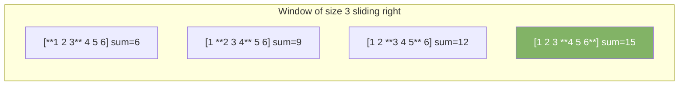
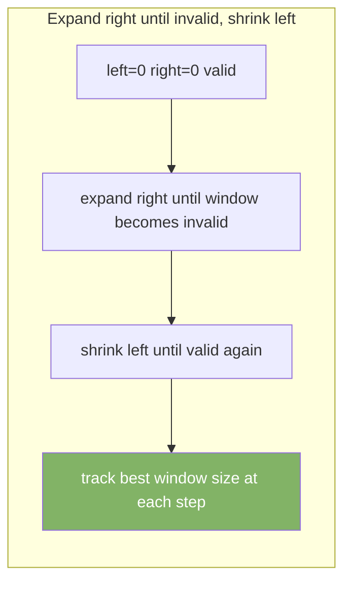

# Sliding Window

A sliding window maintains a contiguous subarray or substring of variable or fixed size. Instead of recomputing from scratch, it adds the new element entering the window and removes the element leaving. Reduces O(n²) to O(n).

---

## Fixed-Size Window

Window size stays constant. Slide one step at a time.



### Example — Maximum Sum Subarray of Size k

```java
int maxSumSubarray(int[] nums, int k) {
    int sum = 0;
    for (int i = 0; i < k; i++) sum += nums[i];

    int max = sum;
    for (int i = k; i < nums.length; i++) {
        sum += nums[i] - nums[i - k]; // add new, remove old
        max = Math.max(max, sum);
    }
    return max;
}
```

---

## Variable-Size Window

Window expands to the right. Shrinks from the left when a condition is violated.



### Example — Longest Substring Without Repeating Characters

```java
int lengthOfLongestSubstring(String s) {
    Set<Character> window = new HashSet<>();
    int left = 0, max = 0;

    for (int right = 0; right < s.length(); right++) {
        char c = s.charAt(right);
        while (window.contains(c)) {
            window.remove(s.charAt(left));
            left++;
        }
        window.add(c);
        max = Math.max(max, right - left + 1);
    }
    return max;
}
// "abcabcbb" → 3 ("abc")
```

---

## Example — Minimum Window Substring

Find the smallest substring in `s` that contains all characters of `t`.

```java
String minWindow(String s, String t) {
    Map<Character, Integer> need = new HashMap<>();
    for (char c : t.toCharArray()) need.merge(c, 1, Integer::sum);

    int left = 0, matched = 0;
    int minLen = Integer.MAX_VALUE, start = 0;
    Map<Character, Integer> window = new HashMap<>();

    for (int right = 0; right < s.length(); right++) {
        char c = s.charAt(right);
        window.merge(c, 1, Integer::sum);
        if (need.containsKey(c) && window.get(c).equals(need.get(c))) matched++;

        while (matched == need.size()) {
            if (right - left + 1 < minLen) {
                minLen = right - left + 1;
                start = left;
            }
            char leftChar = s.charAt(left++);
            if (need.containsKey(leftChar)) {
                if (window.get(leftChar).equals(need.get(leftChar))) matched--;
                window.merge(leftChar, -1, Integer::sum);
            }
        }
    }
    return minLen == Integer.MAX_VALUE ? "" : s.substring(start, start + minLen);
}
```

---

## Example — Max Consecutive Ones (Allow k flips)

```java
int maxOnes(int[] nums, int k) {
    int left = 0, zeros = 0, max = 0;
    for (int right = 0; right < nums.length; right++) {
        if (nums[right] == 0) zeros++;
        while (zeros > k) {
            if (nums[left] == 0) zeros--;
            left++;
        }
        max = Math.max(max, right - left + 1);
    }
    return max;
}
```

---

## Template

```java
int slidingWindow(int[] nums) {
    int left = 0, result = 0;
    // window state (sum, count, set, map...)

    for (int right = 0; right < nums.length; right++) {
        // expand window: add nums[right]

        while (/* window is invalid */) {
            // shrink window: remove nums[left]
            left++;
        }

        // update result with current window [left, right]
        result = Math.max(result, right - left + 1);
    }
    return result;
}
```

---

## When to Use

| Signal in problem                                  | Use sliding window? |
|----------------------------------------------------|---------------------|
| Contiguous subarray or substring                   | Yes                 |
| Fixed or variable window size                      | Yes                 |
| "Longest" or "shortest" subarray satisfying X      | Yes — variable      |
| Sum, average, or count in a subarray               | Yes — fixed         |
| "At most k" distinct / zeros / repeating           | Yes — variable      |
