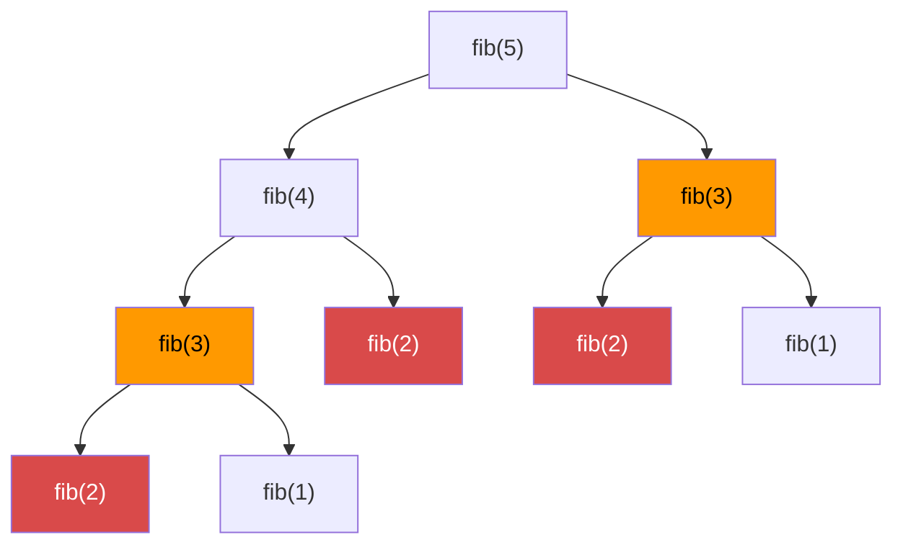

# Dynamic Programming

Break a problem into smaller overlapping subproblems. Solve each once. Cache and reuse the results.

---

## Intuition

Without DP, recursion recomputes the same subproblems millions of times. With DP, you compute each subproblem once and look up the answer instantly the next time. It trades memory for speed.

---

## Two Conditions for DP

1. **Optimal substructure** — the best solution to the problem contains best solutions to its subproblems.
2. **Overlapping subproblems** — the same subproblems appear again and again.

If both hold, DP can help. If subproblems don't overlap, divide-and-conquer works instead.

---

## Sample Input

```
Fibonacci: n = 6  → fib(6) = 8
Coin change: coins = [1, 5, 6, 9], amount = 11  → 2 coins (5+6)
```

---

## Visual Representation — Fibonacci Without DP



`fib(3)` computed twice, `fib(2)` computed three times. Gets exponentially worse for large n.

---

## Step-by-step Trace — Fibonacci (Bottom-up)

Input: n = 6

| i | dp[i-2] | dp[i-1] | dp[i] |
|---|---------|---------|-------|
| 2 | 0 | 1 | 1 |
| 3 | 1 | 1 | 2 |
| 4 | 1 | 2 | 3 |
| 5 | 2 | 3 | 5 |
| 6 | 3 | 5 | **8** |

---

## Java Implementation

### Fibonacci — Top-down (Memoization)

```java
// Time: O(n)  Space: O(n)
Map<Integer, Long> memo = new HashMap<>();

long fib(int n) {
    if (n <= 1) return n;
    if (memo.containsKey(n)) return memo.get(n);
    long result = fib(n - 1) + fib(n - 2);
    memo.put(n, result);
    return result;
}
```

### Fibonacci — Bottom-up (Tabulation)

```java
// Time: O(n)  Space: O(1)
long fib(int n) {
    if (n <= 1) return n;
    long prev2 = 0, prev1 = 1;
    for (int i = 2; i <= n; i++) {
        long curr = prev1 + prev2;
        prev2 = prev1;
        prev1 = curr;
    }
    return prev1;
}
```

### Coin Change — Minimum Coins

```java
// Time: O(amount × coins)  Space: O(amount)
int coinChange(int[] coins, int amount) {
    int[] dp = new int[amount + 1];
    Arrays.fill(dp, amount + 1); // sentinel: impossible value
    dp[0] = 0;
    for (int i = 1; i <= amount; i++)
        for (int coin : coins)
            if (coin <= i) dp[i] = Math.min(dp[i], dp[i - coin] + 1);
    return dp[amount] > amount ? -1 : dp[amount];
}
// coins=[1,5,6,9], amount=11 → 2 (5+6)
```

### 0/1 Knapsack

```java
// Time: O(n × W)  Space: O(n × W)
int knapsack(int[] weights, int[] values, int W) {
    int n = weights.length;
    int[][] dp = new int[n + 1][W + 1];
    for (int i = 1; i <= n; i++)
        for (int w = 0; w <= W; w++) {
            dp[i][w] = dp[i-1][w]; // skip item i
            if (weights[i-1] <= w)
                dp[i][w] = Math.max(dp[i][w], dp[i-1][w-weights[i-1]] + values[i-1]);
        }
    return dp[n][W];
}
```

### How to Approach Any DP Problem

1. Identify overlapping subproblems.
2. Define the state — what does `dp[i]` or `dp[i][j]` mean?
3. Write the recurrence relation.
4. Set base cases.
5. Choose top-down or bottom-up.
6. Reduce space if possible.

---

## Common Mistakes

- **Not defining the DP state clearly.** Write `dp[i] = ...` in plain English before writing code. Vague state leads to wrong recurrences.
- **Wrong base cases.** An off-by-one in base cases corrupts every value built on top.
- **Filling the table in the wrong order.** Bottom-up DP requires computing smaller subproblems before larger ones. Wrong order means you use uncomputed values.
- **Confusing top-down with bottom-up space.** Top-down (memoization) uses stack space for recursion on top of the memo table. Bottom-up avoids the call stack entirely.

---

## Practice Problems

| Difficulty | Problem | Link |
|------------|---------|------|
| Easy | Climbing Stairs | [LeetCode 70](https://leetcode.com/problems/climbing-stairs/) |
| Medium | Coin Change | [LeetCode 322](https://leetcode.com/problems/coin-change/) |
| Medium | Longest Common Subsequence | [LeetCode 1143](https://leetcode.com/problems/longest-common-subsequence/) |

---

## Deep Dive

### Top-down vs Bottom-up

| | Top-down | Bottom-up |
|--|----------|-----------|
| Style | Recursive + memo | Iterative table |
| Order | Lazy — only computes needed subproblems | Eager — fills entire table |
| Stack risk | StackOverflow on deep recursion | No recursion |
| Easier to write | Usually | Takes more planning |

### DP Problem Categories

| Category | Classic Problems |
|----------|----------------|
| 1D DP | Fibonacci, Climbing Stairs, House Robber |
| 2D DP (Grid) | Unique Paths, Minimum Path Sum |
| Subsequence | LCS, LIS, Edit Distance |
| Knapsack | 0/1 Knapsack, Coin Change, Subset Sum |
| String DP | Palindrome Partitioning, Regex Matching |
