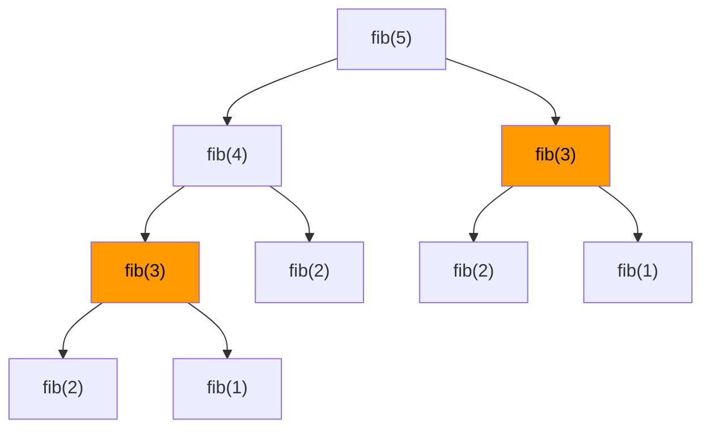

# Dynamic Programming

Dynamic programming (DP) solves problems by breaking them into smaller overlapping subproblems and caching the results. Solve each subproblem once, reuse the answer.

---

## When to Use DP

Two conditions must hold:

1. **Optimal substructure** — the optimal solution contains optimal solutions to subproblems.
2. **Overlapping subproblems** — the same subproblems appear again and again.

---

## Two Approaches

| Approach      | Direction          | How                                        |
|---------------|--------------------|--------------------------------------------|
| Top-down (Memoization) | Problem → subproblems | Recursive + cache results in a map/array |
| Bottom-up (Tabulation) | Subproblems → problem | Fill a table iteratively from base cases |

---

## Example 1 — Fibonacci Number

`fib(n) = fib(n-1) + fib(n-2)`

Without DP, naïve recursion recomputes the same values repeatedly — O(2ⁿ).



`fib(3)` is computed twice. For fib(50), millions of recomputations happen.

### Top-Down (Memoization)

```java
Map<Integer, Long> memo = new HashMap<>();

long fib(int n) {
    if (n <= 1) return n;
    if (memo.containsKey(n)) return memo.get(n);
    long result = fib(n - 1) + fib(n - 2);
    memo.put(n, result);
    return result;
}
// O(n) time, O(n) space
```

### Bottom-Up (Tabulation)

```java
long fib(int n) {
    if (n <= 1) return n;
    long[] dp = new long[n + 1];
    dp[0] = 0;
    dp[1] = 1;
    for (int i = 2; i <= n; i++) {
        dp[i] = dp[i - 1] + dp[i - 2];
    }
    return dp[n];
}
// O(n) time, O(n) space

// Space-optimized: only need last two values
long fibOptimal(int n) {
    if (n <= 1) return n;
    long prev2 = 0, prev1 = 1;
    for (int i = 2; i <= n; i++) {
        long curr = prev1 + prev2;
        prev2 = prev1;
        prev1 = curr;
    }
    return prev1;
}
// O(n) time, O(1) space
```

---

## Example 2 — 0/1 Knapsack

Given items with weights and values, maximize value with a weight limit W.

```java
int knapsack(int[] weights, int[] values, int W) {
    int n = weights.length;
    int[][] dp = new int[n + 1][W + 1];

    for (int i = 1; i <= n; i++) {
        for (int w = 0; w <= W; w++) {
            dp[i][w] = dp[i - 1][w]; // skip item i
            if (weights[i - 1] <= w) {
                dp[i][w] = Math.max(dp[i][w],
                    dp[i - 1][w - weights[i - 1]] + values[i - 1]); // take item i
            }
        }
    }
    return dp[n][W];
}
```

---

## Example 3 — Longest Common Subsequence (LCS)

```java
int lcs(String s1, String s2) {
    int m = s1.length(), n = s2.length();
    int[][] dp = new int[m + 1][n + 1];

    for (int i = 1; i <= m; i++) {
        for (int j = 1; j <= n; j++) {
            if (s1.charAt(i - 1) == s2.charAt(j - 1)) {
                dp[i][j] = dp[i - 1][j - 1] + 1;
            } else {
                dp[i][j] = Math.max(dp[i - 1][j], dp[i][j - 1]);
            }
        }
    }
    return dp[m][n];
}
// lcs("ABCBDAB", "BDCAB") → 4
```

---

## Example 4 — Coin Change (Minimum Coins)

```java
int coinChange(int[] coins, int amount) {
    int[] dp = new int[amount + 1];
    Arrays.fill(dp, amount + 1); // fill with impossible value
    dp[0] = 0;

    for (int i = 1; i <= amount; i++) {
        for (int coin : coins) {
            if (coin <= i) {
                dp[i] = Math.min(dp[i], dp[i - coin] + 1);
            }
        }
    }
    return dp[amount] > amount ? -1 : dp[amount];
}
// coins=[1,5,6,9], amount=11 → 2 (5+6)
```

---

## DP Problem Categories

| Category               | Classic Problems                                   |
|------------------------|----------------------------------------------------|
| 1D DP                  | Fibonacci, Climbing Stairs, House Robber           |
| 2D DP (Grid)           | Unique Paths, Minimum Path Sum                     |
| Subsequence            | LCS, LIS, Edit Distance                            |
| Knapsack               | 0/1 Knapsack, Coin Change, Subset Sum              |
| Interval DP            | Matrix Chain Multiplication, Burst Balloons        |
| String DP              | Palindrome Partitioning, Regex Matching            |

---

## How to Approach a DP Problem

1. Identify if it has optimal substructure and overlapping subproblems.
2. Define the DP state — what does `dp[i]` or `dp[i][j]` represent?
3. Write the recurrence relation.
4. Set base cases.
5. Decide top-down or bottom-up.
6. Check if you can reduce space.
